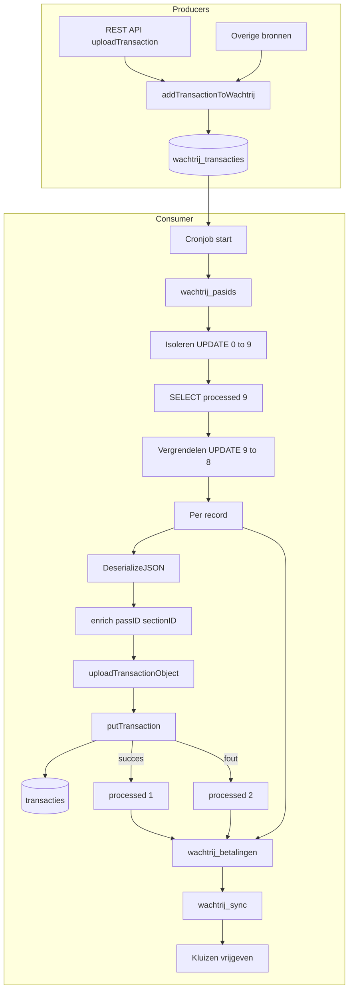
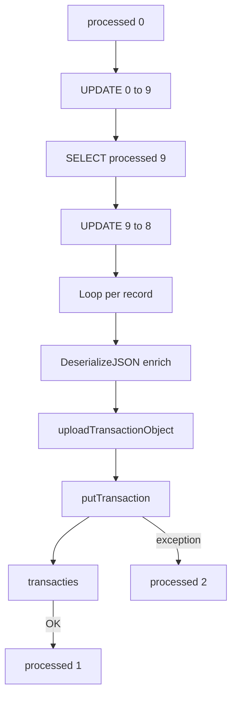

# Verwerking wachtrij_transacties – flowdiagram

Overzicht van het proces dat records uit `wachtrij_transacties` consumeert en verwerkt.

## Consument

De tabel `wachtrij_transacties` wordt verwerkt door:

- **`processTransactions2.cfm`** – cronjob elke 61 seconden  
- URL: `http://remote.veiligstallen.nl/remote/processTransactions2.cfm`  
- Definitie: `scheduler/scheduler.xml` → task "wachtrij transacties"

---

## Global flow



---

## Gedetailleerde flow wachtrij_transacties



---

## Volgorde in processTransactions2.cfm

De cronjob verwerkt de wachtrij-tabellen in vaste volgorde:

| Stap | Tabel | Beschrijving |
|------|-------|--------------|
| 1 | `wachtrij_pasids` | Fietsregistraties (barcode↔passID) – max 50 |
| 2 | `wachtrij_transacties` | Stallingstransacties (in/uit) – max 50 |
| 3 | `wachtrij_betalingen` | Betalingen – max 200 |
| 4 | `wachtrij_sync` | Sectorsync – max 1 (alleen als transactionDate ≤ laatste verwerkte transactie) |
| 5 | — | Kluizen vrijgeven (subscriptions_places) |

---

## processed-statussen

| Waarde | Betekenis |
|--------|-----------|
| 0 | Nieuw / wachtend |
| 9 | Geïsoleerd (tussenstap, batch voor verwerking) |
| 8 | In behandeling (vergrendeld door worker) |
| 1 | Succesvol verwerkt |
| 2 | Fout (error in `error` column) |

### Status 0: nieuw / wachtend

**Wanneer:** Bij INSERT via `addTransactionToWachtrij` (REST API of andere bron), of na handmatige reset van 8 of 2 naar 0.

**Doel:** Record wacht op verwerking. De cron pakt alleen records met `processed=0` en `transactionDate <= now`. Records met toekomstige transactionDate blijven wachten.

**Duur:** Tot de cron het record selecteert en naar 9 zet (of tot handmatige reset).

### Status 9: geïsoleerd

**Wanneer:** Direct na de eerste `UPDATE` die maximaal 50 records met `processed=0` en `transactionDate <= now` selecteert.

**Doel:** Deze records zijn voor deze batch geselecteerd. Andere cron-runs zien ze niet meer als `processed=0`. Zo worden ze niet dubbel gepakt.

**Duur:** Kort. Direct daarna worden ze naar 8 gezet.

### Status 8: in behandeling

**Wanneer:** Na de `SELECT` en voordat de loop per record begint.

**Doel:** Markeert records die nu echt verwerkt worden. Als de cron crasht of timeout heeft tijdens de loop, blijven ze op 8 staan. Het dashboard (`viewTransactions.cfm`) kan ze dan terugzetten naar 0 zodat ze opnieuw worden geprobeerd.

**Duur:** Tijdens de hele verwerking van de batch.

### Status 1: succesvol verwerkt

**Wanneer:** Na succesvolle verwerking in de loop; `uploadTransactionObject` en `putTransaction` zijn goed gelukt.

**Doel:** Record is afgerond. De transactie staat in de `transacties`-tabel. Het record wordt niet meer verwerkt.

**Duur:** Permanent (eindstatus).

### Status 2: fout

**Wanneer:** Na een exception in de loop; `uploadTransactionObject` of `putTransaction` is mislukt.

**Doel:** Record is vastgelopen. De foutmelding staat in de kolom `error`. Kan handmatig naar 0 worden gezet voor retry via `viewTransactions.cfm` (`?resetErrorsTransactions`).

**Duur:** Tot handmatige reset naar 0 of tot archiveren.

### Flow wanneer status = 8

Records met `processed=8` zitten in de loop van `processTransactions2.cfm`. Per record gebeurt het volgende:

1. **getBikeparkByExternalID(bikeparkID)** – bikepark ophalen
2. **DeserializeJSON(transaction)** – JSON uit kolom `transaction` parsen
3. **Enrich** – velden uit het wachtrij-record toevoegen aan het transactie-object:
   - `passID`, `passType`, `sectionID`, `typeCheck`, `transactionDate`
   - `transactionID` (indien ≠ 0), `externalPlaceID` (indien aanwezig)
4. **Fix** – als `typeCheck eq "section"` → `typeCheck = "user"`
5. **uploadTransactionObject** – aanroep op `BikeparkServiceImpl`
6. **putTransaction** – via `TransactionGateway` → INSERT/UPDATE in `transacties`
7. **Resultaat:**
   - Succes → `UPDATE processed=1`, `processDate=now`
   - Fout → `UPDATE processed=2`, `error=message`, `processDate=now`

**Overige processen die status=8 gebruiken – triggers, filters en acties:**

| Proces | Trigger | Filter | Actie |
|--------|---------|--------|-------|
| **resetOccupations.cfm** | Cron elke 301 seconden | `processed IN (0,8,9)` **én** `sectionID` in sectie met open transacties en `BronBezettingsdata = 'FMS'` | **Lezen** – telt in/uit per sectie voor bezetting |
| **admin.cfc** | REST `GET /v1/health` | `processed=8` **én** `typeCheck != 'afboeking'` | **Lezen** – telt aantal voor health-check |
| **viewTransactions.cfm** | Dashboard met URL-params | Geen filter (alle 8) | **Lezen** bij `?showWachtrijInBehandeling`; **Schrijven** (8→0) bij `?resetWachtrijInBehandeling` |
| **archiveWachtrijTransacties.cfm** | Handmatig | `processed IN (0,8,9)` | **Schrijven** – kopieert naar actieve tabel, zet 8 en 9 naar 0 |

---

## resetOccupations

**Doel:** Herijkt de bezetting van secties met stallingstransacties die FMS als bron voor bezettingsdata gebruiken. Zorgt ervoor dat de bezetting ook rekening houdt met transacties die nog in de wachtrij staan.

**Trigger:** Cronjob elke 301 seconden (~5 minuten).  
**Bestand:** `verwijssysteem/cronjobs/resetOccupations.cfm` of `remote/cronjobs/resetOccupations.cfm`.

### Wat wordt gewijzigd

| Tabel | Actie |
|-------|-------|
| `wachtrij_transacties` | **Lezen** – telt `type='in'` en `type='uit'` per sectie |
| `transacties` | **Lezen** – telt open transacties (geverifieerde geparkeerde fietsen) |
| `fietsenstallingen` | **Lezen** – filter `BronBezettingsdata = 'FMS'` |
| `fietsenstalling_sectie` | **Schrijven** – kolom `Bezetting` wordt bijgewerkt |

De tabel `wachtrij_transacties` wordt **niet** gewijzigd; die wordt alleen gelezen.

### Formule

```
Bezetting = occupation + wachtrij_in - wachtrij_uit
```

- **occupation** = aantal open transacties in die sectie (`transacties` met `Date_checkout IS NULL`)
- **wachtrij_in** = aantal `wachtrij_transacties` met `processed IN (0,8,9)` en `type = 'in'` voor die sectie
- **wachtrij_uit** = idem voor `type = 'uit'`

Dus: (geverifieerde geparkeerde fietsen) + (nog niet verwerkte inchecks) − (nog niet verwerkte uitchecks).

### Welke secties

Alleen secties die voldoen aan:

- Er zijn open transacties (`Date_checkout IS NULL`) in die sectie
- De stalling heeft `BronBezettingsdata = 'FMS'` (geen externe bezettingsbron)

### Flow

1. Query secties met open transacties en FMS-bezetting
2. Per sectie: bereken `occupation`, `wachtrij_in`, `wachtrij_uit`
3. `UPDATE fietsenstalling_sectie SET Bezetting = occupation + wachtrij_in - wachtrij_uit WHERE externalId = sectionID`

---

## admin.cfc

**Doel:** REST API voor admin en monitoring. Health-check en aggregaties van wachtrij-transacties voor dashboards.

**Trigger:** REST-calls (on-demand). Voor wachtrij: `GET /v1/health` (telt wachtrij), `GET /v1/transactions` (aggregaties per tijdseenheid).

**Bestand:** `remote/REST/admin/admin.cfc`.

### Wat wordt gewijzigd

| Tabel | Actie |
|-------|-------|
| `wachtrij_transacties` | **Lezen** – health: count met `processed=0` en `processed=8` (excl. afboeking); getTransactions: aggregaties op `dateCreated` (excl. afboeking) |
| `bezettingsdata_tmp` | **Lezen** – lumiguide endpoint |
| `emails` | **Lezen** – getEmail endpoint |

De tabel `wachtrij_transacties` wordt **niet** gewijzigd; die wordt alleen gelezen.

### Endpoints met wachtrij

- **health** – `transactions.waiting` (processed=0), `transactions.pending` (processed=8), filter `typeCheck != 'afboeking'`
- **getTransactionsForFMS** – aggregaties (start, count) per tijdseenheid; filter op `dateCreated`, optioneel `citycode`/`locationid`

---

## viewTransactions.cfm

**Doel:** Dashboard voor wachtrij-monitoring. Toont aantallen, kan records resetten, verwerking pauzeren en TransactionGateway herladen.

**Trigger:** Bezoek dashboard met `?action=viewTransactions`. Schrijfacties alleen bij specifieke URL-params.

**Bestand:** `remote/dashboard/actions/viewTransactions.cfm`.

### Wat wordt gewijzigd

| Tabel | Actie |
|-------|-------|
| `wachtrij_transacties` | **Lezen** – aantallen (processed=0, 8, 2), details bij `?showWachtrij`, `?showWachtrijInBehandeling`, `?showErrors` |
| `wachtrij_transacties` | **Schrijven** – bij `?resetWachtrijInBehandeling`: 8→0; bij `?resetErrorsTransactions`: 2→0 (alleen laatste 24h) |
| `wachtrij_pasids` | **Lezen** – aantallen; **Schrijven** – bij `?resetErrorsPassIds`: 2→0 (laatste 24h) |
| `wachtrij_betalingen` | **Lezen** – aantallen |
| `transacties` | **Lezen** – laatste transactie bij `?showTransaction` |
| `application` | **Schrijven** – bij `?pause`: `pauseProcessTransactionsUntil`; bij `?resume`: opheffen; bij `?reinitTransactionGateway`: herladen |

### URL-params

| Param | Actie |
|-------|-------|
| `showWachtrij` | Toon max 100 records met processed=0 |
| `showWachtrijInBehandeling` | Toon max 100 records met processed=8 |
| `showErrors` | Toon max 100 records met processed=2 (laatste 24h) |
| `resetWachtrijInBehandeling` | Alle 8→0 |
| `resetErrorsTransactions` | Alle 2→0 (laatste 24h) |
| `pause` | Pauzeer processTransactions 15 min |
| `resume` | Hervat verwerking |
| `reinitTransactionGateway` | Herlaad TransactionGateway |

---

## archiveWachtrijTransacties.cfm

**Doel:** Archiveert de tabel `wachtrij_transacties`. Maakt een dagarchief en behoudt onverwerkte records (0, 8, 9) in de actieve tabel.

**Trigger:** Handmatig (niet in scheduler).

**Bestand:** `verwijssysteem/remote/archiveWachtrijTransacties.cfm` of `remote/remote/archiveWachtrijTransacties.cfm`.

### Wat wordt gewijzigd

| Tabel | Actie |
|-------|-------|
| `wachtrij_transacties` | **Schrijven** – tabel wordt hernoemd naar `wachtrij_transacties_archive_yyyymmdd` |
| `wachtrij_transacties_new` | **Schrijven** – nieuwe lege tabel wordt `wachtrij_transacties` |
| `wachtrij_transacties` | **Schrijven** – `INSERT` van records met `processed IN (0,8,9)` uit archief; daarna `UPDATE` 8,9→0 |

### Flow

1. **CREATE** `wachtrij_transacties_new` (lege kopie van structuur)
2. **RENAME** `wachtrij_transacties` → `wachtrij_transacties_archive_yyyymmdd`
3. **RENAME** `wachtrij_transacties_new` → `wachtrij_transacties`
4. **INSERT** uit archief waar `processed IN (0,8,9)` (onverwerkte records blijven in actieve tabel)
5. **UPDATE** `processed=0` waar `processed IN (8,9)` (voor herverwerking)

Verwerkte records (1, 2) blijven alleen in het archief.

---

## Bestanden

| Bestand | Rol |
|---------|-----|
| `verwijssysteem/remote/processTransactions2.cfm` | Hoofdverwerker (verwijssysteem) |
| `remote/remote/processTransactions2.cfm` | Hoofdverwerker (remote) |
| `cflib/.../service/BikeparkServiceImpl.cfc` | `uploadTransactionObject` |
| `cflib/.../persistence/TransactionGateway.cfc` | `putTransaction` → transacties |
