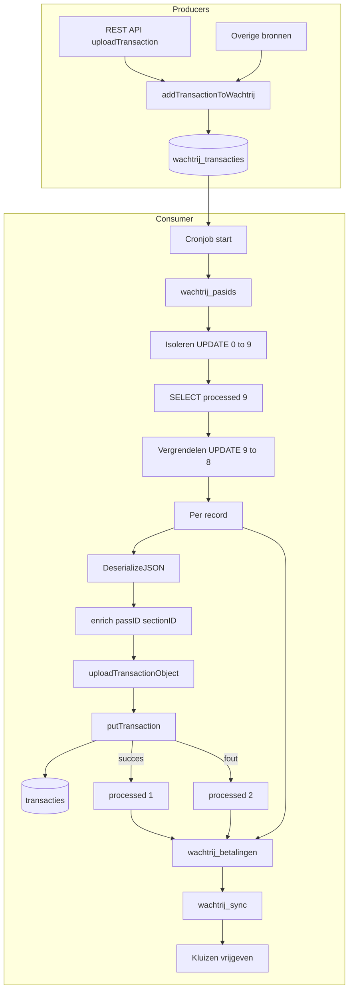
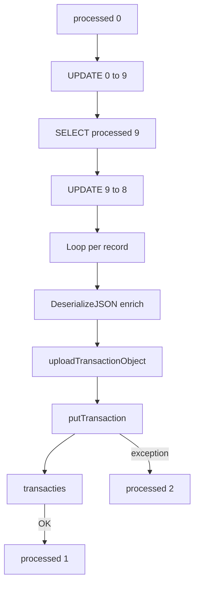

# Verwerking wachtrij_transacties – flowdiagram

Overzicht van het proces dat records uit `wachtrij_transacties` consumeert en verwerkt.

## Consument

De tabel `wachtrij_transacties` wordt verwerkt door:

- **`processTransactions2.cfm`** – cronjob elke 61 seconden  
- URL: `http://remote.veiligstallen.nl/remote/processTransactions2.cfm`  
- Definitie: `scheduler/scheduler.xml` → task "wachtrij transacties"

---

## Global flow

---

## Gedetailleerde flow wachtrij_transacties

---

## Volgorde in processTransactions2.cfm

De cronjob verwerkt de wachtrij-tabellen in vaste volgorde:

| Stap | Tabel | Beschrijving |
|------|-------|--------------|
| 1 | `wachtrij_pasids` | Fietsregistraties (barcode↔passID) – max 50 |
| 2 | `wachtrij_transacties` | Stallingstransacties (in/uit) – max 50 |
| 3 | `wachtrij_betalingen` | Betalingen – max 200 |
| 4 | `wachtrij_sync` | Sectorsync – max 1 (alleen als transactionDate ≤ laatste verwerkte transactie) |
| 5 | — | Kluizen vrijgeven (subscriptions_places) |

---

## processed-statussen

| Waarde | Betekenis |
|--------|-----------|
| 0 | Nieuw / wachtend |
| 9 | Geïsoleerd (tussenstap, batch voor verwerking) |
| 8 | In behandeling (vergrendeld door worker) |
| 1 | Succesvol verwerkt |
| 2 | Fout (error in `error` column) |

### Status 9: geïsoleerd

**Wanneer:** Direct na de eerste `UPDATE` die maximaal 50 records met `processed=0` en `transactionDate <= now` selecteert.

**Doel:** Deze records zijn voor deze batch geselecteerd. Andere cron-runs zien ze niet meer als `processed=0`. Zo worden ze niet dubbel gepakt.

**Duur:** Kort. Direct daarna worden ze naar 8 gezet.

### Status 8: in behandeling

**Wanneer:** Na de `SELECT` en voordat de loop per record begint.

**Doel:** Markeert records die nu echt verwerkt worden. Als de cron crasht of timeout heeft tijdens de loop, blijven ze op 8 staan. Het dashboard (`viewTransactions.cfm`) kan ze dan terugzetten naar 0 zodat ze opnieuw worden geprobeerd.

**Duur:** Tijdens de hele verwerking van de batch.

### Flow wanneer status = 8

Records met `processed=8` zitten in de loop van `processTransactions2.cfm`. Per record gebeurt het volgende:

1. **getBikeparkByExternalID(bikeparkID)** – bikepark ophalen
2. **DeserializeJSON(transaction)** – JSON uit kolom `transaction` parsen
3. **Enrich** – velden uit het wachtrij-record toevoegen aan het transactie-object:
   - `passID`, `passType`, `sectionID`, `typeCheck`, `transactionDate`
   - `transactionID` (indien ≠ 0), `externalPlaceID` (indien aanwezig)
4. **Fix** – als `typeCheck eq "section"` → `typeCheck = "user"`
5. **uploadTransactionObject** – aanroep op `BikeparkServiceImpl`
6. **putTransaction** – via `TransactionGateway` → INSERT/UPDATE in `transacties`
7. **Resultaat:**
   - Succes → `UPDATE processed=1`, `processDate=now`
   - Fout → `UPDATE processed=2`, `error=message`, `processDate=now`

**Overige processen die status=8 gebruiken:**

| Proces | Actie |
|--------|-------|
| **resetOccupations.cfm** | Telt records met `processed IN (0,8,9)` voor bezetting (wachtrij_in, wachtrij_uit) |
| **admin.cfc** | Toont aantal/records met `processed=8` in admin-dashboard |
| **viewTransactions.cfm** | Toont records met `processed=8`; kan reset naar 0 voor retry |
| **archiveWachtrijTransacties.cfm** | Bij archiveren: records met 0,8,9 blijven in actieve tabel; 8,9 worden terug naar 0 gezet |

### Welk proces wanneer – triggers en filters

De processen zien allemaal dezelfde records met `processed=8`; ze concurreren niet om records. Het verschil zit in **wanneer** ze draaien en **welke** records ze benaderen of wijzigen:

| Proces | Trigger | Filter op records | Actie |
|--------|---------|------------------|-------|
| **resetOccupations.cfm** | Cron elke **301 seconden** | `processed IN (0,8,9)` **én** `sectionID` moet overeenkomen met een sectie uit `transacties` waar `Date_checkout IS NULL` en `BronBezettingsdata = 'FMS'` | **Lezen** – telt in/uit per sectie voor bezetting |
| **admin.cfc** | REST-call `GET /v1/health` | `processed=8` **én** `typeCheck != 'afboeking'` | **Lezen** – telt aantal voor health-check |
| **viewTransactions.cfm** | Bezoek dashboard met URL-params | Geen filter (alle 8) | **Lezen** bij `?showWachtrijInBehandeling`; **Schrijven** (8→0) bij `?resetWachtrijInBehandeling` |
| **archiveWachtrijTransacties.cfm** | **Handmatig** (niet in scheduler) | Alle records met `processed IN (0,8,9)` | **Schrijven** – kopieert naar actieve tabel, zet 8 en 9 naar 0 |

**Samenvatting:**

- **resetOccupations**: alleen secties met open transacties en FMS-bezetting; elke ~5 minuten.
- **admin**: health-endpoint; alleen lezen, geen afboekingen.
- **viewTransactions**: alleen bij gebruikersactie; kan alle 8 tonen of resetten.
- **archiveWachtrijTransacties**: alleen bij handmatige uitvoering; verwerkt alle niet-afgeronde records.

### Samenvatting

| Status | Betekenis | Rol |
|--------|-----------|-----|
| **9** | Geïsoleerd | Record hoort bij deze batch, niet meer beschikbaar voor andere runs |
| **8** | In behandeling | Record wordt nu verwerkt; bij crash kan handmatig naar 0 worden gezet voor retry |

---

## Overige processen die wachtrij_transacties gebruiken

| Proces | Actie | Consumeert? |
|--------|-------|-------------|
| **resetOccupations.cfm** | Leest `processed IN (0,8,9)` voor bezetting in/uit | Nee – alleen lezen |
| **archiveWachtrijTransacties.cfm** | Archiveert tabel; kopieert 0,8,9 terug naar nieuwe tabel | Nee – alleen archiveren |
| **viewTransactions.cfm** | Dashboard: reset 8→0, 2→0 voor retry | Nee – alleen status reset |
| **correctBikepark.cfm** | Admin: correcties, reset processed | Nee – alleen correcties |

---

## Bestanden

| Bestand | Rol |
|---------|-----|
| `verwijssysteem/remote/processTransactions2.cfm` | Hoofdverwerker (verwijssysteem) |
| `remote/remote/processTransactions2.cfm` | Hoofdverwerker (remote) |
| `cflib/.../service/BikeparkServiceImpl.cfc` | `uploadTransactionObject` |
| `cflib/.../persistence/TransactionGateway.cfc` | `putTransaction` → transacties |
