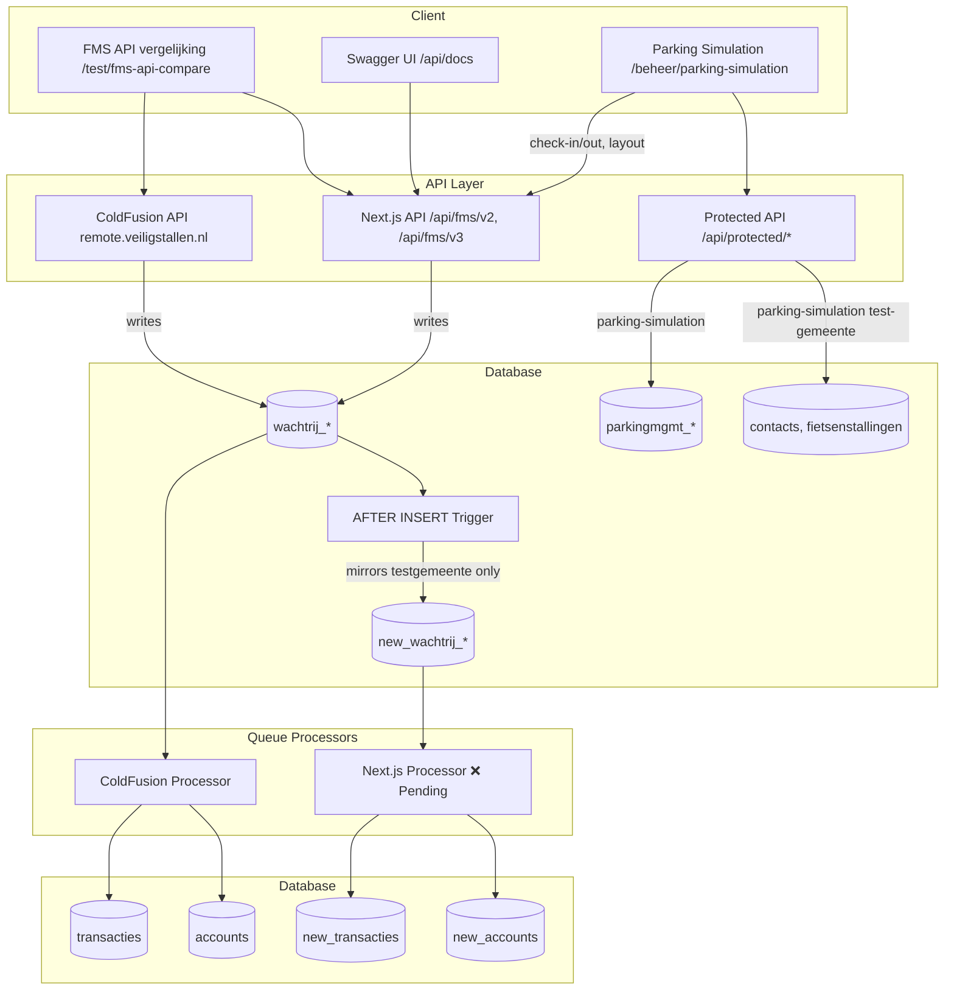
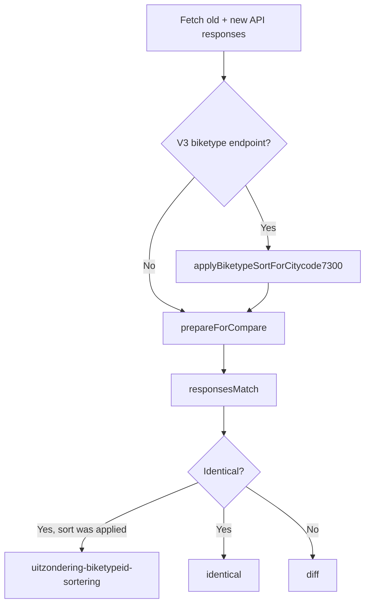
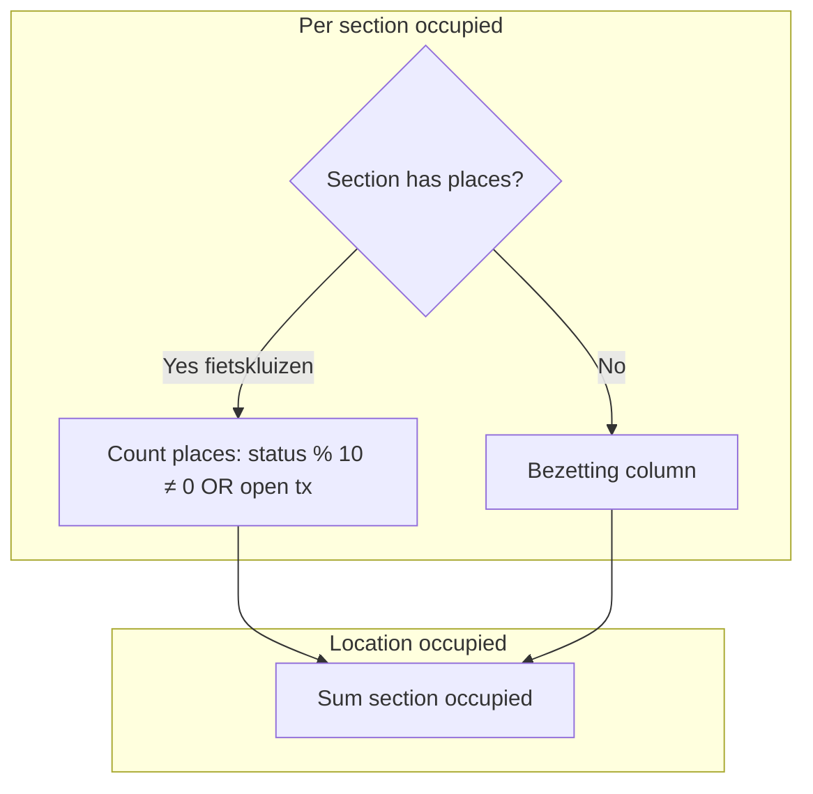
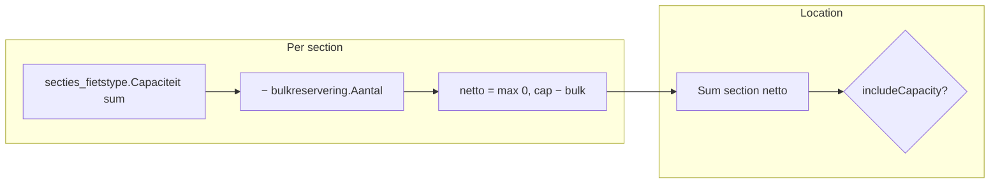
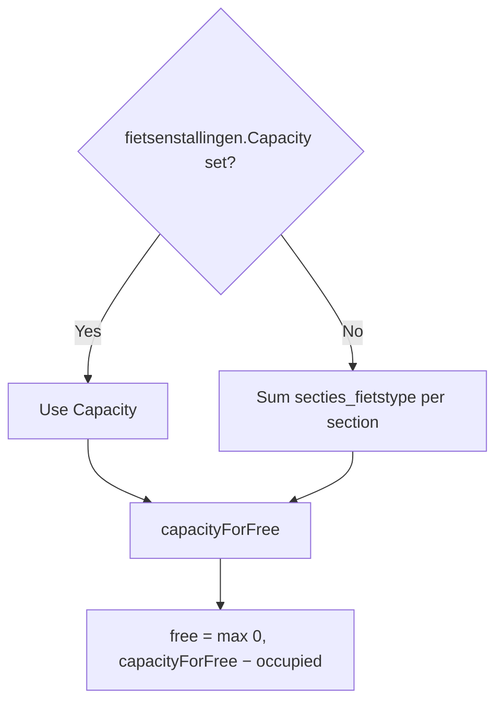
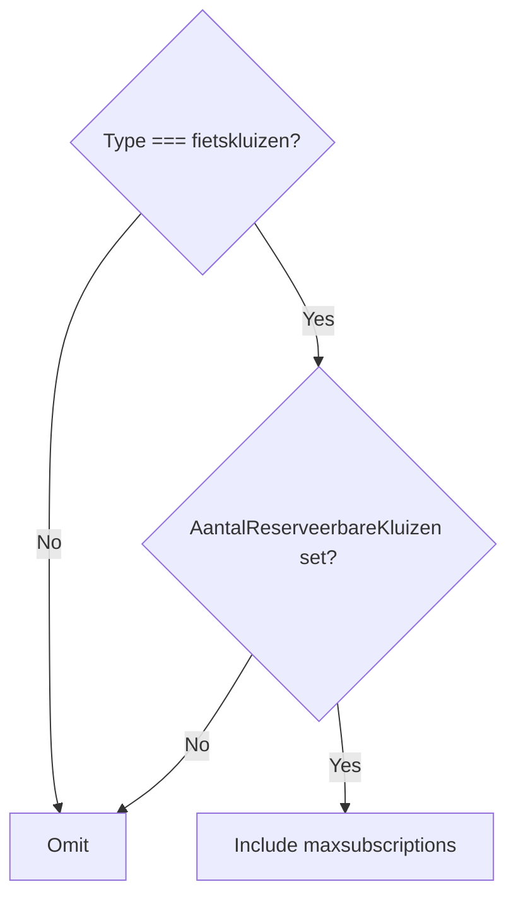
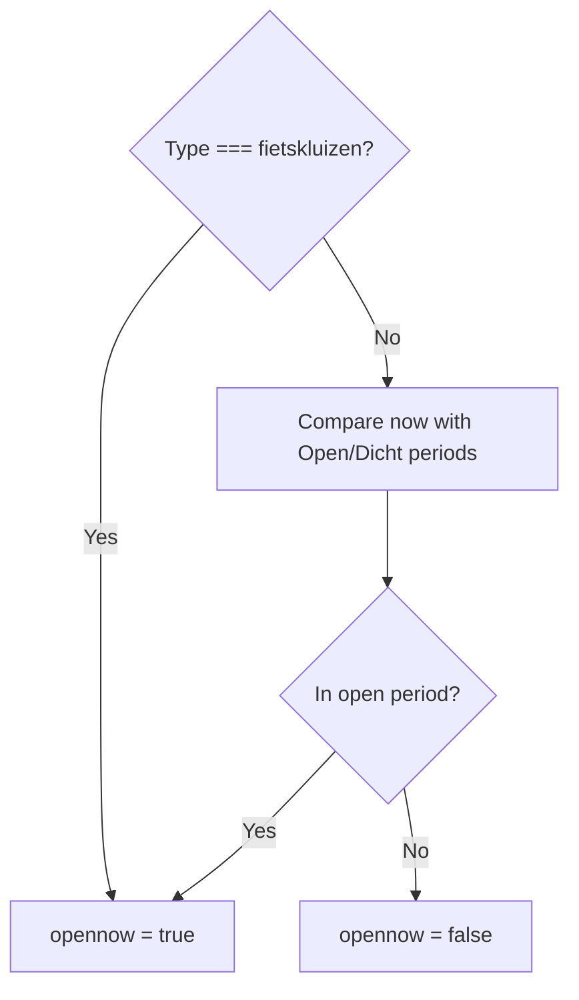
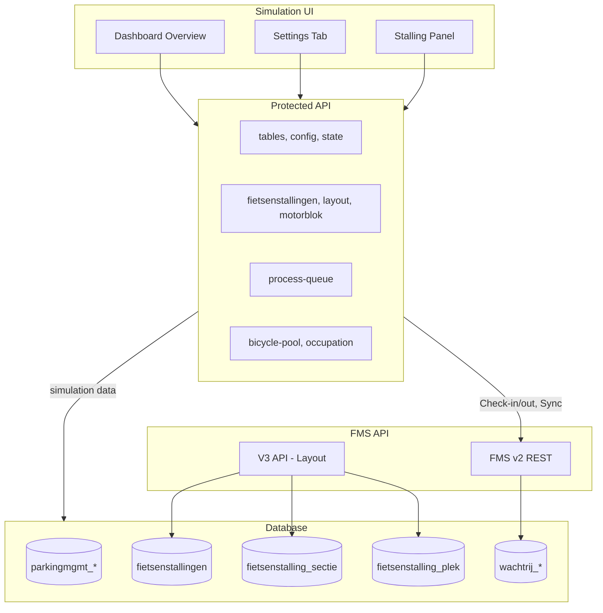

# FMS REST API Next.js Migration and Transaction Processing Plan

**Version:** 2.0  
**Created:** 2026-02  
**Updated:** 2026-02-27  
**Status:** Active – merged from API Porting Plan and FMS API Next.js Migration plan.

---

## Scope

- **REST only** – no SOAP, no legacy FMS V1 API formats
- **New REST design** – FMS operations exposed as REST endpoints (V2 method-based, V3 resource hierarchy)
- **Transaction processing backend** – queue processing and business logic
- **Test environment** – duplicate tables, trigger mirroring, test municipality for safe validation

**Separate plan:** Datastandard and Reporting APIs – see [DATASTANDARD_REPORTING_API_PLAN.md](DATASTANDARD_REPORTING_API_PLAN.md).

---

## Implementation Status

| Area | Status | Notes |
|------|--------|-------|
| **Duplicate tables + triggers** | ✅ Done | Prisma schema, migration, trigger SQL; create/drop new_* tables via Database → Beheer page |
| **Parking Simulation tables** | ✅ Done | Create/remove via SettingsTab Bootstrap; tables API (GET status, POST create/remove) |
| **Test municipality** | ✅ Done | Create/delete with 7 stallings (config-driven); documenttemplates, contact_report_settings copied from Utrecht |
| **Extract stallings script** | ✅ Done | `scripts/extract-stallings.ts` + config; outputs to generated file |
| **FMS migration** | ✅ Done | `new_wachtrij_*` tables and triggers |
| **FMS v2 read endpoints** | ✅ Done | getServerTime, getJsonBikeTypes, getJsonPaymentTypes, getJsonClientTypes |
| **FMS v2 write endpoints** | ✅ Done | saveJsonBike(s), uploadJsonTransaction(s), addJsonSaldo(s), syncSector |
| **Wachtrij service** | ✅ Done | `src/server/services/fms/wachtrij-service.ts` – inserts into queue tables |
| **Swagger/OpenAPI** | ✅ Done | Spec + UI at `/api/docs` (public); write ops documented |
| **GET comparison page** | ✅ Done | `/test/fms-api-compare` |
| **Queue processor** | ❌ Pending | Process `new_wachtrij_*` → `new_transacties`, `new_accounts`, etc. |
| **fms-table-resolver.ts** | ❌ Pending | Resolve table names for processor |
| **new_webservice_log** | ❌ Pending | Log FMS API calls |
| **Scheduler/cron** | ❌ Pending | Phase 3 – `/api/cron/process-queues` |
| **Business logic services** | ❌ Pending | bikeparkService, transactionService, accountService |
| **Archive process** | ❌ Pending | Daily archive of processed queue records |
| **V3 API** | ✅ Done | citycodes, locations, location/{id}, sections, section/{id}, places, subscriptiontypes. Response structure synced with ColdFusion (see §4.4). Biketypes ordered by SectionBiketypeID; ColdFusion has no orderby (see §14.1, A.11). |
| **Testing** | ❌ Pending | Unit tests, integration tests |
| **API migration guide** | ❌ Pending | Documentation for clients |

---

## Context

The existing FMS REST API runs on ColdFusion at `https://remote.veiligstallen.nl` with two versions (V1 is not ported):

- **V2**: Method-based URLs, JSON-only (`/v2/REST/{method}/{bikeparkID}/{sectorID}`)
- **V3**: REST hierarchy (`/rest/v3/citycodes/{citycode}/locations/{locationid}/...`)

The Next.js app lives in [fietsberaad-veiligstallen-app/](../) with Prisma, NextAuth, and existing test pages at `/test/*`.

---

## High-Level Architecture



---

## Component Design

| Component | Location | Status | Purpose |
|-----------|----------|--------|---------|
| **FMS V2 API** | `src/pages/api/fms/v2/[[...path]].ts` | ✅ Done | Method-based REST (saveJsonBike, uploadJsonTransaction, addJsonSaldo, syncSector, read-only) |
| **FMS V3 API** | `src/pages/api/fms/v3/citycodes/[[...path]].ts` | ✅ Done | Resource hierarchy (citycodes, locations, sections, places, subscriptiontypes) |
| **FMS V3 Service** | `src/server/services/fms/fms-v3-service.ts` | ✅ Done | Location/section/place assembly, ColdFusion-compatible response structure |
| **Wachtrij Service** | `src/server/services/fms/wachtrij-service.ts` | ✅ Done | Insert into wachtrij_* queue tables |
| **new_* tables create/drop** | `src/components/beheer/database/DataApiComponent.tsx` | ✅ Done | Create/drop new_* tables and triggers; on Database → Beheer page |
| **Parking Simulation** | `src/components/beheer/parking-simulation/` | ✅ Done | Simulation UI: DashboardOverview, SettingsTab, StallingPanel; tables bootstrap |
| **Queue Processor** | `src/server/services/queue/processor.ts` | ❌ Pending | Process new_wachtrij_* → new_transacties, new_accounts |
| **Swagger UI** | `/api/docs`, `src/pages/test/fms-api-docs.tsx` | ✅ Done | OpenAPI 3.0 spec, write ops documented |
| **FMS Compare** | `src/pages/test/fms-api-compare.tsx` | ✅ Done | Side-by-side old vs new API comparison |

---

## Protected API Endpoints

**Access:** All require NextAuth session. Most require `fietsberaad_superadmin` unless noted.

### new_* Tables (Database → Beheer)

| Endpoint | Method | Purpose |
|----------|--------|---------|
| `/api/protected/data-api/fms-tables` | POST | Create/drop new_* tables and triggers (UI: Database → Beheer) |

### Parking Simulation

| Endpoint | Method | Purpose |
|----------|--------|---------|
| `/api/protected/parking-simulation/test-gemeente/status` | GET | Check if test municipality exists |
| `/api/protected/parking-simulation/test-gemeente/create` | POST | Create test municipality (7 stallings) |
| `/api/protected/parking-simulation/test-gemeente/delete` | POST | Delete test municipality |
| `/api/protected/parking-simulation/tables` | GET | Check if parkingmgmt tables exist |
| `/api/protected/parking-simulation/tables` | POST | create/remove/reset tables |
| `/api/protected/parking-simulation/config` | GET, PATCH | Simulation config (credentials, clock); parkingmgmt_simulation_config |
| `/api/protected/parking-simulation/state` | GET, POST | Bicycles, occupation (GET); park/remove/move (POST) |
| `/api/protected/parking-simulation/time` | GET | Current simulation time |
| `/api/protected/parking-simulation/sections-places/[locationid]` | GET | Sections and places for location |
| `/api/protected/parking-simulation/bicycle-pool` | POST, DELETE | Create/delete bicycle pool |
| `/api/protected/parking-simulation/process-queue` | POST | Call remote process-queue (ColdFusion) |
| `/api/protected/parking-simulation/clone-stalling` | POST | Clone stalling to testgemeente |
| `/api/protected/parking-simulation/dataprovider` | GET, POST, DELETE | Simulatie dataprovider status/create/delete |
| `/api/protected/parking-simulation/test-users` | GET | Test users for simulation |

### FMS Compare

| Endpoint | Method | Purpose |
|----------|--------|---------|
| `/api/protected/fms-api-compare` | GET, POST | Compare single endpoint |
| `/api/protected/fms-api-compare-full-dataset` | GET, POST | Full-dataset comparison |

### Wachtrij (wachtrij role)

| Endpoint | Method | Purpose |
|----------|--------|---------|
| `/api/protected/wachtrij/wachtrij_transacties` | GET | Queue monitor; optional `bikeparkID`, `transactionDateFrom` |
| `/api/protected/transacties` | GET | Transacties; optional `bikeparkID`, `FietsenstallingID`, `dateCheckinFrom` |
| `/api/protected/wachtrij/wachtrij_pasids` | GET | Queue monitor; optional `bikeparkID` |
| `/api/protected/wachtrij/wachtrij_betalingen` | GET | Queue monitor; optional `bikeparkID` |
| `/api/protected/wachtrij/wachtrij_sync` | GET | Queue monitor; optional `bikeparkID` |

---

## 1. Duplicate Tables and Trigger-Based Mirroring

**Status: ✅ Done**

### 1.1 Parallel Flows (Mirror Only, No Delete from wachtrij_*)

Both the ColdFusion and Next.js flows run in parallel. The trigger **mirrors** testgemeente rows to `new_wachtrij_*` but **never deletes** from `wachtrij_*`. This allows comparison of production data with new data after processing.

- **API writes:** Both ColdFusion and Next.js API write to `wachtrij_*` (production queue tables).
- **Trigger:** `AFTER INSERT` on each `wachtrij_*` table. If `bikeparkID` belongs to testgemeente (via `fietsenstallingen.SiteID`), **INSERT** into `new_wachtrij_*`. No DELETE.
- **ColdFusion processor:** Processes `wachtrij_*` (all rows, including testgemeente) → writes to `transacties`, `accounts`, etc.
- **Next.js processor:** Processes `new_wachtrij_*` (testgemeente only) → writes to `new_transacties`, `new_accounts`, etc.
- **Comparison:** Filter production data (`transacties`, `accounts`, …) by testgemeente bike parks vs `new_transacties`, `new_accounts`, … to validate the Next.js implementation.

### 1.2 Tables

*Queue tables (filled by trigger mirror):* `new_wachtrij_transacties`, `new_wachtrij_pasids`, `new_wachtrij_betalingen`, `new_wachtrij_sync`

*Downstream tables (Next.js processor output):* `new_transacties`, `new_transacties_archief`, `new_accounts`, `new_accounts_pasids`, `new_financialtransactions`

**Minimum for test phase: 9 tables** (4 queue + 5 downstream). Created via `NewFmsTableActions.createNewFmsTables()` (inline SQL, same pattern as ParkingmgmtTableActions).

### 1.3 Triggers

- **Event:** `AFTER INSERT` on `wachtrij_transacties`, `wachtrij_pasids`, `wachtrij_betalingen`, `wachtrij_sync`
- **Condition:** `bikeparkID` belongs to testgemeente via `fietsenstallingen.SiteID` → `contacts` where `CompanyName = 'testgemeente API'`
- **Action:** `INSERT` into corresponding `new_wachtrij_*` table (same row data)
- **No DELETE** – rows remain in `wachtrij_*` for the ColdFusion processor

Create/drop via `POST /api/protected/data-api/fms-tables` with `action: 'create-tables'`, `'create-triggers'`, or `'drop'`.

---

## 2. new_* Tables Create/Drop (Database → Beheer)

**Status: ✅ Done**

**Location:** Beheer → Database → Beheer. The DataApiComponent provides UI to create/drop the `new_*` tables and triggers.

- **Create test tabellen** – creates `new_wachtrij_transacties`, `new_wachtrij_pasids`, `new_wachtrij_betalingen`, `new_wachtrij_sync`
- **Maak triggers** – creates `AFTER INSERT` triggers on `wachtrij_*` that mirror testgemeente rows to `new_wachtrij_*`
- **Verwijder test tabellen** – drops the `new_*` tables and triggers

**API:** `POST /api/protected/data-api/fms-tables` with `action: 'create-tables'`, `'create-triggers'`, or `'drop'`.

---

## 2.5 Parking Simulation Tables (Bootstrap)

**Status: ✅ Done**

**Location:** Beheer → Parking Simulation → Instellingen tab → Bootstrap section.

The Parking Simulation simulation uses four `parkingmgmt_*` tables: `parkingmgmt_simulation_config`, `parkingmgmt_bicycles`, `parkingmgmt_spot_detection`, `parkingmgmt_occupation`. These can be created or removed via the Bootstrap UI. (Cost calculation mode comes from FMS `BerekentStallingskosten` on fietsenstallingen.)

**Table structure:** `parkingmgmt_simulation_config` is the singleton config per testgemeente (one row per siteID). It stores API credentials, baseUrl, processQueueBaseUrl, simulation clock offset, etc. Bicycles and spot_detection reference it via `simulationConfigId`.

### API

| Endpoint | Method | Purpose |
|----------|--------|---------|
| `/api/protected/parking-simulation/tables` | GET | Check if all 4 parkingmgmt tables exist → `{ tablesExist: boolean }` |
| `/api/protected/parking-simulation/tables` | POST | `action: 'create'` – create parkingmgmt tables via raw SQL; `action: 'remove'` – drop tables; `action: 'reset'` – clear data, reset clock |

**Access:** `fietsberaad_superadmin` only.

### UI (SettingsTab Bootstrap)

- **Status:** "Aanwezig" / "Niet aanwezig" / "Bezig…"
- **"Maak tabellen"** – disabled when tables exist
- **"Verwijder tabellen"** – disabled when tables do not exist; confirmation via `window.confirm`

**Reference:** Same pattern as fms-tables API (create/drop tables).

---

## 3. Test Municipality "testgemeente API"

**Status: ✅ Done** – create/delete with 7 stallings (bewaakt, buurtstalling, fietskluizen, geautomatiseerd, onbewaakt, fietstrommel, toezicht). Config-driven extraction from Utrecht. documenttemplates and contact_report_settings copied from Utrecht.

**Goal:** Safe environment for PUT/PATCH/DELETE testing.

**Municipality:** `CompanyName = "testgemeente API"` in `contacts` (ItemType = "organizations").

### 3.1 API Endpoints

| Endpoint | Method | Purpose |
|----------|--------|---------|
| `/api/protected/parking-simulation/test-gemeente/status` | GET | Check if test municipality exists, return ID |
| `/api/protected/parking-simulation/test-gemeente/create` | POST | Create test municipality with stallings, modules, FMS permit |
| `/api/protected/parking-simulation/test-gemeente/delete` | POST | Remove test municipality and related data |

### 3.2 Extract Stallings Script

- **Script:** `scripts/extract-stallings.ts`
- **Config:** `scripts/extract-stallings-config.json` – `stallingsCount`, `stallings[]` with `stallingID`, `newstallingname`, `name`
- **Output:** `src/data/stalling-data-by-target.generated.ts` – template data with IDs replaced, titles from config
- **Usage:** `npx tsx scripts/extract-stallings.ts --output src/data/stalling-data-by-target.generated.ts`
- **Docs:** `scripts/README-extract-stallings.md`

### 3.3 Test Gemeente Setup Specification

**Source data:** Use static data from Utrecht.


| Parameter | Value |
|-----------|-------|
| Source contact ID (Utrecht) | `E1991A95-08EF-F11D-FF946CE1AA0578FB` |
| Test gemeente postal code (ZipID) | `9933` |
| Test gemeente gemeentecode | `9933` |
| Stalling placement | Circle of 250 m radius around municipality coords; positions must not overlap |

**StallingsID format:** `9933_001`, `9933_002`, etc. (citycode + 3-digit sequence).

**Stalling coordinates:** Place each of the 7 stallings at a unique point on a 250 m radius circle. Formula for stalling index `i` (0–6):

```
center_lat, center_lon, r = 250  // meters
angle_deg = i * (360 / 7)
angle_rad = angle_deg * π / 180
lat = center_lat + (r / 111320) * cos(angle_rad)
lon = center_lon + (r / (111320 * cos(center_lat * π/180))) * sin(angle_rad)
```

### 3.4 Municipality-Level Configuration

| Order | Configuration | Status |
|-------|---------------|--------|
| 1 | contacts | ✅ Done |
| 2 | user_contact_role | ✅ Done |
| 3 | modules_contacts | ✅ Done |
| 4 | documenttemplates | ✅ Done |
| 5 | contact_report_settings | ✅ Done |
| 6 | instellingen | Optional |
| 7 | fmsservice_permit | ✅ Done |

**User access:** Creating user is added to `user_contact_role`; `security_users_sites` synced for all users with access.

---

## 4. FMS REST API (V2/V3)

**Status: 🔶 Partial** – Read-only and write endpoints done. **V3 open data:** citycodes, locations, location/{id}, sections, section/{id}, places, subscriptiontypes. Response structure synced with ColdFusion (see §4.4). **TODO:** getSectors, getBikes, getSubscriptors, updateLocker, isAllowedToUse (V2); balances, subscriptions, bikeupdates (V3 protected).

**Reference:** [QUEUE_PROCESSOR_PORTING_PLAN.md](QUEUE_PROCESSOR_PORTING_PLAN.md) Appendix E – only REST is used; SOAP/CFC remote is deprecated.

**Scope:** Implement only endpoints from ColdFusion REST (`remote/REST/FMSService.cfc`, `remote/REST/v3/fms_service.cfc`). Do not add SOAP-only methods (e.g. `getJsonBikeType`). See [§12.1 REST-only: No SOAP methods](#121-rest-only-no-soap-methods).

### 4.1 Route Structure

```
/api/fms/v2/...          (V2: method-based, JSON-only)
/api/fms/v3/citycodes/... (V3: REST resource hierarchy)
```

**Implementation:** `/api/fms/v2/[[...path]]` – path format: `{method}/{bikeparkID}/{sectionID}`. Write methods require HTTP Basic Auth (operator permit). Service: `src/server/services/fms/wachtrij-service.ts`.

### 4.2 V2 Endpoints

| Operation | Method | Path (v2) | Queue table |
|-----------|--------|-----------|-------------|
| Save bike | POST | `/api/fms/v2/saveJsonBike/{bikeparkID}` | wachtrij_pasids |
| Save bikes (bulk) | POST | `/api/fms/v2/saveJsonBikes/{bikeparkID}` | wachtrij_pasids |
| Upload transaction | POST | `/api/fms/v2/uploadJsonTransaction/{bikeparkID}/{sectionID}` | wachtrij_transacties |
| Upload transactions (bulk) | POST | `/api/fms/v2/uploadJsonTransactions/{bikeparkID}/{sectionID}` | wachtrij_transacties |
| Add balance | POST | `/api/fms/v2/addJsonSaldo/{bikeparkID}` | wachtrij_betalingen |
| Add balances (bulk) | POST | `/api/fms/v2/addJsonSaldos/{bikeparkID}` | wachtrij_betalingen |
| Sync sector | PUT | `/api/fms/v2/syncSector/{bikeparkID}/{sectionID}` | wachtrij_sync |

**Read-only:** getServerTime, getJsonBikeTypes, getJsonPaymentTypes, getJsonClientTypes.

### 4.3 V3 Endpoints

V3 REST hierarchy: citycodes, citycodes/{citycode}, citycodes/{citycode}/locations, citycodes/{citycode}/locations/{locationid}, sections, section/{id}, places, subscriptiontypes.

### 4.4 V3 Response Structure (ColdFusion Compatibility)

The V3 API response structure is synced with the ColdFusion REST API (`BaseRestService.cfc`, `fms_service.cfc`) to ensure identical output for comparison and client compatibility.

| Endpoint | Behaviour |
|----------|-----------|
| **Location (single section)** | Returns `{ sectionid, name, biketypes }` at root – not the full location object (address, capacity, city, etc.). Matches old API. |
| **Location (multi-section)** | Returns full location with `sections` array. Each section in the array has only `sectionid` and `name`; biketypes are not duplicated in sections. |
| **Section (standalone)** | Full section: `sectionid`, `name`, `biketypes`, plus conditional `maxsubscriptions` (fietskluizen), `places` (depth>1), `rates` (hasUniBikeTypePrices). Key order: maxsubscriptions, sectionid, name, biketypes, places, rates. Biketype array order: Next.js uses `SectionBiketypeID` (insertion order); ColdFusion has no explicit order (see §14.1). |
| **Section fields** | `capacity`, `occupation`, `free`, `occupationsource` omitted when `fields` param not passed (FMS getSection does not pass fields). |
| **Citycodes locations** | Locations in `citycodes` and `citycodes/{citycode}` omit `exploitantname`, `sections`, `station`, `city`, `address`, `postalcode` to match old API. `citycodes/{citycode}/locations` omits `sections` (sections via separate endpoint). `locations/{id}` keeps full location with sections. |

**Field comparison (ColdFusion vs Next.js):** All location fields aligned, including `thirdpartyreservationsurl` (Bikepark.getThirdPartyReservationsUrl → fietsenstallingen.thirdPartyReservationsUrl).

**Implementation:** `src/server/services/fms/fms-v3-service.ts` – `buildColdFusionLocation`, `toSectionForLocation`, `toSectionOrder`, `getSection`, `getLocation`.

### 4.5 Authentication & Type Safety

- HTTP Basic Auth, integrate with `fmsservice_permit` and `contacts`
- Roles: `operator`, `dataprovider.type1`, `dataprovider.type2`, `admin`
- **Strong typing:** All FMS API methods must be strongly typed. Use Zod for runtime validation. No `as any` or untyped JSON parsing.

**Method reference:** [SERVICES_FMS.md](SERVICES_FMS.md) – method-by-method documentation.

---

## 5. GET Comparison Test Page

**Status: ✅ Done**

**Location:** `src/pages/test/fms-api-compare.tsx`  
**Access:** Restricted to `VSSecurityTopic.fietsberaad_superadmin`.

**Behavior:** List GET endpoints; user selects endpoint and fills parameters; "Compare" fetches from old API (remote.veiligstallen.nl) and new API (localhost); side-by-side JSON diff. Basic Auth from session or env.

### 5.1 Depth Filter

The comparison page includes a **depth** filter (values 1, 2, or 3, default 3) that is passed as `?depth=X` to all V3 API calls. Depth controls how much nested data is returned (e.g. depth≥2 includes sections and places in section responses).

> **Note:** The `fields` parameter is not yet implemented in the new version of the API. See [§5.2 ColdFusion `fields` Parameter](#52-coldfusion-fields-parameter) for how the old API handles it.

### 5.2 ColdFusion `fields` Parameter

The ColdFusion REST API (`fms_service.cfc`, `BaseRestService.cfc`) uses a `fields` query parameter to control which properties are included in responses. The Next.js V3 API does not yet implement this; responses include all fields.

**Parameter binding:** `fields` is declared with `restargsource="query"` and has **no default**. When the client omits `?fields=`, the argument is empty/undefined.

**Decision logic:** Each field is included only when:

1. `arguments.fields eq "*"`, or  
2. The field name is present in the comma-separated `fields` list (e.g. via `ListFindNoCase(arguments.fields, "location.name")`).

**Always-included fields:** There is no explicit configuration. A field is "always included" only if it is assigned without a `fields` check. In the ColdFusion code:

| Response type | Always included |
|---------------|-----------------|
| Location      | `locationid`    |
| City          | `citycode`      |

All other fields (name, lat, long, exploitantname, address, openinghours, services, etc.) are conditional on the `fields` parameter.

**Special case – `subscriptiontypes`:** This field is **never** included when `fields=*`. It must be explicitly requested as `location.subscriptiontypes`. The ColdFusion comment states: "hier moet expliciet om gevraagd worden, dus * voldoet niet" (must be explicitly requested; `*` does not satisfy).

**Field names:** Examples include `location.name`, `location.lat`, `location.long`, `location.openinghours`, `location.services`, `location.exploitantname`, `location.address`, `city.name`, etc. Some accept aliases (e.g. `location.type` for `location.locationtype`).

**Field classification (ColdFusion `BaseRestService.cfc`):**

| Response | Always included | Selectable via `fields` | Explicit only (excluded by `*`) |
|----------|------------------|--------------------------|----------------------------------|
| **City** | `citycode` | `name` (`city.name`) | — |
| **Location** | `locationid` | `name`, `lat`, `long`, `exploitantname`, `exploitantcontact`, `address`, `postalcode`, `city`, `costsdescription`, `thirdpartyreservationsurl`, `description`, `locationtype`, `station`, `occupied`, `free`, `capacity`, `occupationsource`, `openinghours` (incl. `opennow`, `periods`, `extrainfo`), `services`, `sections` | `subscriptiontypes` (`location.subscriptiontypes`) |
| **Section** | `sectionid`, `name`, `biketypes`, `places`, `rates`, `maxsubscriptions` | `capacity`, `occupation`, `free`, `occupationsource` (`section.occupied`, `section.occupation`, etc.) | — |

*Note:* The Section REST endpoint (`getSection`) does not pass `fields` to `BaseRestService.getSection`, so in practice section occupation fields are omitted. The `getSections` endpoint accepts `fields` but does not forward it to `getSection`.

**Future work – BerekentStallingskosten:** When the `fields` parameter is implemented in the V3 API, add `BerekentStallingskosten` (or `berekentStallingskosten`) as a selectable location field. The Parking Simulation simulation needs this to determine whether to calculate and send `price` in `uploadJsonTransaction` (when `false`, client must provide price; when `true`, Veiligstallen queue processor calculates). Connect the simulation to this field via the API once the fields parameter is available.

### 5.3 Non-numeric ZipID (citycode) Special Case

**Contacts:** Some contacts use a non-numeric `ZipID` (e.g. NS – `ZipID = "NS"`). The REST path `/{citycode}` passes this as a string.

**ColdFusion behaviour:** `BaseRestService.cfc` declares `citycode` inconsistently:

| Function        | citycode type | Works with non-numeric ZipID? |
|----------------|---------------|-------------------------------|
| getCity        | `string`      | ✓ Yes                         |
| getLocations   | `string`      | ✓ Yes                         |
| getLocation    | `numeric`     | ✗ No – "Cannot cast String [ns] to numeric" |
| getSections    | `numeric`     | ✗ No                          |
| getSection     | (via getLocation) | ✗ No                       |
| getSubscriptionTypes | (via getLocation) | ✗ No                    |

Functions with `type="numeric"` fail before the body runs because ColdFusion tries to cast the argument. `getCouncilByZipID()` and Council's `getZipID()` use strings; the mismatch is only in the argument type declaration.

**Next.js:** All lookups use `ZipID` (string) from `contacts`. Non-numeric citycodes work. Ensure case matches DB (e.g. `contacts.ZipID` may be "NS").

**FMS API compare exception:** Parts of the old API do not work for non-numeric citycodes. For any contact with a non-numeric ZipID, the following endpoints are excluded from the compare with status "Overgeslagen (non-numeric citycode)": `getLocation`, `getSections`, `getSection`, `getPlaces`, `getSubscriptionTypes`. `getCity` and `getLocations` are run normally.

---

## 6. Swagger Documentation

**Status: ✅ Done**

- OpenAPI 3.0 specs in `src/lib/openapi/fms-api.json`
- Swagger UI: `/api/docs` redirects to `/test/fms-api-docs` (public)
- Spec served at `/api/openapi/fms-api` (public)
- Write operations documented (Bike, Transaction, Saldo, SyncSector, Result schemas)

**Source of truth:** [FMSservice-rest_v3.0.4.pdf](../documentatie-crow/1-api/FMSservice-rest_v3.0.4.pdf)

---

## 7. Transaction Processing Backend (Phase 3)

**Status: ❌ Pending**

**Location:** `/src/server/services/queue/processor.ts`

| Queue | Batch size | Logic |
|-------|------------|-------|
| wachtrij_pasids | 50 | Link bikes to passes |
| wachtrij_transacties | 50 | 3-step locking, create transactions |
| wachtrij_betalingen | 200 | Update account balances |
| wachtrij_sync | 1 | Sector sync |

**ColdFusion:** `processTransactions2.cfm` runs every 61s. Processing order: wachtrij_pasids → wachtrij_transacties → wachtrij_betalingen → wachtrij_sync.

**Next.js processor (test phase):** Processes `new_wachtrij_*` (testgemeente only) → writes to `new_transacties`, `new_accounts`, etc. Both flows run; compare production data (filtered by testgemeente) with `new_*` data to validate.

**Reference:** [stroomdiagram-stallingstransacties_v2.md](stroomdiagram-stallingstransacties_v2.md), [QUEUE_PROCESSOR_PORTING_PLAN.md](QUEUE_PROCESSOR_PORTING_PLAN.md) Appendix A.

### 7.1 Transaction Flow

**Check-In:** Validate bikepark, section, passID → check for open transaction → create `transacties` → update `accounts_pasids`.

**Check-Out:** Find open transaction → calculate Stallingsduur/Stallingskosten → update account balance, create `financialtransactions` → update `transacties` → update `accounts_pasids`.

**Special cases:** Sync transactions, overlap (force checkout), locker transactions.

### 7.2 Scheduler & Archive

- Endpoint: `/api/cron/process-queues` (callable via cron)
- Error handling, email alerts for financial errors
- Archive: Daily `wachtrij_*_archive{yyyymmdd}`

---

## 8. API Specification Details (from FMSservice-rest_v3.0.4.pdf)

### 8.1 Datatypes and Enums

| Property | Values | Notes |
|----------|--------|-------|
| biketypeid | 1–6 | 1=fiets, 2=bromfiets, 3=speciaal, 4=elektrisch, 5=motor, 6=mindervaliden |
| idtype | 0–4 | 0=barcode, 1=ov-chipkaart, 2=cijfercode, 3=tijdelijk ov, 4=tijdelijk barcode |
| typecheck | user, controle, reservation | |
| type | in, out | |
| paymenttypeid | 1–2 | 1=betaald, 2=kwijtschelding |
| locationtypeid | 1–7 | Maps to fietsenstallingtypen |
| statuscode | 0–4 | 0=vrij, 1=bezet, 2=abonnement, 3=gereserveerd, 4=buiten werking |

**Timestamp formats:** `yyyy-mm-dd hh:mm:ss` or ISO 8601.

### 8.2 ID Conventions

- **citycode:** 4 digits (postcode)
- **locationid (StallingsID):** `citycode_001` (3-digit). Globally unique; Prisma schema has `@unique(map: "idxstallingsid")` on `fietsenstallingen`. Lookups use locationid only (no citycode).
- **sectionid:** `citycode_001_1`
- **placeid:** integer

### 8.3 Roles (map to fmsservice_permit)

| Role | Permissions |
|------|-------------|
| Dataleverancier#1 | Transactions, sync, bike updates (read/write) |
| Dataleverancier#2 | Occupation data, completed transactions |
| Operator | All protected read/write |

**Open data:** No auth for citycodes, locations, sections, places.

---

## 9. Key Files

| File | Status | Purpose |
|------|--------|---------|
| `NewFmsTableActions.ts` | ✅ | 9 new_* tables (inline SQL); triggers: `src/server/sql/fms-mirror-triggers.sql` |
| `src/server/services/fms/wachtrij-service.ts` | ✅ | Insert into queue tables |
| `src/server/utils/fms-table-resolver.ts` | ⏳ | Resolve table names for processor |
| `src/pages/api/fms/v2/[[...path]].ts` | ✅ | V2 routes (read + write ops done) |
| `src/pages/api/fms/v3/citycodes/[[...path]].ts` | ✅ | V3 routes (citycodes, locations, sections, places, subscriptiontypes) |
| `src/pages/test/fms-api-compare.tsx` | ✅ | GET comparison UI |
| `src/server/utils/fms-compare.ts` | ✅ | Comparison logic: prepareForCompare, applyBiketypeSortForCitycode7300, responsesMatch |
| `src/lib/openapi/fms-api.json` | ✅ | OpenAPI 3.0 spec |
| `src/pages/test/fms-api-docs.tsx` | ✅ | Swagger UI |
| `src/components/beheer/database/DataApiComponent.tsx` | ✅ | new_* tables create/drop (Database → Beheer) |
| `src/pages/api/protected/data-api/fms-tables.ts` | ✅ | Create/drop new_* tables and triggers (UI: Database → Beheer) |
| `src/pages/api/protected/parking-simulation/test-gemeente/status.ts` | ✅ | Check if test municipality exists |
| `src/pages/api/protected/parking-simulation/test-gemeente/create.ts` | ✅ | Create (7 stallings, documenttemplates, contact_report_settings) |
| `src/pages/api/protected/parking-simulation/test-gemeente/delete.ts` | ✅ | Delete test municipality |
| `src/pages/api/protected/parking-simulation/tables.ts` | ✅ | Create/remove parkingmgmt tables; GET status |
| `src/components/beheer/parking-simulation/SettingsTab.tsx` | ✅ | Bootstrap: Parking Simulation tabellen create/remove UI |
---

## 10. Implementation Order

1. ~~Duplicate tables + triggers~~ ✅
2. new_* tables create/drop (Database → Beheer) ✅
3. ~~Parking Simulation tables (create/remove)~~ ✅
4. ~~FMS services (read + write)~~ ✅
5. ~~GET comparison page~~ ✅
6. ~~Swagger~~ ✅
7. Phase 3 – Transaction processing (queue processor)
8. ~~documenttemplates, contact_report_settings for test municipality~~ ✅
9. ~~V3 open data endpoints~~ ✅ (locations, sections, places, subscriptiontypes)
10. Testing
11. API migration guide
12. **TODO:** Update V3 `exploitantcontact` to match Contact beheerder form logic (HelpdeskHandmatigIngesteld, exploitant Helpdesk, site Helpdesk). Currently uses BeheerderContact only for ColdFusion compatibility.
13. ~~**TODO:** Align V3 `occupied`/`capacity`/`free` with ColdFusion~~ ✅ Done. See [OCCUPIED_CAPACITY_COMPARISON.md](OCCUPIED_CAPACITY_COMPARISON.md).
14. **TODO:** Resolve count differences between old and new API for `citycodes/{citycode}` and for `citycodes/{citycode}/locations` (old vs new, not between the two endpoints). Suspected cause: records in the `wachtrij` table affecting occupied/capacity/free calculations. To investigate and fix later.

---

## 11. Key References

| Document | Purpose |
|----------|---------|
| [SERVICES_FMS.md](SERVICES_FMS.md) | FMS API behaviour (ColdFusion reference) |
| [DATASTANDARD_REPORTING_API_PLAN.md](DATASTANDARD_REPORTING_API_PLAN.md) | Datastandard and Reporting APIs (separate plan) |
| [QUEUE_PROCESSOR_PORTING_PLAN.md](QUEUE_PROCESSOR_PORTING_PLAN.md) Appendix E | Which REST methods write to queue tables |
| [QUEUE_PROCESSOR_PORTING_PLAN.md](QUEUE_PROCESSOR_PORTING_PLAN.md) Appendix A | Queue processing steps |
| [stroomdiagram-stallingstransacties_v2.md](stroomdiagram-stallingstransacties_v2.md) | Transaction flow diagram |
| [FMSservice-rest_v3.0.4.pdf](../documentatie-crow/1-api/FMSservice-rest_v3.0.4.pdf) | Official CROW FMS REST API v3 documentation |
| [QUEUE_PROCESSOR_PORTING_PLAN.md](QUEUE_PROCESSOR_PORTING_PLAN.md) Appendix C | ColdFusion → DB source mapping (occupation, capacity, sectionBikeTypes) |
| [OCCUPIED_CAPACITY_COMPARISON.md](OCCUPIED_CAPACITY_COMPARISON.md) | Capacity comparison old vs new API |
| `scripts/README-extract-stallings.md` | Extract stallings for test municipality |

---

## 12. Decisions and Constraints

### 12.1 REST-only: No SOAP methods

**Source of truth for endpoints:** ColdFusion REST API only – `remote/REST/FMSService.cfc` (V2) and `remote/REST/v3/fms_service.cfc` (V3). Do **not** port methods from SOAP/CFC services (`remote/v1/FMSService.cfc`, `remote/v2/FMSService.cfc`).

**Methods to NOT implement** (exist in SOAP/CFC but not in REST):

| Method | Reason |
|--------|--------|
| `getJsonBikeType/{bikeTypeID}` | REST has only `getBikeTypes` (plural), no single-by-ID |
| `getBikeType` (deprecated) | Same – REST has no single bike type endpoint |

**Before adding any new endpoint:** Verify it exists in `remote/REST/FMSService.cfc` or `remote/REST/v3/fms_service.cfc`. If it only exists in `remote/v1/` or `remote/v2/` (SOAP/CFC), do not add it.

### 12.2 Other constraints

- **Mirror only, no delete:** The trigger copies testgemeente rows from `wachtrij_*` to `new_wachtrij_*` but never deletes from `wachtrij_*`. Both ColdFusion and Next.js processors run in parallel; compare results afterwards.
- **Queue processor:** Next.js processor reads from `new_wachtrij_*`, writes to `new_transacties`, `new_accounts`, etc. ColdFusion processor continues to process `wachtrij_*` as normal.
- **FMS base path:** Existing clients will be updated once development is complete. No proxy/rewrite required.
- **Test gemeente stub:** Create `fmsservice_permit` entry for the test municipality so API calls can authenticate.
- **GET comparison page:** Access restricted to `VSSecurityTopic.fietsberaad_superadmin`.
- **Logging:** Create `webservice_log` table with the same suffix (e.g. `new_webservice_log` when suffix is `_new`). Log FMS API calls there.
- **Phased implementation:** Reuse code between V2 and V3 as much as possible. SOAP implementation is **not** ported.
- **ColdFusion REST API** remains the behavioural reference.

---

## 13. V3 Citycodes Caching

**Endpoint:** `GET /v3/citycodes/{citycode}` (single city with locations)

**Implementation:** `src/server/services/fms/fms-v3-service.ts`

In-memory cache for `getCity(citycode)` to improve response time (ColdFusion achieves ~1s; Next.js uncached can take 30+ seconds due to multiple DB round trips).

| Setting | Value | Behaviour |
|---------|-------|-----------|
| `CACHE_CITYCODES_DURATION_MINUTES` | `0` in development | No caching; every request hits the database. Use for dev/testing. |
| `CACHE_CITYCODES_DURATION_MINUTES` | `30` in production | Cache TTL 30 minutes (matches ColdFusion getCities). Subsequent requests within TTL return from memory. |

**Logic:** `process.env.NODE_ENV === "development" ? 0 : 30`

**Cache key:** `citycode` + `depth` (query param)

**Cached versions may have different fields than the request:** The cache stores the full response for a given `(citycode, depth)`. A subsequent request with different query parameters (e.g. `fields`) within the TTL will receive the cached response, which may include or omit fields based on the **first** request that populated the cache, not the current request. ColdFusion behaves similarly: its `getCities` cache is built with whatever `fields` value the first request had (see `docs/analyse-motorblok/OPENINGHOURS_CITYCODES_COLDFUSION.md`).

**ColdFusion reference:** `fms_service.cfc` caches `getCities` (all citycodes) for 30 minutes in `application.citycodes`. The single-city endpoint `getCity` is **not** cached in ColdFusion.

---

## 14. Accepted Differences (FMS API Compare)

The FMS API compare page (`/test/fms-api-compare`) has an **Instellingen** tab with the option **"Dynamische verschillen toestaan"** and **maxverschil**. This filters out small occupied/free differences before comparison.

### Dynamic occupied/free differences (buurtstallingen)

**Symptom:** Off-by-one differences in `occupied` and `free` between old and new API, typically only for **buurtstallingen** (locations without physical locker places). Example: Old 263/96 vs New 262/97.

**Cause: Caching.** Both APIs read `fietsenstalling_sectie.Bezetting`, which is updated by the `resetOccupations` cronjob every ~5 minutes. The ColdFusion REST API uses ORM (Hibernate) entity caching: when a Bikepark/section is loaded, it may be served from cache on subsequent requests. The new API does a fresh Prisma query each time. As a result, one API can return a cached (stale) `Bezetting` while the other returns the latest value. The difference is dynamic: re-running the test after a short while often yields identical results once caches expire.

**Accepted:** When the difference is within maxverschil and totals to 0 (e.g. occupied +1, free -1), the compare page can treat these as identical via the "Dynamische verschillen toestaan" setting.

### 14.1 Biketype sort uitzondering (all stallingen)

**Symptom:** The `biketypes` array in section responses can differ in order between old and new API. ColdFusion returns biketypes in database/ORM order (no explicit `orderby` on `sectionBikeTypes`); Next.js returns them ordered by `SectionBiketypeID` (insertion order).

**Affected endpoints:** V3 citycodes/{citycode}, V3 citycodes/{citycode}/locations, V3 locations/{locationid}, V3 locations/{locationid}/sections, V3 sections/{sectionid}.

**Accepted:** For **all stallingen** (all citycodes), the FMS API compare page sorts both old and new responses by `biketypeid` ascending before comparison. When the test passes after this normalization, the status is shown as **"Uitzondering - biketypeid sortering"** instead of "Identiek".

**Implementation:** `src/server/utils/fms-compare.ts` – `applyBiketypeSortForCitycode7300()`, `sortBiketypesByBiketypeid()`.

**How to fix in ColdFusion:** Add `orderby="SectionBiketypeID asc"` to the `sectionBikeTypes` relation in `BikeparkSection.cfc` and `orderby="SectionBiketypeID asc"` to `bikeparkBikeTypes` in `Bikepark.cfc`. See [Appendix A.11](#a11-biketype-array-order) for details.

### 14.2 FMS API compare flow

The compare page and full-dataset API use this flow:



**Order:** Biketype sort (when applicable) → prepareForCompare (strip dynamic occupied/free) → responsesMatch (canonical JSON or special handling for getServerTime, subscriptiontypes).

---

## Appendix A: Dynamic and Conditional Parameters

This appendix documents how dynamic parameters (occupation, free, capacity, etc.) and parameters that depend on conditions are calculated. Reference: `fms-v3-service.ts`, [QUEUE_PROCESSOR_PORTING_PLAN.md](QUEUE_PROCESSOR_PORTING_PLAN.md) Appendix C, `OCCUPIED_CAPACITY_COMPARISON.md`.

---

### A.1 Occupation (occupied)

**Scope:** Location-level (always in response); section-level (only when `fields` includes occupation; FMS getSection does not pass fields, so typically omitted).

**Calculation:** Sum over all sections of the location.

| Section type | Source |
|-------------|--------|
| **Non-locker** (buurtstalling, bewaakt, etc.) | `fietsenstalling_sectie.Bezetting` |
| **Fietskluizen** (lockers) | Count of places where `place.status % 10 !== 0` OR (place has no status AND open transaction exists for that PlaceID) |

**Bezetting update:** The `Bezetting` column is updated by the `resetOccupations` cronjob (~5 min):

```
Bezetting = occupation + wachtrij_in - wachtrij_uit
```

- `occupation` = open transacties (`transacties` met `Date_checkout IS NULL`)
- `wachtrij_in` = `wachtrij_transacties` met `processed IN (0,8,9)` en `type = 'in'`
- `wachtrij_uit` = idem voor `type = 'uit'`

Only sections with `BronBezettingsdata = 'FMS'` are updated.



---

### A.2 Capacity

**Scope:** Location-level (only when `includeCapacity`); section-level (when `fields` includes capacity).

**Calculation:**

1. **Per section:** Sum of `secties_fietstype.Capaciteit` over all section bike types (no Toegestaan filter).
2. **Bulkreservations:** Subtract `bulkreservering.Aantal` when a bulk reservation exists for today:
   - `Startdatumtijd` date = today
   - `Einddatumtijd` >= now
   - Not in `bulkreserveringuitzondering` for today
3. **Location capacity:** Sum of section netto capacities (`max(0, sectionCapacity - bulk)`).
4. **includeCapacity:** `capacity` is included only when `bikepark.getCapacity() > 0` (omit when Capacity=0).



---

### A.3 Free

**Scope:** Location-level (always); section-level (when `fields` includes free).

**Calculation:**

```
free = max(0, capacityForFree − occupied)
```

**capacityForFree** (used only for free, not for `capacity` field):

- If `fietsenstallingen.Capacity` is set and > 0 → use it
- Else → sum of `secties_fietstype.Capaciteit` per section (raw, no bulk subtraction)



---

### A.4 Occupationsource

**Scope:** Location-level (always).

**Calculation:** `fietsenstallingen.BronBezettingsdata ?? "FMS"`

Static per location; indicates the source of occupation data (FMS vs external).

---

### A.5 Maxsubscriptions

**Scope:** Section-level (conditional).

**Condition:** Included only when `fietsenstallingen.Type === "fietskluizen"` AND `AantalReserveerbareKluizen` is not null.

**Value:** `fietsenstallingen.AantalReserveerbareKluizen`



---

### A.6 Section biketype capacity

**Scope:** Per biketype in section `biketypes` array.

**Condition:** Included only when `sectie_fietstype.Toegestaan === true` AND `sectie_fietstype.Capaciteit > 0`.

**Value:** `sectie_fietstype.Capaciteit`

*Note:* For location-level capacity/free/occupied, Toegestaan is **not** used; all section bike types are summed. Toegestaan only affects whether capacity is shown per biketype in the section response.

---

### A.7 Place statuscode

**Scope:** Per place in section `places` (when depth > 1 and section has places).

**Calculation:** `statuscode = (fietsenstalling_plek.status ?? 0) % 10`

| statuscode | Meaning |
|------------|---------|
| 0 | vrij |
| 1 | bezet |
| 2 | abonnement |
| 3 | gereserveerd |
| 4 | buiten werking |

---

### A.8 Place datelaststatusupdate

**Scope:** Per place (conditional).

**Condition:** Included only when `fietsenstalling_plek.dateLastStatusUpdate` is not null.

**Value:** ISO 8601 format `YYYY-MM-DDTHH:mm:ss` (first 19 chars).

---

### A.9 Opennow (openinghours)

**Scope:** Location `openinghours.opennow`.

**Calculation:** Derived from opening hours and current time:

- **Fietskluizen:** Always `true` (24/7).
- **Other types:** Compare current day/time with `Open_*`/`Dicht_*` periods. `opennow = true` when current time falls within an open period (including overnight spans).



---

### A.10 Include capacity (conditional field)

**Scope:** Location-level `capacity` field.

**Condition:** `capacity` is included in the response only when:

- Sum of `secties_fietstype.Capaciteit` over all sections > 0, OR
- `fietsenstallingen.Capacity` is set and > 0

ColdFusion: `capacity` only when `bikepark.getCapacity() > 0`.

---

### A.11 Biketype array order

**Scope:** Per section in `biketypes` array; affects V3 citycodes/{citycode}, citycodes/{citycode}/locations, locations/{locationid}, locations/{locationid}/sections, sections/{sectionid}.

**Current behaviour:**

| API | Order |
|-----|-------|
| **ColdFusion** | Undefined – `sectionBikeTypes` relation has no `orderby`; Hibernate returns rows in database default order. |
| **Next.js** | `ORDER BY SectionBiketypeID ASC` – insertion order (Prisma `orderBy` on all sectie_fietstype queries). |

**Database:** `sectie_fietstype.SectionBiketypeID` is the primary key (auto-increment). Ascending order = insertion order.

**FMS API compare uitzondering:** For all stallingen, both responses are normalized by sorting `biketypes` by `biketypeid` ascending before comparison. If identical, status = "Uitzondering - biketypeid sortering".

**How to fix in ColdFusion** (to align with Next.js and remove the uitzondering):

1. **BikeparkSection.cfc** – add `orderby` to `sectionBikeTypes`:

```cfm
<cfproperty  name="sectionBikeTypes"  fieldtype="one-to-many" cascade="all-delete-orphan"
	cfc="SectionBikeType" fkcolumn="SectieID" inverse="true" orderby="SectionBiketypeID asc">
```

2. **Bikepark.cfc** – add `orderby` to `bikeparkBikeTypes` (used when `hasUniSectionPrices`):

```cfm
<cfproperty  name="bikeparkBikeTypes" fieldtype="one-to-many" cascade="all-delete-orphan"
	cfc="SectionBikeType" fkcolumn="StallingsID" inverse="true" orderby="SectionBiketypeID asc">
```

**Files:** `cflib/nl/fietsberaad/model/bikepark/BikeparkSection.cfc` (line ~26), `cflib/nl/fietsberaad/model/bikepark/Bikepark.cfc` (line ~135).

---

## Bicycle Parking Simulation

A bicycle parking simulation for testing FMS REST v2/v3 write methods, built in Beheer → Parking Simulation. The simulation state (bikes, occupation, spot detection) is persisted in `parkingmgmt_*` database tables. It adapts to selected stallings from testgemeente, triggers real FMS v2 API calls for check-in/out and sync, and integrates with the process-queue.

### Simulation Architecture



**Simulation state:** Persisted in database (`parkingmgmt_simulation_config`, `parkingmgmt_bicycles`, `parkingmgmt_occupation`, `parkingmgmt_spot_detection`), not in memory.

### Simulation Component Design

#### 1. Simulation State (Database)

**Location:** `parkingmgmt_*` tables in database

- **parkingmgmt_simulation_config**: Singleton per testgemeente – credentials, baseUrl, processQueueBaseUrl, simulationTimeOffsetSeconds, simulationStartDate
- **parkingmgmt_bicycles**: Bicycle pool `{ id, barcode, passID, biketypeID, status }` – linked via `simulationConfigId`
- **parkingmgmt_occupation**: Which bike is parked where (bicycleId, locationid, sectionid, placeId, checkedIn)
- **parkingmgmt_spot_detection**: Per-spot detection state (Lumiguide simulation)

#### 2. Stalling Dashboard (Main UI)

**Route:** `/beheer/parking-simulation` (Beheer → Parking Simulation)

**Tabs:**

- **Dashboard** – stallings overview, select stalling for details
- **Instellingen** – credentials, bootstrap (tables, bicycle pool, clone stallings)

**Stalling Panel content:**

- **Layout**: Sections, places (fietskluizen), occupation from V3 API
- **Bicycle selector**: Dropdown of available bikes from pool
- **Actions**: Check-in, Check-out → calls FMS v2 directly (client credentials)
- **Motorblok tab**: Wachtrij + transacties for selected stalling
- **Process queue**: Button to call remote process-queue (ColdFusion)

#### 3. Bootstrap / Instellingen Tab

- **Parking Simulation tabellen**: Create/remove via `POST /api/protected/parking-simulation/tables`
- **Bicycle pool**: Create via `POST /api/protected/parking-simulation/bicycle-pool`
- **Clone stallings**: Clone from existing gemeente to testgemeente
- **Simulation dataprovider**: Create/delete simulatie dataprovider for FMS auth
- **Reset**: `POST tables` with `action: 'reset'` – clears data, resets clock

#### 4. Simulation Protected API Endpoints

**Endpoints under `/api/protected/parking-simulation/`:**

| Endpoint | Method | Purpose |
|----------|--------|---------|
| `test-gemeente/status` | GET | Check if test municipality exists |
| `test-gemeente/create` | POST | Create test municipality (7 stallings) |
| `test-gemeente/delete` | POST | Delete test municipality |
| `tables` | GET, POST | Check/create/remove/reset parkingmgmt tables |
| `config` | GET, PATCH | Simulation config (credentials, clock); parkingmgmt_simulation_config |
| `state` | GET, POST | Bicycles, occupation (GET); park/remove/move (POST) |
| `time` | GET | Current simulation time |
| `sections-places/[locationid]` | GET | Sections and places for location |
| `bicycle-pool` | POST, DELETE | Create/delete bicycle pool |
| `process-queue` | POST | Call remote process-queue |
| `clone-stalling` | POST | Clone stalling to testgemeente |
| `dataprovider` | GET, POST, DELETE | Simulatie dataprovider |
| `test-users` | GET | Test users for simulation |

**Stallings list, delete, clone source:** Use `GET /api/protected/fietsenstallingen?GemeenteID=<site_id>` (filter by type/search client-side for clone source) and `DELETE /api/protected/fietsenstallingen/[id]`. Test gemeente: `GET /api/protected/parking-simulation/test-gemeente/status`, `POST create`, `POST delete`.

**Credentials:** Client fetches from session or stores in localStorage; FMS v2 calls use Basic Auth (direct client call).

### Simulation Workflow Mapping

| Workflow                        | Simulation Action                                                       | API Call                                             |
| ------------------------------- | ----------------------------------------------------------------------- | ---------------------------------------------------- |
| **Wilmar check-in**             | User selects bike, selects spot, clicks "Check-in"                      | `POST uploadJsonTransaction` type=in, placeID        |
| **Wilmar check-out**            | User selects parked bike, clicks "Check-out"                            | `POST uploadJsonTransaction` type=out                |
| **Wilmar sync**                 | User clicks "Synchronize"                                               | `PUT syncSector` with bikes array from sim state     |
| **Lumiguide occupation**        | Simulated: when bike parks, "detection" updates (if spot is detected)   | Future: `reportOccupationData` or protected endpoint |
| **Park without check-in**       | Place bike in sim only; no API call                                     | —                                                    |
| **Remove without check-out**    | Remove bike from sim only; no API call                                  | —                                                    |
| **Undetected spot (Lumiguide)** | Spot marked as undetected; bike can park but Lumiguide doesn't "see" it | Sim state only                                       |
| **Add balance**                 | User adds saldo to pass                                                 | `POST addJsonSaldo`                                  |
| **Save bike (link pass)**       | Register bike–pass link                                                 | `POST saveJsonBike`                                  |

### Simulation Data Flow: Layout

- **Stalling selection**: From `fietsenstallingen` (filter by user's municipalities or testgemeente via `fietsenstallingen?GemeenteID=`)
- **Layout**: Use `fms-v3-service.getLocation(citycode, locationid, depth=3)` or equivalent – returns sections with places for fietskluizen
- **ID mapping**: `locationid` = `StallingsID` (e.g. `9933_001`), `sectionid` = `externalId` (e.g. `9933_001_1`), `placeid` = `fietsenstalling_plek.id`

### Simulation File Structure

```
src/
  pages/
    simulation/
      index.tsx               # Redirect or landing
  components/
    beheer/
      parking-simulation/
        ParkingManagementDashboard.tsx  # Main dashboard
        DashboardOverview.tsx            # Stallings overview
        SettingsTab.tsx                  # Instellingen (bootstrap, credentials)
        StallingPanel.tsx                # Per-stalling view + actions
        SimulationClockOverlay.tsx       # Clock display
  lib/
    parking-simulation/
      fms-api-client.ts       # FMS v2 calls with auth
      types.ts                # Types (DEFAULT_SIMULATION_START_DATE, etc.)
  pages/api/protected/
    parking-simulation/
      tables.ts               # Create/remove/reset tables
      config.ts               # Config (GET/PATCH)
      state.ts                # Bicycles, occupation (GET + POST)
      sections-places/[locationid].ts  # Sections and places
      bicycle-pool.ts         # Create/delete pool
      process-queue/index.ts
      test-gemeente/status.ts
      test-gemeente/create.ts
      test-gemeente/delete.ts
      time.ts
      clone-stalling.ts
      dataprovider/index.ts
      test-users.ts
```

### Simulation Implementation Phases

#### Phase 1: Core Simulation (MVP) ✅ Done

- Bootstrap: tables create/remove, bicycle pool, clone stallings
- Dashboard: layout visualization (sections, places for fietskluizen)
- Check-in / check-out via `uploadJsonTransaction` (client)
- Sync via `syncSector`
- Simulation state in database (parkingmgmt_*)

#### Phase 2: Lumiguide & Occupation

- Lumiguide stalls: `parkingmgmt_spot_detection` for per-spot detection state
- `reportOccupationData` not yet ported – Lumiguide occupation simulated in UI/DB only

#### Phase 3: Financial & Subscriptions

- `addJsonSaldo` for balance updates (client)
- `saveJsonBike` for bike–pass registration
- Simulation dataprovider: create/delete for FMS auth

### Simulation Dependencies

- **Existing**: `wachtrij-service`, FMS v2 routes, `fms-v3-service` (layout), `fms-test-credentials`
- **Auth**: `fietsberaad_superadmin` for FMS credentials; consider `beheer` role for stallings list
- **Testgemeente**: Use testgemeente stallings for safe testing (writes go to `wachtrij_*`, mirrored to `new_wachtrij_*`)

### Simulation Open Questions

1. **reportOccupationData**: Not implemented in Next.js. For Lumiguide simulation, we can either (a) add a minimal protected endpoint that writes to `fietsenstalling_sectie.Bezetting` for simulation, or (b) keep Lumiguide as UI-only simulation until the method is ported.
2. **Test users**: Phase 3 – create test accounts with passIDs for subscription scenarios.
3. **Automatic simulation**: Optional future – auto park/unpark on timer for stress testing.

---

