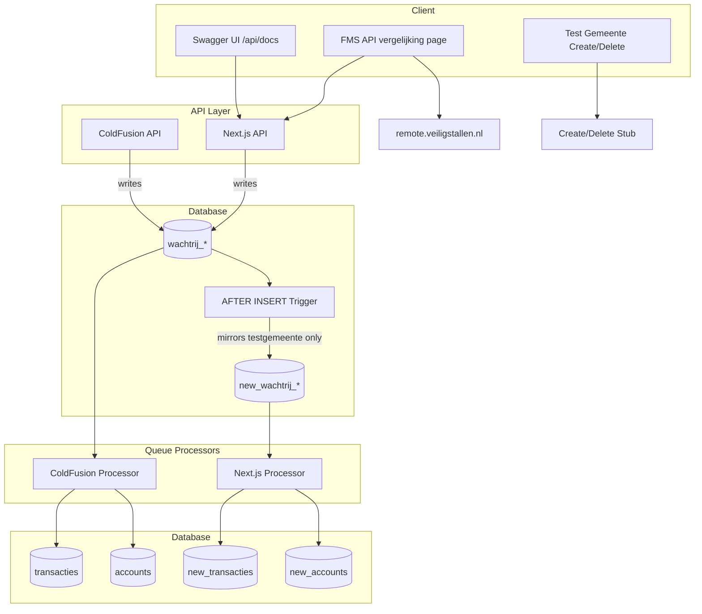
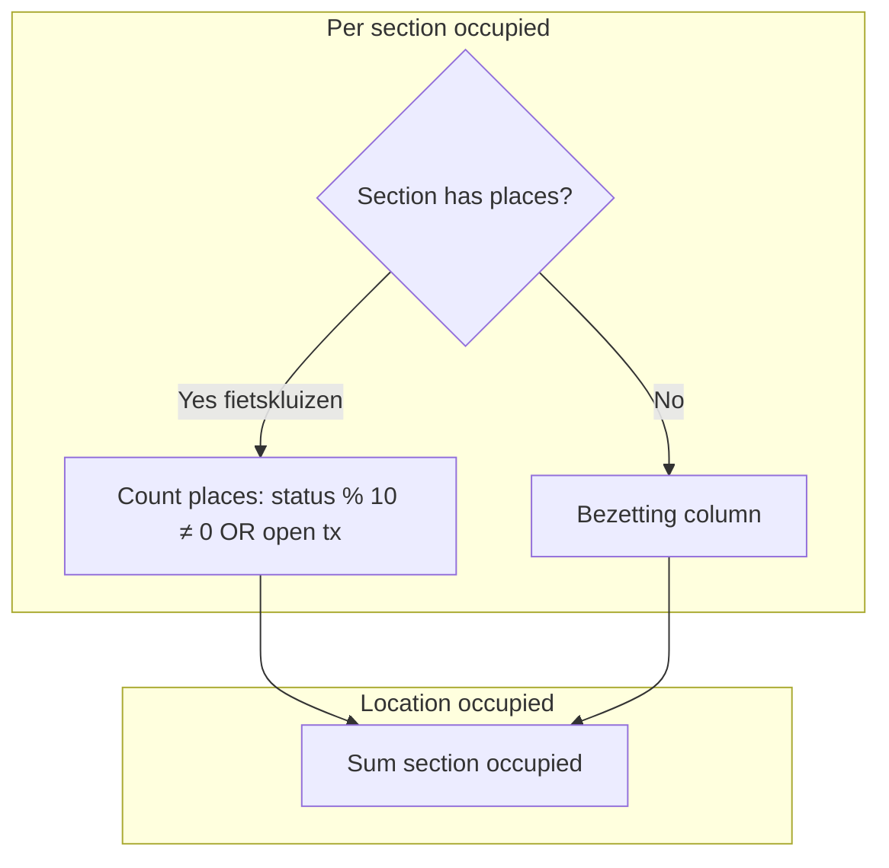
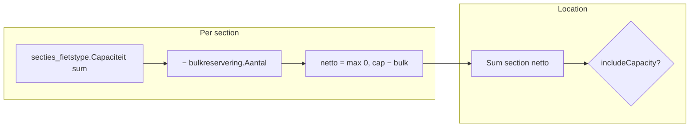
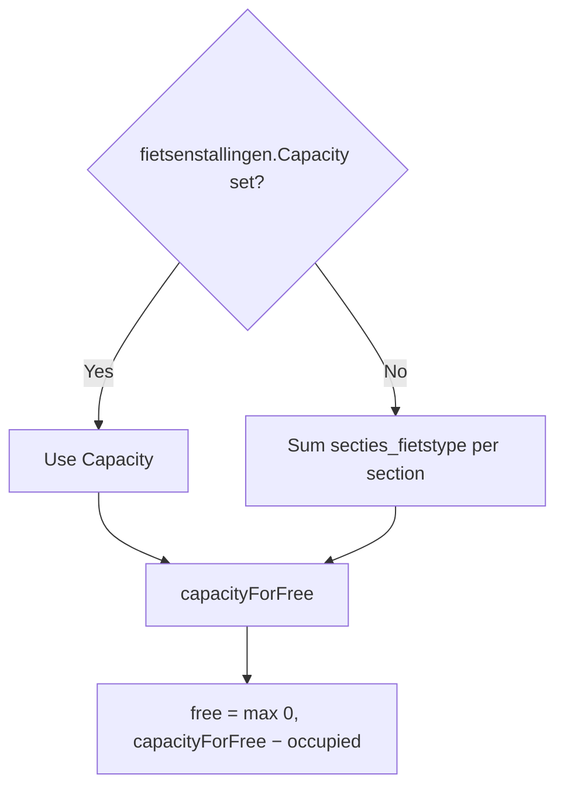
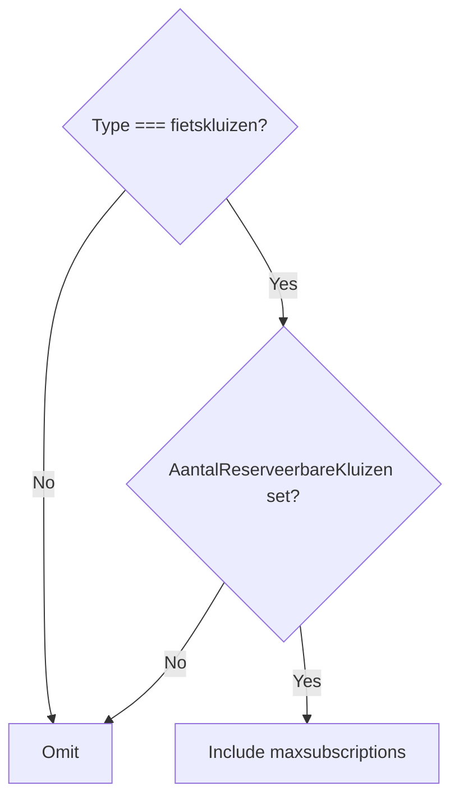
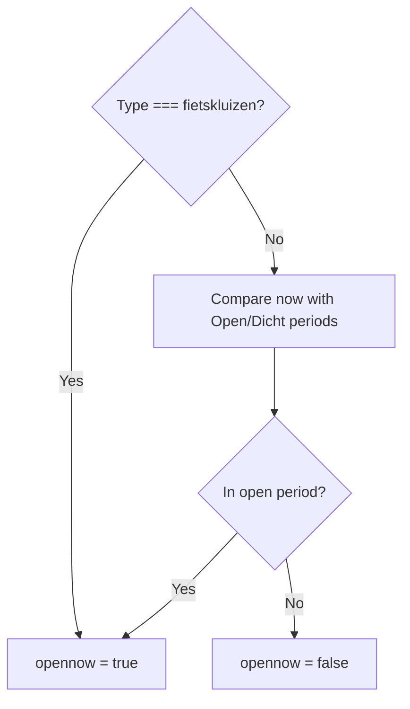

# FMS REST API Next.js Migration and Transaction Processing Plan

**Version:** 2.0  
**Created:** 2026-02  
**Updated:** 2026-02-25  
**Status:** Active – merged from API Porting Plan and FMS API Next.js Migration plan.

---

## Scope

- **REST only** – no SOAP, no legacy FMS V1 API formats
- **New REST design** – FMS operations exposed as REST endpoints (V2 method-based, V3 resource hierarchy)
- **Transaction processing backend** – queue processing and business logic
- **Test environment** – duplicate tables, trigger mirroring, test municipality for safe validation

**Separate plan:** Datastandard and Reporting APIs – see [DATASTANDARD_REPORTING_API_PLAN.md](DATASTANDARD_REPORTING_API_PLAN.md).

---

## Implementation Status

| Area | Status | Notes |
|------|--------|-------|
| **Duplicate tables + triggers** | ✅ Done | Prisma schema, migration, trigger SQL; create/drop via Data API page |
| **Data API page** | ✅ Done | Menu, DataApiComponent, fms-tables API, test-gemeente status/create/delete |
| **Test municipality** | ✅ Done | Create/delete with 7 stallings (config-driven); documenttemplates, contact_report_settings copied from Utrecht |
| **Extract stallings script** | ✅ Done | `scripts/extract-stallings.ts` + config; outputs to generated file |
| **FMS migration** | ✅ Done | `new_wachtrij_*` tables and triggers |
| **FMS v2 read endpoints** | ✅ Done | getServerTime, getJsonBikeTypes, getJsonPaymentTypes, getJsonClientTypes |
| **FMS v2 write endpoints** | ✅ Done | saveJsonBike(s), uploadJsonTransaction(s), addJsonSaldo(s), syncSector |
| **Wachtrij service** | ✅ Done | `src/server/services/fms/wachtrij-service.ts` – inserts into queue tables |
| **Swagger/OpenAPI** | ✅ Done | Spec + UI at `/api/docs` (public); write ops documented |
| **GET comparison page** | ✅ Done | `/test/fms-api-compare` |
| **Queue processor** | ❌ Pending | Process `new_wachtrij_*` → `new_transacties`, `new_accounts`, etc. |
| **fms-table-resolver.ts** | ❌ Pending | Resolve table names for processor |
| **new_webservice_log** | ❌ Pending | Log FMS API calls |
| **Scheduler/cron** | ❌ Pending | Phase 3 – `/api/cron/process-queues` |
| **Business logic services** | ❌ Pending | bikeparkService, transactionService, accountService |
| **Archive process** | ❌ Pending | Daily archive of processed queue records |
| **V3 API** | ✅ Done | citycodes, locations, location/{id}, sections, section/{id}, places, subscriptiontypes. Response structure synced with ColdFusion (see §4.4). |
| **Testing** | ❌ Pending | Unit tests, integration tests |
| **API migration guide** | ❌ Pending | Documentation for clients |

---

## Context

The existing FMS REST API runs on ColdFusion at `https://remote.veiligstallen.nl` with two versions (V1 is not ported):

- **V2**: Method-based URLs, JSON-only (`/v2/REST/{method}/{bikeparkID}/{sectorID}`)
- **V3**: REST hierarchy (`/rest/v3/citycodes/{citycode}/locations/{locationid}/...`)

The Next.js app lives in [fietsberaad-veiligstallen-app/](../) with Prisma, NextAuth, and existing test pages at `/test/*`.

---

## Architecture Overview



---

## 1. Duplicate Tables and Trigger-Based Mirroring

**Status: ✅ Done**

### 1.1 Parallel Flows (Mirror Only, No Delete from wachtrij_*)

Both the ColdFusion and Next.js flows run in parallel. The trigger **mirrors** testgemeente rows to `new_wachtrij_*` but **never deletes** from `wachtrij_*`. This allows comparison of production data with new data after processing.

- **API writes:** Both ColdFusion and Next.js API write to `wachtrij_*` (production queue tables).
- **Trigger:** `AFTER INSERT` on each `wachtrij_*` table. If `bikeparkID` belongs to testgemeente (via `fietsenstallingen.SiteID`), **INSERT** into `new_wachtrij_*`. No DELETE.
- **ColdFusion processor:** Processes `wachtrij_*` (all rows, including testgemeente) → writes to `transacties`, `accounts`, etc.
- **Next.js processor:** Processes `new_wachtrij_*` (testgemeente only) → writes to `new_transacties`, `new_accounts`, etc.
- **Comparison:** Filter production data (`transacties`, `accounts`, …) by testgemeente bike parks vs `new_transacties`, `new_accounts`, … to validate the Next.js implementation.

### 1.2 Tables

*Queue tables (filled by trigger mirror):* `new_wachtrij_transacties`, `new_wachtrij_pasids`, `new_wachtrij_betalingen`, `new_wachtrij_sync`

*Downstream tables (Next.js processor output):* `new_transacties`, `new_transacties_archief`, `new_accounts`, `new_accounts_pasids`, `new_financialtransactions`

**Minimum for test phase: 9 tables** (4 queue + 5 downstream). Migration: `prisma/migrations/20250224000000_add_new_fms_tables/migration.sql`.

### 1.3 Triggers

- **Event:** `AFTER INSERT` on `wachtrij_transacties`, `wachtrij_pasids`, `wachtrij_betalingen`, `wachtrij_sync`
- **Condition:** `bikeparkID` belongs to testgemeente via `fietsenstallingen.SiteID` → `contacts` where `CompanyName = 'testgemeente API'`
- **Action:** `INSERT` into corresponding `new_wachtrij_*` table (same row data)
- **No DELETE** – rows remain in `wachtrij_*` for the ColdFusion processor

Create/drop via Data API page: `POST /api/protected/data-api/fms-tables` with `action: 'create'` or `'drop'`.

---

## 2. Data API Page

**Status: ✅ Done**

**Route:** `/beheer/database/data-api` (DataApiComponent). **Access:** `fietsberaad_superadmin` only.

### Section 1: FMS Test Tabellen (new_* tables) en Triggers

- **Status:** Show whether `new_*` tables and triggers exist
- **Buttons:** "Maak test tabellen", "Maak triggers", "Verwijder test tabellen"

### Section 2: Test API Gemeente

- **Toggle button:** "Maak Test API gemeente" / "Verwijder Test API gemeente" (based on `GET /api/protected/test-gemeente/status`)
- **"Ga naar testgemeente (fietsenstallingen)"** – switches active contact and navigates

---

## 3. Test Municipality "testgemeente API"

**Status: ✅ Done** – create/delete with 7 stallings (bewaakt, buurtstalling, fietskluizen, geautomatiseerd, onbewaakt, fietstrommel, toezicht). Config-driven extraction from Utrecht. documenttemplates and contact_report_settings copied from Utrecht.

**Goal:** Safe environment for PUT/PATCH/DELETE testing.

**Municipality:** `CompanyName = "testgemeente API"` in `contacts` (ItemType = "organizations").

### 3.1 API Endpoints

| Endpoint | Method | Purpose |
|----------|--------|---------|
| `/api/protected/test-gemeente/status` | GET | Check if test municipality exists, return ID |
| `/api/protected/test-gemeente/create` | POST | Create test municipality with stallings, modules, FMS permit |
| `/api/protected/test-gemeente/delete` | POST | Remove test municipality and related data |

### 3.2 Extract Stallings Script

- **Script:** `scripts/extract-stallings.ts`
- **Config:** `scripts/extract-stallings-config.json` – `stallingsCount`, `stallings[]` with `stallingID`, `newstallingname`, `name`
- **Output:** `src/data/stalling-data-by-target.generated.ts` – template data with IDs replaced, titles from config
- **Usage:** `npx tsx scripts/extract-stallings.ts --output src/data/stalling-data-by-target.generated.ts`
- **Docs:** `scripts/README-extract-stallings.md`

### 3.3 Test Gemeente Setup Specification

**Source data:** Use static data from Utrecht.


| Parameter | Value |
|-----------|-------|
| Source contact ID (Utrecht) | `E1991A95-08EF-F11D-FF946CE1AA0578FB` |
| Test gemeente postal code (ZipID) | `9933` |
| Test gemeente gemeentecode | `9933` |
| Stalling placement | Circle of 250 m radius around municipality coords; positions must not overlap |

**StallingsID format:** `9933_001`, `9933_002`, etc. (citycode + 3-digit sequence).

**Stalling coordinates:** Place each of the 7 stallings at a unique point on a 250 m radius circle. Formula for stalling index `i` (0–6):

```
center_lat, center_lon, r = 250  // meters
angle_deg = i * (360 / 7)
angle_rad = angle_deg * π / 180
lat = center_lat + (r / 111320) * cos(angle_rad)
lon = center_lon + (r / (111320 * cos(center_lat * π/180))) * sin(angle_rad)
```

### 3.4 Municipality-Level Configuration

| Order | Configuration | Status |
|-------|---------------|--------|
| 1 | contacts | ✅ Done |
| 2 | user_contact_role | ✅ Done |
| 3 | modules_contacts | ✅ Done |
| 4 | documenttemplates | ✅ Done |
| 5 | contact_report_settings | ✅ Done |
| 6 | instellingen | Optional |
| 7 | fmsservice_permit | ✅ Done |

**User access:** Creating user is added to `user_contact_role`; `security_users_sites` synced for all users with access.

---

## 4. FMS REST API (V2/V3)

**Status: 🔶 Partial** – Read-only and write endpoints done. **V3 open data:** citycodes, locations, location/{id}, sections, section/{id}, places, subscriptiontypes. Response structure synced with ColdFusion (see §4.4). **TODO:** getSectors, getBikes, getSubscriptors, updateLocker, isAllowedToUse (V2); balances, subscriptions, bikeupdates (V3 protected).

**Reference:** [wachtrij-tables-api-methods.md](wachtrij-tables-api-methods.md) – only REST is used; SOAP/CFC remote is deprecated.

**Scope:** Implement only endpoints from ColdFusion REST (`remote/REST/FMSService.cfc`, `remote/REST/v3/fms_service.cfc`). Do not add SOAP-only methods (e.g. `getJsonBikeType`). See [§12.1 REST-only: No SOAP methods](#121-rest-only-no-soap-methods).

### 4.1 Route Structure

```
/api/fms/v2/...          (V2: method-based, JSON-only)
/api/fms/v3/citycodes/... (V3: REST resource hierarchy)
```

**Implementation:** `/api/fms/v2/[[...path]]` – path format: `{method}/{bikeparkID}/{sectionID}`. Write methods require HTTP Basic Auth (operator permit). Service: `src/server/services/fms/wachtrij-service.ts`.

### 4.2 V2 Endpoints

| Operation | Method | Path (v2) | Queue table |
|-----------|--------|-----------|-------------|
| Save bike | POST | `/api/fms/v2/saveJsonBike/{bikeparkID}` | wachtrij_pasids |
| Save bikes (bulk) | POST | `/api/fms/v2/saveJsonBikes/{bikeparkID}` | wachtrij_pasids |
| Upload transaction | POST | `/api/fms/v2/uploadJsonTransaction/{bikeparkID}/{sectionID}` | wachtrij_transacties |
| Upload transactions (bulk) | POST | `/api/fms/v2/uploadJsonTransactions/{bikeparkID}/{sectionID}` | wachtrij_transacties |
| Add balance | POST | `/api/fms/v2/addJsonSaldo/{bikeparkID}` | wachtrij_betalingen |
| Add balances (bulk) | POST | `/api/fms/v2/addJsonSaldos/{bikeparkID}` | wachtrij_betalingen |
| Sync sector | PUT | `/api/fms/v2/syncSector/{bikeparkID}/{sectionID}` | wachtrij_sync |

**Read-only:** getServerTime, getJsonBikeTypes, getJsonPaymentTypes, getJsonClientTypes.

### 4.3 V3 Endpoints

V3 REST hierarchy: citycodes, citycodes/{citycode}, citycodes/{citycode}/locations, citycodes/{citycode}/locations/{locationid}, sections, section/{id}, places, subscriptiontypes.

### 4.4 V3 Response Structure (ColdFusion Compatibility)

The V3 API response structure is synced with the ColdFusion REST API (`BaseRestService.cfc`, `fms_service.cfc`) to ensure identical output for comparison and client compatibility.

| Endpoint | Behaviour |
|----------|-----------|
| **Location (single section)** | Returns `{ sectionid, name, biketypes }` at root – not the full location object (address, capacity, city, etc.). Matches old API. |
| **Location (multi-section)** | Returns full location with `sections` array. Each section in the array has only `sectionid` and `name`; biketypes are not duplicated in sections. |
| **Section (standalone)** | Full section: `sectionid`, `name`, `biketypes`, plus conditional `maxsubscriptions` (fietskluizen), `places` (depth>1), `rates` (hasUniBikeTypePrices). Key order: maxsubscriptions, sectionid, name, biketypes, places, rates. |
| **Section fields** | `capacity`, `occupation`, `free`, `occupationsource` omitted when `fields` param not passed (FMS getSection does not pass fields). |
| **Citycodes locations** | Locations in `citycodes` and `citycodes/{citycode}` omit `exploitantname`, `sections`, `station`, `city`, `address`, `postalcode` to match old API. `citycodes/{citycode}/locations` omits `sections` (sections via separate endpoint). `locations/{id}` keeps full location with sections. |

**Field comparison (ColdFusion vs Next.js):** ColdFusion `getLocation` outputs `thirdpartyreservationsurl` (Bikepark.getThirdPartyReservationsUrl); Next.js does not yet include it. All other location fields aligned.

**Implementation:** `src/server/services/fms/fms-v3-service.ts` – `buildColdFusionLocation`, `toSectionForLocation`, `toSectionOrder`, `getSection`, `getLocation`.

### 4.5 Authentication & Type Safety

- HTTP Basic Auth, integrate with `fmsservice_permit` and `contacts`
- Roles: `operator`, `dataprovider.type1`, `dataprovider.type2`, `admin`
- **Strong typing:** All FMS API methods must be strongly typed. Use Zod for runtime validation. No `as any` or untyped JSON parsing.

**Method reference:** [SERVICES_FMS.md](SERVICES_FMS.md) – method-by-method documentation.

---

## 5. GET Comparison Test Page

**Status: ✅ Done**

**Location:** `src/pages/test/fms-api-compare.tsx`  
**Access:** Restricted to `VSSecurityTopic.fietsberaad_superadmin`.

**Behavior:** List GET endpoints; user selects endpoint and fills parameters; "Compare" fetches from old API (remote.veiligstallen.nl) and new API (localhost); side-by-side JSON diff. Basic Auth from session or env.

### 5.1 Depth Filter

The comparison page includes a **depth** filter (values 1, 2, or 3, default 3) that is passed as `?depth=X` to all V3 API calls. Depth controls how much nested data is returned (e.g. depth≥2 includes sections and places in section responses).

> **Note:** The `fields` parameter is not yet implemented in the new version of the API. See [§5.2 ColdFusion `fields` Parameter](#52-coldfusion-fields-parameter) for how the old API handles it.

### 5.2 ColdFusion `fields` Parameter

The ColdFusion REST API (`fms_service.cfc`, `BaseRestService.cfc`) uses a `fields` query parameter to control which properties are included in responses. The Next.js V3 API does not yet implement this; responses include all fields.

**Parameter binding:** `fields` is declared with `restargsource="query"` and has **no default**. When the client omits `?fields=`, the argument is empty/undefined.

**Decision logic:** Each field is included only when:

1. `arguments.fields eq "*"`, or  
2. The field name is present in the comma-separated `fields` list (e.g. via `ListFindNoCase(arguments.fields, "location.name")`).

**Always-included fields:** There is no explicit configuration. A field is "always included" only if it is assigned without a `fields` check. In the ColdFusion code:

| Response type | Always included |
|---------------|-----------------|
| Location      | `locationid`    |
| City          | `citycode`      |

All other fields (name, lat, long, exploitantname, address, openinghours, services, etc.) are conditional on the `fields` parameter.

**Special case – `subscriptiontypes`:** This field is **never** included when `fields=*`. It must be explicitly requested as `location.subscriptiontypes`. The ColdFusion comment states: "hier moet expliciet om gevraagd worden, dus * voldoet niet" (must be explicitly requested; `*` does not satisfy).

**Field names:** Examples include `location.name`, `location.lat`, `location.long`, `location.openinghours`, `location.services`, `location.exploitantname`, `location.address`, `city.name`, etc. Some accept aliases (e.g. `location.type` for `location.locationtype`).

**Field classification (ColdFusion `BaseRestService.cfc`):**

| Response | Always included | Selectable via `fields` | Explicit only (excluded by `*`) |
|----------|------------------|--------------------------|----------------------------------|
| **City** | `citycode` | `name` (`city.name`) | — |
| **Location** | `locationid` | `name`, `lat`, `long`, `exploitantname`, `exploitantcontact`, `address`, `postalcode`, `city`, `costsdescription`, `thirdpartyreservationsurl`, `description`, `locationtype`, `station`, `occupied`, `free`, `capacity`, `occupationsource`, `openinghours` (incl. `opennow`, `periods`, `extrainfo`), `services`, `sections` | `subscriptiontypes` (`location.subscriptiontypes`) |
| **Section** | `sectionid`, `name`, `biketypes`, `places`, `rates`, `maxsubscriptions` | `capacity`, `occupation`, `free`, `occupationsource` (`section.occupied`, `section.occupation`, etc.) | — |

*Note:* The Section REST endpoint (`getSection`) does not pass `fields` to `BaseRestService.getSection`, so in practice section occupation fields are omitted. The `getSections` endpoint accepts `fields` but does not forward it to `getSection`.

### 5.3 Non-numeric ZipID (citycode) Special Case

**Contacts:** Some contacts use a non-numeric `ZipID` (e.g. NS – `ZipID = "NS"`). The REST path `/{citycode}` passes this as a string.

**ColdFusion behaviour:** `BaseRestService.cfc` declares `citycode` inconsistently:

| Function        | citycode type | Works with non-numeric ZipID? |
|----------------|---------------|-------------------------------|
| getCity        | `string`      | ✓ Yes                         |
| getLocations   | `string`      | ✓ Yes                         |
| getLocation    | `numeric`     | ✗ No – "Cannot cast String [ns] to numeric" |
| getSections    | `numeric`     | ✗ No                          |
| getSection     | (via getLocation) | ✗ No                       |
| getSubscriptionTypes | (via getLocation) | ✗ No                    |

Functions with `type="numeric"` fail before the body runs because ColdFusion tries to cast the argument. `getCouncilByZipID()` and Council's `getZipID()` use strings; the mismatch is only in the argument type declaration.

**Next.js:** All lookups use `ZipID` (string) from `contacts`. Non-numeric citycodes work. Ensure case matches DB (e.g. `contacts.ZipID` may be "NS").

**FMS API compare exception:** Parts of the old API do not work for non-numeric citycodes. For any contact with a non-numeric ZipID, the following endpoints are excluded from the compare with status "Overgeslagen (non-numeric citycode)": `getLocation`, `getSections`, `getSection`, `getPlaces`, `getSubscriptionTypes`. `getCity` and `getLocations` are run normally.

---

## 6. Swagger Documentation

**Status: ✅ Done**

- OpenAPI 3.0 specs in `src/lib/openapi/fms-api.json`
- Swagger UI: `/api/docs` redirects to `/test/fms-api-docs` (public)
- Spec served at `/api/openapi/fms-api` (public)
- Write operations documented (Bike, Transaction, Saldo, SyncSector, Result schemas)

**Source of truth:** [FMSservice-rest_v3.0.4.pdf](../documentatie-crow/1-api/FMSservice-rest_v3.0.4.pdf)

---

## 7. Transaction Processing Backend (Phase 3)

**Status: ❌ Pending**

**Location:** `/src/server/services/queue/processor.ts`

| Queue | Batch size | Logic |
|-------|------------|-------|
| wachtrij_pasids | 50 | Link bikes to passes |
| wachtrij_transacties | 50 | 3-step locking, create transactions |
| wachtrij_betalingen | 200 | Update account balances |
| wachtrij_sync | 1 | Sector sync |

**ColdFusion:** `processTransactions2.cfm` runs every 61s. Processing order: wachtrij_pasids → wachtrij_transacties → wachtrij_betalingen → wachtrij_sync.

**Next.js processor (test phase):** Processes `new_wachtrij_*` (testgemeente only) → writes to `new_transacties`, `new_accounts`, etc. Both flows run; compare production data (filtered by testgemeente) with `new_*` data to validate.

**Reference:** [stroomdiagram-stallingstransacties_v2.md](stroomdiagram-stallingstransacties_v2.md), [wachtrij-transactie-processing-stappen.md](wachtrij-transactie-processing-stappen.md).

### 7.1 Transaction Flow

**Check-In:** Validate bikepark, section, passID → check for open transaction → create `transacties` → update `accounts_pasids`.

**Check-Out:** Find open transaction → calculate Stallingsduur/Stallingskosten → update account balance, create `financialtransactions` → update `transacties` → update `accounts_pasids`.

**Special cases:** Sync transactions, overlap (force checkout), locker transactions.

### 7.2 Scheduler & Archive

- Endpoint: `/api/cron/process-queues` (callable via cron)
- Error handling, email alerts for financial errors
- Archive: Daily `wachtrij_*_archive{yyyymmdd}`

---

## 8. API Specification Details (from FMSservice-rest_v3.0.4.pdf)

### 8.1 Datatypes and Enums

| Property | Values | Notes |
|----------|--------|-------|
| biketypeid | 1–6 | 1=fiets, 2=bromfiets, 3=speciaal, 4=elektrisch, 5=motor, 6=mindervaliden |
| idtype | 0–4 | 0=barcode, 1=ov-chipkaart, 2=cijfercode, 3=tijdelijk ov, 4=tijdelijk barcode |
| typecheck | user, controle, reservation | |
| type | in, out | |
| paymenttypeid | 1–2 | 1=betaald, 2=kwijtschelding |
| locationtypeid | 1–7 | Maps to fietsenstallingtypen |
| statuscode | 0–4 | 0=vrij, 1=bezet, 2=abonnement, 3=gereserveerd, 4=buiten werking |

**Timestamp formats:** `yyyy-mm-dd hh:mm:ss` or ISO 8601.

### 8.2 ID Conventions

- **citycode:** 4 digits (postcode)
- **locationid (StallingsID):** `citycode_001` (3-digit). Globally unique; Prisma schema has `@unique(map: "idxstallingsid")` on `fietsenstallingen`. Lookups use locationid only (no citycode).
- **sectionid:** `citycode_001_1`
- **placeid:** integer

### 8.3 Roles (map to fmsservice_permit)

| Role | Permissions |
|------|-------------|
| Dataleverancier#1 | Transactions, sync, bike updates (read/write) |
| Dataleverancier#2 | Occupation data, completed transactions |
| Operator | All protected read/write |

**Open data:** No auth for citycodes, locations, sections, places.

---

## 9. Key Files

| File | Status | Purpose |
|------|--------|---------|
| `prisma/migrations/20250224000000_add_new_fms_tables/` | ✅ | 9 new_* tables + trigger SQL |
| `src/server/services/fms/wachtrij-service.ts` | ✅ | Insert into queue tables |
| `src/server/utils/fms-table-resolver.ts` | ⏳ | Resolve table names for processor |
| `src/pages/api/fms/v2/[[...path]].ts` | ✅ | V2 routes (read + write ops done) |
| `src/pages/api/fms/v3/citycodes/[[...path]].ts` | ✅ | V3 routes (citycodes, locations, sections, places, subscriptiontypes) |
| `src/pages/test/fms-api-compare.tsx` | ✅ | GET comparison UI |
| `src/lib/openapi/fms-api.json` | ✅ | OpenAPI 3.0 spec |
| `src/pages/test/fms-api-docs.tsx` | ✅ | Swagger UI |
| `src/components/beheer/database/DataApiComponent.tsx` | ✅ | Data API page |
| `src/pages/api/protected/data-api/fms-tables.ts` | ✅ | Create/drop new_* tables and triggers |
| `src/pages/api/protected/test-gemeente/status.ts` | ✅ | Check if test municipality exists |
| `src/pages/api/protected/test-gemeente/create.ts` | ✅ | Create (7 stallings, documenttemplates, contact_report_settings) |
| `src/pages/api/protected/test-gemeente/delete.ts` | ✅ | Delete test municipality |

---

## 10. Implementation Order

1. ~~Duplicate tables + triggers~~ ✅
2. ~~Data API page~~ ✅
3. ~~FMS services (read + write)~~ ✅
4. ~~GET comparison page~~ ✅
5. ~~Swagger~~ ✅
6. Phase 3 – Transaction processing (queue processor)
7. ~~documenttemplates, contact_report_settings for test municipality~~ ✅
8. ~~V3 open data endpoints~~ ✅ (locations, sections, places, subscriptiontypes)
9. Testing
10. API migration guide
11. **TODO:** Update V3 `exploitantcontact` to match Contact beheerder form logic (HelpdeskHandmatigIngesteld, exploitant Helpdesk, site Helpdesk). Currently uses BeheerderContact only for ColdFusion compatibility.
12. ~~**TODO:** Align V3 `occupied`/`capacity`/`free` with ColdFusion~~ ✅ Done. See [OCCUPIED_CAPACITY_COMPARISON.md](OCCUPIED_CAPACITY_COMPARISON.md).
13. **TODO:** Resolve count differences between old and new API for `citycodes/{citycode}` and for `citycodes/{citycode}/locations` (old vs new, not between the two endpoints). Suspected cause: records in the `wachtrij` table affecting occupied/capacity/free calculations. To investigate and fix later.

---

## 11. Key References

| Document | Purpose |
|----------|---------|
| [SERVICES_FMS.md](SERVICES_FMS.md) | FMS API behaviour (ColdFusion reference) |
| [DATASTANDARD_REPORTING_API_PLAN.md](DATASTANDARD_REPORTING_API_PLAN.md) | Datastandard and Reporting APIs (separate plan) |
| [wachtrij-tables-api-methods.md](wachtrij-tables-api-methods.md) | Which REST methods write to queue tables |
| [wachtrij-transactie-processing-stappen.md](wachtrij-transactie-processing-stappen.md) | Queue processing steps |
| [stroomdiagram-stallingstransacties_v2.md](stroomdiagram-stallingstransacties_v2.md) | Transaction flow diagram |
| [FMSservice-rest_v3.0.4.pdf](../documentatie-crow/1-api/FMSservice-rest_v3.0.4.pdf) | Official CROW FMS REST API v3 documentation |
| `scripts/README-extract-stallings.md` | Extract stallings for test municipality |

---

## 12. Decisions and Constraints

### 12.1 REST-only: No SOAP methods

**Source of truth for endpoints:** ColdFusion REST API only – `remote/REST/FMSService.cfc` (V2) and `remote/REST/v3/fms_service.cfc` (V3). Do **not** port methods from SOAP/CFC services (`remote/v1/FMSService.cfc`, `remote/v2/FMSService.cfc`).

**Methods to NOT implement** (exist in SOAP/CFC but not in REST):

| Method | Reason |
|--------|--------|
| `getJsonBikeType/{bikeTypeID}` | REST has only `getBikeTypes` (plural), no single-by-ID |
| `getBikeType` (deprecated) | Same – REST has no single bike type endpoint |

**Before adding any new endpoint:** Verify it exists in `remote/REST/FMSService.cfc` or `remote/REST/v3/fms_service.cfc`. If it only exists in `remote/v1/` or `remote/v2/` (SOAP/CFC), do not add it.

### 12.2 Other constraints

- **Mirror only, no delete:** The trigger copies testgemeente rows from `wachtrij_*` to `new_wachtrij_*` but never deletes from `wachtrij_*`. Both ColdFusion and Next.js processors run in parallel; compare results afterwards.
- **Queue processor:** Next.js processor reads from `new_wachtrij_*`, writes to `new_transacties`, `new_accounts`, etc. ColdFusion processor continues to process `wachtrij_*` as normal.
- **FMS base path:** Existing clients will be updated once development is complete. No proxy/rewrite required.
- **Test gemeente stub:** Create `fmsservice_permit` entry for the test municipality so API calls can authenticate.
- **GET comparison page:** Access restricted to `VSSecurityTopic.fietsberaad_superadmin`.
- **Logging:** Create `webservice_log` table with the same suffix (e.g. `new_webservice_log` when suffix is `_new`). Log FMS API calls there.
- **Phased implementation:** Reuse code between V2 and V3 as much as possible. SOAP implementation is **not** ported.
- **ColdFusion REST API** remains the behavioural reference.

---

## 13. V3 Citycodes Caching

**Endpoint:** `GET /v3/citycodes/{citycode}` (single city with locations)

**Implementation:** `src/server/services/fms/fms-v3-service.ts`

In-memory cache for `getCity(citycode)` to improve response time (ColdFusion achieves ~1s; Next.js uncached can take 30+ seconds due to multiple DB round trips).

| Setting | Value | Behaviour |
|---------|-------|-----------|
| `CACHE_CITYCODES_DURATION_MINUTES` | `0` in development | No caching; every request hits the database. Use for dev/testing. |
| `CACHE_CITYCODES_DURATION_MINUTES` | `30` in production | Cache TTL 30 minutes (matches ColdFusion getCities). Subsequent requests within TTL return from memory. |

**Logic:** `process.env.NODE_ENV === "development" ? 0 : 30`

**Cache key:** `citycode` + `depth` (query param)

**Cached versions may have different fields than the request:** The cache stores the full response for a given `(citycode, depth)`. A subsequent request with different query parameters (e.g. `fields`) within the TTL will receive the cached response, which may include or omit fields based on the **first** request that populated the cache, not the current request. ColdFusion behaves similarly: its `getCities` cache is built with whatever `fields` value the first request had (see `docs/analyse-motorblok/OPENINGHOURS_CITYCODES_COLDFUSION.md`).

**ColdFusion reference:** `fms_service.cfc` caches `getCities` (all citycodes) for 30 minutes in `application.citycodes`. The single-city endpoint `getCity` is **not** cached in ColdFusion.

---

## 14. Accepted Differences (FMS API Compare)

The FMS API compare page (`/test/fms-api-compare`) has an **Instellingen** tab with the option **"Dynamische verschillen toestaan"** and **maxverschil**. This filters out small occupied/free differences before comparison.

### Dynamic occupied/free differences (buurtstallingen)

**Symptom:** Off-by-one differences in `occupied` and `free` between old and new API, typically only for **buurtstallingen** (locations without physical locker places). Example: Old 263/96 vs New 262/97.

**Cause: Caching.** Both APIs read `fietsenstalling_sectie.Bezetting`, which is updated by the `resetOccupations` cronjob every ~5 minutes. The ColdFusion REST API uses ORM (Hibernate) entity caching: when a Bikepark/section is loaded, it may be served from cache on subsequent requests. The new API does a fresh Prisma query each time. As a result, one API can return a cached (stale) `Bezetting` while the other returns the latest value. The difference is dynamic: re-running the test after a short while often yields identical results once caches expire.

**Accepted:** When the difference is within maxverschil and totals to 0 (e.g. occupied +1, free -1), the compare page can treat these as identical via the "Dynamische verschillen toestaan" setting.

---

## Appendix A: Dynamic and Conditional Parameters

This appendix documents how dynamic parameters (occupation, free, capacity, etc.) and parameters that depend on conditions are calculated. Reference: `fms-v3-service.ts`, `OCCUPIED_CAPACITY_FLOW.md`, `OCCUPIED_CAPACITY_COMPARISON.md`.

---

### A.1 Occupation (occupied)

**Scope:** Location-level (always in response); section-level (only when `fields` includes occupation; FMS getSection does not pass fields, so typically omitted).

**Calculation:** Sum over all sections of the location.

| Section type | Source |
|-------------|--------|
| **Non-locker** (buurtstalling, bewaakt, etc.) | `fietsenstalling_sectie.Bezetting` |
| **Fietskluizen** (lockers) | Count of places where `place.status % 10 !== 0` OR (place has no status AND open transaction exists for that PlaceID) |

**Bezetting update:** The `Bezetting` column is updated by the `resetOccupations` cronjob (~5 min):

```
Bezetting = occupation + wachtrij_in - wachtrij_uit
```

- `occupation` = open transacties (`transacties` met `Date_checkout IS NULL`)
- `wachtrij_in` = `wachtrij_transacties` met `processed IN (0,8,9)` en `type = 'in'`
- `wachtrij_uit` = idem voor `type = 'uit'`

Only sections with `BronBezettingsdata = 'FMS'` are updated.



---

### A.2 Capacity

**Scope:** Location-level (only when `includeCapacity`); section-level (when `fields` includes capacity).

**Calculation:**

1. **Per section:** Sum of `secties_fietstype.Capaciteit` over all section bike types (no Toegestaan filter).
2. **Bulkreservations:** Subtract `bulkreservering.Aantal` when a bulk reservation exists for today:
   - `Startdatumtijd` date = today
   - `Einddatumtijd` >= now
   - Not in `bulkreserveringuitzondering` for today
3. **Location capacity:** Sum of section netto capacities (`max(0, sectionCapacity - bulk)`).
4. **includeCapacity:** `capacity` is included in response only when `totalCapacityRaw > 0` OR `fietsenstallingen.Capacity > 0`.



---

### A.3 Free

**Scope:** Location-level (always); section-level (when `fields` includes free).

**Calculation:**

```
free = max(0, capacityForFree − occupied)
```

**capacityForFree** (used only for free, not for `capacity` field):

- If `fietsenstallingen.Capacity` is set and > 0 → use it
- Else → sum of `secties_fietstype.Capaciteit` per section (raw, no bulk subtraction)



---

### A.4 Occupationsource

**Scope:** Location-level (always).

**Calculation:** `fietsenstallingen.BronBezettingsdata ?? "FMS"`

Static per location; indicates the source of occupation data (FMS vs external).

---

### A.5 Maxsubscriptions

**Scope:** Section-level (conditional).

**Condition:** Included only when `fietsenstallingen.Type === "fietskluizen"` AND `AantalReserveerbareKluizen` is not null.

**Value:** `fietsenstallingen.AantalReserveerbareKluizen`



---

### A.6 Section biketype capacity

**Scope:** Per biketype in section `biketypes` array.

**Condition:** Included only when `sectie_fietstype.Toegestaan === true` AND `sectie_fietstype.Capaciteit > 0`.

**Value:** `sectie_fietstype.Capaciteit`

*Note:* For location-level capacity/free/occupied, Toegestaan is **not** used; all section bike types are summed. Toegestaan only affects whether capacity is shown per biketype in the section response.

---

### A.7 Place statuscode

**Scope:** Per place in section `places` (when depth > 1 and section has places).

**Calculation:** `statuscode = (fietsenstalling_plek.status ?? 0) % 10`

| statuscode | Meaning |
|------------|---------|
| 0 | vrij |
| 1 | bezet |
| 2 | abonnement |
| 3 | gereserveerd |
| 4 | buiten werking |

---

### A.8 Place datelaststatusupdate

**Scope:** Per place (conditional).

**Condition:** Included only when `fietsenstalling_plek.dateLastStatusUpdate` is not null.

**Value:** ISO 8601 format `YYYY-MM-DDTHH:mm:ss` (first 19 chars).

---

### A.9 Opennow (openinghours)

**Scope:** Location `openinghours.opennow`.

**Calculation:** Derived from opening hours and current time:

- **Fietskluizen:** Always `true` (24/7).
- **Other types:** Compare current day/time with `Open_*`/`Dicht_*` periods. `opennow = true` when current time falls within an open period (including overnight spans).



---

### A.10 Include capacity (conditional field)

**Scope:** Location-level `capacity` field.

**Condition:** `capacity` is included in the response only when:

- Sum of `secties_fietstype.Capaciteit` over all sections > 0, OR
- `fietsenstallingen.Capacity` is set and > 0

ColdFusion: `capacity` only when `bikepark.getCapacity() > 0`.

