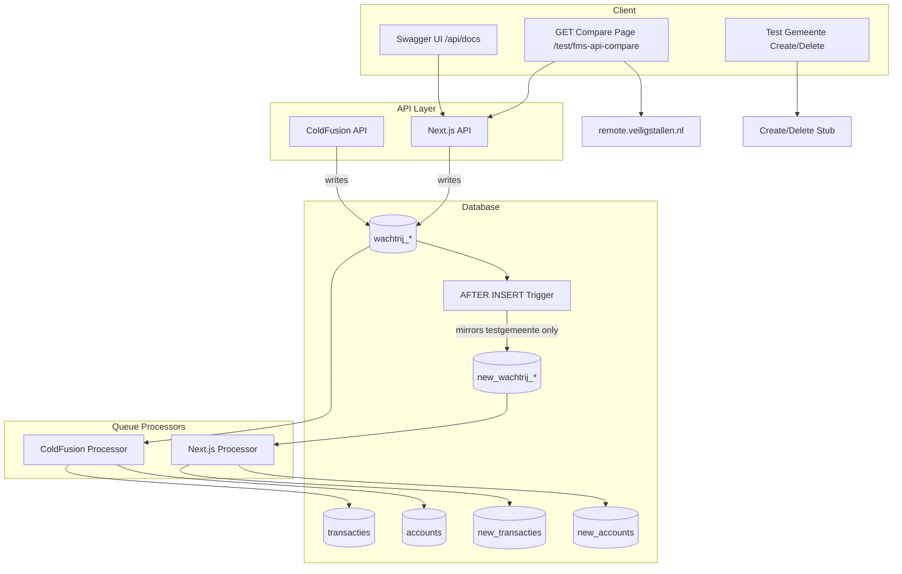

# FMS REST API Next.js Migration and Transaction Processing Plan

**Version:** 2.0  
**Created:** 2026-02  
**Updated:** 2026-02-25  
**Status:** Active – merged from API Porting Plan and FMS API Next.js Migration plan.

---

## Scope

- **REST only** – no SOAP, no legacy FMS V1 API formats
- **New REST design** – FMS operations exposed as REST endpoints (V2 method-based, V3 resource hierarchy)
- **Transaction processing backend** – queue processing and business logic
- **Test environment** – duplicate tables, trigger mirroring, test municipality for safe validation

**Separate plan:** Datastandard and Reporting APIs – see [DATASTANDARD_REPORTING_API_PLAN.md](DATASTANDARD_REPORTING_API_PLAN.md).

---

## Implementation Status

| Area | Status | Notes |
|------|--------|-------|
| **Duplicate tables + triggers** | ✅ Done | Prisma schema, migration, trigger SQL; create/drop via Data API page |
| **Data API page** | ✅ Done | Menu, DataApiComponent, fms-tables API, test-gemeente status/create/delete |
| **Test municipality** | ✅ Done | Create/delete with 7 stallings (config-driven); documenttemplates, contact_report_settings copied from Utrecht |
| **Extract stallings script** | ✅ Done | `scripts/extract-stallings.ts` + config; outputs to generated file |
| **FMS migration** | ✅ Done | `new_wachtrij_*` tables and triggers |
| **FMS v2 read endpoints** | ✅ Done | getServerTime, getJsonBikeTypes, getJsonPaymentTypes, getJsonClientTypes |
| **FMS v2 write endpoints** | ✅ Done | saveJsonBike(s), uploadJsonTransaction(s), addJsonSaldo(s), syncSector |
| **Wachtrij service** | ✅ Done | `src/server/services/fms/wachtrij-service.ts` – inserts into queue tables |
| **Swagger/OpenAPI** | ✅ Done | Spec + UI at `/api/docs` (public); write ops documented |
| **GET comparison page** | ✅ Done | `/test/fms-api-compare` |
| **Queue processor** | ❌ Pending | Process `new_wachtrij_*` → `new_transacties`, `new_accounts`, etc. |
| **fms-table-resolver.ts** | ❌ Pending | Resolve table names for processor |
| **new_webservice_log** | ❌ Pending | Log FMS API calls |
| **Scheduler/cron** | ❌ Pending | Phase 3 – `/api/cron/process-queues` |
| **Business logic services** | ❌ Pending | bikeparkService, transactionService, accountService |
| **Archive process** | ❌ Pending | Daily archive of processed queue records |
| **V3 API** | ✅ Done | citycodes, locations, location/{id}, sections, section/{id}, places, subscriptiontypes. Response structure synced with ColdFusion (see §4.4). |
| **Testing** | ❌ Pending | Unit tests, integration tests |
| **API migration guide** | ❌ Pending | Documentation for clients |

---

## Context

The existing FMS REST API runs on ColdFusion at `https://remote.veiligstallen.nl` with two versions (V1 is not ported):

- **V2**: Method-based URLs, JSON-only (`/v2/REST/{method}/{bikeparkID}/{sectorID}`)
- **V3**: REST hierarchy (`/rest/v3/citycodes/{citycode}/locations/{locationid}/...`)

The Next.js app lives in [fietsberaad-veiligstallen-app/](../) with Prisma, NextAuth, and existing test pages at `/test/*`.

---

## Architecture Overview



---

## 1. Duplicate Tables and Trigger-Based Mirroring

**Status: ✅ Done**

### 1.1 Parallel Flows (Mirror Only, No Delete from wachtrij_*)

Both the ColdFusion and Next.js flows run in parallel. The trigger **mirrors** testgemeente rows to `new_wachtrij_*` but **never deletes** from `wachtrij_*`. This allows comparison of production data with new data after processing.

- **API writes:** Both ColdFusion and Next.js API write to `wachtrij_*` (production queue tables).
- **Trigger:** `AFTER INSERT` on each `wachtrij_*` table. If `bikeparkID` belongs to testgemeente (via `fietsenstallingen.SiteID`), **INSERT** into `new_wachtrij_*`. No DELETE.
- **ColdFusion processor:** Processes `wachtrij_*` (all rows, including testgemeente) → writes to `transacties`, `accounts`, etc.
- **Next.js processor:** Processes `new_wachtrij_*` (testgemeente only) → writes to `new_transacties`, `new_accounts`, etc.
- **Comparison:** Filter production data (`transacties`, `accounts`, …) by testgemeente bike parks vs `new_transacties`, `new_accounts`, … to validate the Next.js implementation.

### 1.2 Tables

*Queue tables (filled by trigger mirror):* `new_wachtrij_transacties`, `new_wachtrij_pasids`, `new_wachtrij_betalingen`, `new_wachtrij_sync`

*Downstream tables (Next.js processor output):* `new_transacties`, `new_transacties_archief`, `new_accounts`, `new_accounts_pasids`, `new_financialtransactions`

**Minimum for test phase: 9 tables** (4 queue + 5 downstream). Migration: `prisma/migrations/20250224000000_add_new_fms_tables/migration.sql`.

### 1.3 Triggers

- **Event:** `AFTER INSERT` on `wachtrij_transacties`, `wachtrij_pasids`, `wachtrij_betalingen`, `wachtrij_sync`
- **Condition:** `bikeparkID` belongs to testgemeente via `fietsenstallingen.SiteID` → `contacts` where `CompanyName = 'testgemeente API'`
- **Action:** `INSERT` into corresponding `new_wachtrij_*` table (same row data)
- **No DELETE** – rows remain in `wachtrij_*` for the ColdFusion processor

Create/drop via Data API page: `POST /api/protected/data-api/fms-tables` with `action: 'create'` or `'drop'`.

---

## 2. Data API Page

**Status: ✅ Done**

**Route:** `/beheer/database/data-api` (DataApiComponent). **Access:** `fietsberaad_superadmin` only.

### Section 1: FMS Test Tabellen (new_* tables) en Triggers

- **Status:** Show whether `new_*` tables and triggers exist
- **Buttons:** "Maak test tabellen", "Maak triggers", "Verwijder test tabellen"

### Section 2: Test API Gemeente

- **Toggle button:** "Maak Test API gemeente" / "Verwijder Test API gemeente" (based on `GET /api/protected/test-gemeente/status`)
- **"Ga naar testgemeente (fietsenstallingen)"** – switches active contact and navigates

---

## 3. Test Municipality "testgemeente API"

**Status: ✅ Done** – create/delete with 7 stallings (bewaakt, buurtstalling, fietskluizen, geautomatiseerd, onbewaakt, fietstrommel, toezicht). Config-driven extraction from Utrecht. documenttemplates and contact_report_settings copied from Utrecht.

**Goal:** Safe environment for PUT/PATCH/DELETE testing.

**Municipality:** `CompanyName = "testgemeente API"` in `contacts` (ItemType = "organizations").

### 3.1 API Endpoints

| Endpoint | Method | Purpose |
|----------|--------|---------|
| `/api/protected/test-gemeente/status` | GET | Check if test municipality exists, return ID |
| `/api/protected/test-gemeente/create` | POST | Create test municipality with stallings, modules, FMS permit |
| `/api/protected/test-gemeente/delete` | POST | Remove test municipality and related data |

### 3.2 Extract Stallings Script

- **Script:** `scripts/extract-stallings.ts`
- **Config:** `scripts/extract-stallings-config.json` – `stallingsCount`, `stallings[]` with `stallingID`, `newstallingname`, `name`
- **Output:** `src/data/stalling-data-by-target.generated.ts` – template data with IDs replaced, titles from config
- **Usage:** `npx tsx scripts/extract-stallings.ts --output src/data/stalling-data-by-target.generated.ts`
- **Docs:** `scripts/README-extract-stallings.md`

### 3.3 Test Gemeente Setup Specification

**Source data:** Use static data from Utrecht.


| Parameter | Value |
|-----------|-------|
| Source contact ID (Utrecht) | `E1991A95-08EF-F11D-FF946CE1AA0578FB` |
| Test gemeente postal code (ZipID) | `9933` |
| Test gemeente gemeentecode | `9933` |
| Stalling placement | Circle of 250 m radius around municipality coords; positions must not overlap |

**StallingsID format:** `9933_001`, `9933_002`, etc. (citycode + 3-digit sequence).

**Stalling coordinates:** Place each of the 7 stallings at a unique point on a 250 m radius circle. Formula for stalling index `i` (0–6):

```
center_lat, center_lon, r = 250  // meters
angle_deg = i * (360 / 7)
angle_rad = angle_deg * π / 180
lat = center_lat + (r / 111320) * cos(angle_rad)
lon = center_lon + (r / (111320 * cos(center_lat * π/180))) * sin(angle_rad)
```

### 3.4 Municipality-Level Configuration

| Order | Configuration | Status |
|-------|---------------|--------|
| 1 | contacts | ✅ Done |
| 2 | user_contact_role | ✅ Done |
| 3 | modules_contacts | ✅ Done |
| 4 | documenttemplates | ✅ Done |
| 5 | contact_report_settings | ✅ Done |
| 6 | instellingen | Optional |
| 7 | fmsservice_permit | ✅ Done |

**User access:** Creating user is added to `user_contact_role`; `security_users_sites` synced for all users with access.

---

## 4. FMS REST API (V2/V3)

**Status: 🔶 Partial** – Read-only and write endpoints done. **V3 open data:** citycodes, locations, location/{id}, sections, section/{id}, places, subscriptiontypes. Response structure synced with ColdFusion (see §4.4). **TODO:** getSectors, getBikes, getSubscriptors, updateLocker, isAllowedToUse (V2); balances, subscriptions, bikeupdates (V3 protected).

**Reference:** [wachtrij-tables-api-methods.md](wachtrij-tables-api-methods.md) – only REST is used; SOAP/CFC remote is deprecated.

**Scope:** Implement only endpoints from ColdFusion REST (`remote/REST/FMSService.cfc`, `remote/REST/v3/fms_service.cfc`). Do not add SOAP-only methods (e.g. `getJsonBikeType`). See [§12.1 REST-only: No SOAP methods](#121-rest-only-no-soap-methods).

### 4.1 Route Structure

```
/api/fms/v2/...          (V2: method-based, JSON-only)
/api/fms/v3/citycodes/... (V3: REST resource hierarchy)
```

**Implementation:** `/api/fms/v2/[[...path]]` – path format: `{method}/{bikeparkID}/{sectionID}`. Write methods require HTTP Basic Auth (operator permit). Service: `src/server/services/fms/wachtrij-service.ts`.

### 4.2 V2 Endpoints

| Operation | Method | Path (v2) | Queue table |
|-----------|--------|-----------|-------------|
| Save bike | POST | `/api/fms/v2/saveJsonBike/{bikeparkID}` | wachtrij_pasids |
| Save bikes (bulk) | POST | `/api/fms/v2/saveJsonBikes/{bikeparkID}` | wachtrij_pasids |
| Upload transaction | POST | `/api/fms/v2/uploadJsonTransaction/{bikeparkID}/{sectionID}` | wachtrij_transacties |
| Upload transactions (bulk) | POST | `/api/fms/v2/uploadJsonTransactions/{bikeparkID}/{sectionID}` | wachtrij_transacties |
| Add balance | POST | `/api/fms/v2/addJsonSaldo/{bikeparkID}` | wachtrij_betalingen |
| Add balances (bulk) | POST | `/api/fms/v2/addJsonSaldos/{bikeparkID}` | wachtrij_betalingen |
| Sync sector | PUT | `/api/fms/v2/syncSector/{bikeparkID}/{sectionID}` | wachtrij_sync |

**Read-only:** getServerTime, getJsonBikeTypes, getJsonPaymentTypes, getJsonClientTypes.

### 4.4 V3 Response Structure (ColdFusion Compatibility)

The V3 API response structure is synced with the ColdFusion REST API (`BaseRestService.cfc`, `fms_service.cfc`) to ensure identical output for comparison and client compatibility.

| Endpoint | Behaviour |
|----------|-----------|
| **Location (single section)** | Returns `{ sectionid, name, biketypes }` at root – not the full location object (address, capacity, city, etc.). Matches old API. |
| **Location (multi-section)** | Returns full location with `sections` array. Each section in the array has only `sectionid` and `name`; biketypes are not duplicated in sections. |
| **Section (standalone)** | Full section: `sectionid`, `name`, `biketypes`, plus conditional `maxsubscriptions` (fietskluizen), `places` (depth>1), `rates` (hasUniBikeTypePrices). Key order: maxsubscriptions, sectionid, name, biketypes, places, rates. |
| **Section fields** | `capacity`, `occupation`, `free`, `occupationsource` omitted when `fields` param not passed (FMS getSection does not pass fields). |

**Implementation:** `src/server/services/fms/fms-v3-service.ts` – `buildColdFusionLocation`, `toSectionForLocation`, `toSectionOrder`, `getSection`, `getLocation`.

### 4.5 Authentication & Type Safety

- HTTP Basic Auth, integrate with `fmsservice_permit` and `contacts`
- Roles: `operator`, `dataprovider.type1`, `dataprovider.type2`, `admin`
- **Strong typing:** All FMS API methods must be strongly typed. Use Zod for runtime validation. No `as any` or untyped JSON parsing.

**Method reference:** [SERVICES_FMS.md](SERVICES_FMS.md) – method-by-method documentation.

---

## 5. GET Comparison Test Page

**Status: ✅ Done**

**Location:** `src/pages/test/fms-api-compare.tsx`  
**Access:** Restricted to `VSSecurityTopic.fietsberaad_superadmin`.

**Behavior:** List GET endpoints; user selects endpoint and fills parameters; "Compare" fetches from old API (remote.veiligstallen.nl) and new API (localhost); side-by-side JSON diff. Basic Auth from session or env.

---

## 6. Swagger Documentation

**Status: ✅ Done**

- OpenAPI 3.0 specs in `src/lib/openapi/fms-api.json`
- Swagger UI: `/api/docs` redirects to `/test/fms-api-docs` (public)
- Spec served at `/api/openapi/fms-api` (public)
- Write operations documented (Bike, Transaction, Saldo, SyncSector, Result schemas)

**Source of truth:** [FMSservice-rest_v3.0.4.pdf](../documentatie-crow/1-api/FMSservice-rest_v3.0.4.pdf)

---

## 7. Transaction Processing Backend (Phase 3)

**Status: ❌ Pending**

**Location:** `/src/server/services/queue/processor.ts`

| Queue | Batch size | Logic |
|-------|------------|-------|
| wachtrij_pasids | 50 | Link bikes to passes |
| wachtrij_transacties | 50 | 3-step locking, create transactions |
| wachtrij_betalingen | 200 | Update account balances |
| wachtrij_sync | 1 | Sector sync |

**ColdFusion:** `processTransactions2.cfm` runs every 61s. Processing order: wachtrij_pasids → wachtrij_transacties → wachtrij_betalingen → wachtrij_sync.

**Next.js processor (test phase):** Processes `new_wachtrij_*` (testgemeente only) → writes to `new_transacties`, `new_accounts`, etc. Both flows run; compare production data (filtered by testgemeente) with `new_*` data to validate.

**Reference:** [stroomdiagram-stallingstransacties_v2.md](stroomdiagram-stallingstransacties_v2.md), [wachtrij-transactie-processing-stappen.md](wachtrij-transactie-processing-stappen.md).

### 7.1 Transaction Flow

**Check-In:** Validate bikepark, section, passID → check for open transaction → create `transacties` → update `accounts_pasids`.

**Check-Out:** Find open transaction → calculate Stallingsduur/Stallingskosten → update account balance, create `financialtransactions` → update `transacties` → update `accounts_pasids`.

**Special cases:** Sync transactions, overlap (force checkout), locker transactions.

### 7.2 Scheduler & Archive

- Endpoint: `/api/cron/process-queues` (callable via cron)
- Error handling, email alerts for financial errors
- Archive: Daily `wachtrij_*_archive{yyyymmdd}`

---

## 8. API Specification Details (from FMSservice-rest_v3.0.4.pdf)

### 8.1 Datatypes and Enums

| Property | Values | Notes |
|----------|--------|-------|
| biketypeid | 1–6 | 1=fiets, 2=bromfiets, 3=speciaal, 4=elektrisch, 5=motor, 6=mindervaliden |
| idtype | 0–4 | 0=barcode, 1=ov-chipkaart, 2=cijfercode, 3=tijdelijk ov, 4=tijdelijk barcode |
| typecheck | user, controle, reservation | |
| type | in, out | |
| paymenttypeid | 1–2 | 1=betaald, 2=kwijtschelding |
| locationtypeid | 1–7 | Maps to fietsenstallingtypen |
| statuscode | 0–4 | 0=vrij, 1=bezet, 2=abonnement, 3=gereserveerd, 4=buiten werking |

**Timestamp formats:** `yyyy-mm-dd hh:mm:ss` or ISO 8601.

### 8.2 ID Conventions

- **citycode:** 4 digits (postcode)
- **locationid:** `citycode_001` (3-digit)
- **sectionid:** `citycode_001_1`
- **placeid:** integer

### 8.3 Roles (map to fmsservice_permit)

| Role | Permissions |
|------|-------------|
| Dataleverancier#1 | Transactions, sync, bike updates (read/write) |
| Dataleverancier#2 | Occupation data, completed transactions |
| Operator | All protected read/write |

**Open data:** No auth for citycodes, locations, sections, places.

---

## 9. Key Files

| File | Status | Purpose |
|------|--------|---------|
| `prisma/migrations/20250224000000_add_new_fms_tables/` | ✅ | 9 new_* tables + trigger SQL |
| `src/server/services/fms/wachtrij-service.ts` | ✅ | Insert into queue tables |
| `src/server/utils/fms-table-resolver.ts` | ⏳ | Resolve table names for processor |
| `src/pages/api/fms/v2/[[...path]].ts` | ✅ | V2 routes (read + write ops done) |
| `src/pages/api/fms/v3/citycodes/[[...path]].ts` | ✅ | V3 routes (citycodes, locations, sections, places, subscriptiontypes) |
| `src/pages/test/fms-api-compare.tsx` | ✅ | GET comparison UI |
| `src/lib/openapi/fms-api.json` | ✅ | OpenAPI 3.0 spec |
| `src/pages/test/fms-api-docs.tsx` | ✅ | Swagger UI |
| `src/components/beheer/database/DataApiComponent.tsx` | ✅ | Data API page |
| `src/pages/api/protected/data-api/fms-tables.ts` | ✅ | Create/drop new_* tables and triggers |
| `src/pages/api/protected/test-gemeente/status.ts` | ✅ | Check if test municipality exists |
| `src/pages/api/protected/test-gemeente/create.ts` | ✅ | Create (7 stallings, documenttemplates, contact_report_settings) |
| `src/pages/api/protected/test-gemeente/delete.ts` | ✅ | Delete test municipality |

---

## 10. Implementation Order

1. ~~Duplicate tables + triggers~~ ✅
2. ~~Data API page~~ ✅
3. ~~FMS services (read + write)~~ ✅
4. ~~GET comparison page~~ ✅
5. ~~Swagger~~ ✅
6. Phase 3 – Transaction processing (queue processor)
7. ~~documenttemplates, contact_report_settings for test municipality~~ ✅
8. ~~V3 open data endpoints~~ ✅ (locations, sections, places, subscriptiontypes)
9. Testing
10. API migration guide

---

## 11. Key References

| Document | Purpose |
|----------|---------|
| [SERVICES_FMS.md](SERVICES_FMS.md) | FMS API behaviour (ColdFusion reference) |
| [DATASTANDARD_REPORTING_API_PLAN.md](DATASTANDARD_REPORTING_API_PLAN.md) | Datastandard and Reporting APIs (separate plan) |
| [wachtrij-tables-api-methods.md](wachtrij-tables-api-methods.md) | Which REST methods write to queue tables |
| [wachtrij-transactie-processing-stappen.md](wachtrij-transactie-processing-stappen.md) | Queue processing steps |
| [stroomdiagram-stallingstransacties_v2.md](stroomdiagram-stallingstransacties_v2.md) | Transaction flow diagram |
| [FMSservice-rest_v3.0.4.pdf](../documentatie-crow/1-api/FMSservice-rest_v3.0.4.pdf) | Official CROW FMS REST API v3 documentation |
| `scripts/README-extract-stallings.md` | Extract stallings for test municipality |

---

## 12. Decisions and Constraints

### 12.1 REST-only: No SOAP methods

**Source of truth for endpoints:** ColdFusion REST API only – `remote/REST/FMSService.cfc` (V2) and `remote/REST/v3/fms_service.cfc` (V3). Do **not** port methods from SOAP/CFC services (`remote/v1/FMSService.cfc`, `remote/v2/FMSService.cfc`).

**Methods to NOT implement** (exist in SOAP/CFC but not in REST):

| Method | Reason |
|--------|--------|
| `getJsonBikeType/{bikeTypeID}` | REST has only `getBikeTypes` (plural), no single-by-ID |
| `getBikeType` (deprecated) | Same – REST has no single bike type endpoint |

**Before adding any new endpoint:** Verify it exists in `remote/REST/FMSService.cfc` or `remote/REST/v3/fms_service.cfc`. If it only exists in `remote/v1/` or `remote/v2/` (SOAP/CFC), do not add it.

### 12.2 Other constraints

- **Mirror only, no delete:** The trigger copies testgemeente rows from `wachtrij_*` to `new_wachtrij_*` but never deletes from `wachtrij_*`. Both ColdFusion and Next.js processors run in parallel; compare results afterwards.
- **Queue processor:** Next.js processor reads from `new_wachtrij_*`, writes to `new_transacties`, `new_accounts`, etc. ColdFusion processor continues to process `wachtrij_*` as normal.
- **FMS base path:** Existing clients will be updated once development is complete. No proxy/rewrite required.
- **Test gemeente stub:** Create `fmsservice_permit` entry for the test municipality so API calls can authenticate.
- **GET comparison page:** Access restricted to `VSSecurityTopic.fietsberaad_superadmin`.
- **Logging:** Create `webservice_log` table with the same suffix (e.g. `new_webservice_log` when suffix is `_new`). Log FMS API calls there.
- **Phased implementation:** Reuse code between V2 and V3 as much as possible. SOAP implementation is **not** ported.
- **ColdFusion REST API** remains the behavioural reference.
