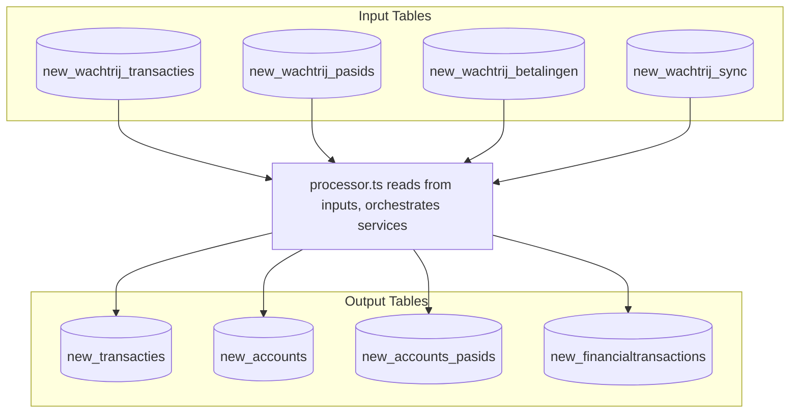
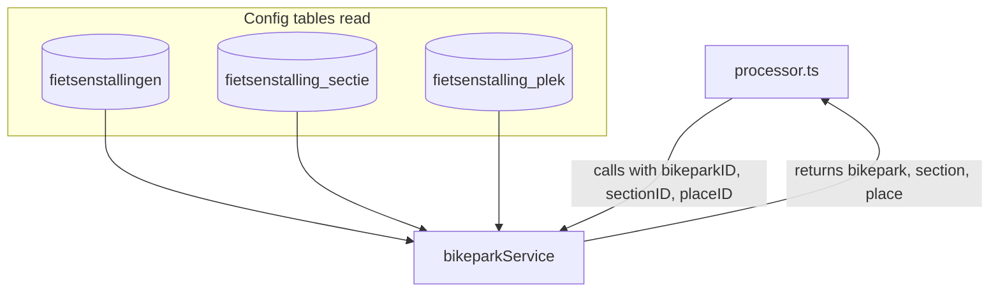
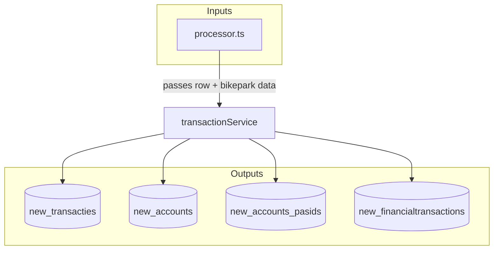
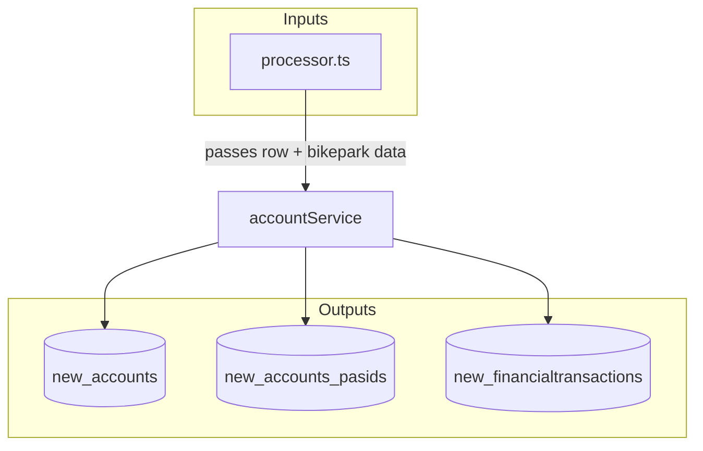
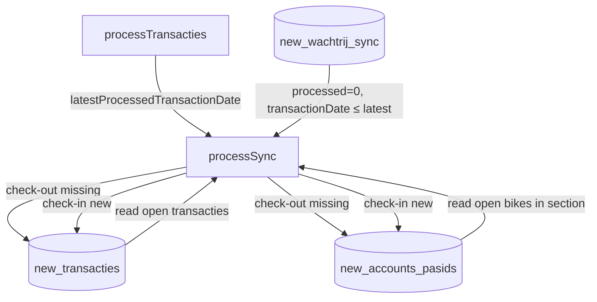
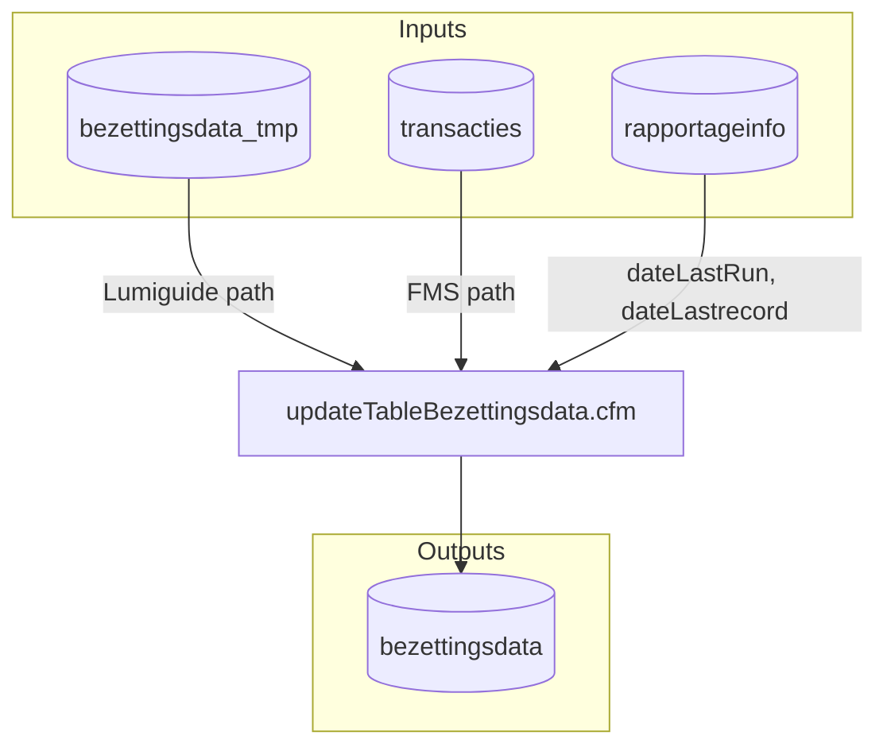

# Queue Processing Component Port to Next.js

**Overview:** Port the ColdFusion queue processing component (processTransactions2.cfm) to Next.js, implementing a processor that reads from new_wachtrij_* tables and writes to new_transacties, new_accounts, new_accounts_pasids, and new_financialtransactions. Also document which tables used by queue processing have no UI.

---

## Current State

- **ColdFusion processor:** `processTransactions2.cfm` runs every 61 seconds via cron at `https://remote.veiligstallen.nl/remote/processTransactions2.cfm`
- **Next.js processor:** Implemented. The app:
  - Writes to `wachtrij_*` via [wachtrij-service.ts](src/server/services/fms/wachtrij-service.ts)
  - Triggers ColdFusion or local processor via [process-queue/index.ts](src/pages/api/protected/parking-simulation/process-queue/index.ts) (based on `useLocalProcessor`)
  - Local processor: [processor.ts](src/server/services/queue/processor.ts) reads `new_wachtrij_*` → writes `new_*`; `latestProcessedTransactionDate` passed from processTransacties to processSync (matches ColdFusion)
  - Cron: [api/cron/process-queues](src/pages/api/cron/process-queues/index.ts) (Bearer CRON_SECRET)
  - Monitors queues via [WachtrijMonitorComponent](src/components/wachtrij/WachtrijMonitorComponent.tsx) (reads `wachtrij_*`); StallingPanel motorblok tabs show `new_*` when `useLocalProcessor` is on
- **Mirror flow:** DB triggers copy testgemeente rows from `wachtrij_*` to `new_wachtrij_*`, and from `bezettingsdata_tmp` to `new_bezettingsdata_tmp` (Trigger 5). Triggers must be installed manually: Beheer | Database → Maak test tabellen → run the SQL shown in the amber box. Script: [fms-mirror-triggers.sql](src/server/sql/fms-mirror-triggers.sql)
- **Config:** `parkingsimulation_simulation_config.useLocalProcessor` (default true for new configs). SettingsTab toggle.

---

## Tables Without UI Used by Queue Processing

The queue processor reads from queue tables and writes to downstream tables. Several of these have **no UI** in the Next.js app:


| Table                         | Role                                             | UI Status                                   |
| ----------------------------- | ------------------------------------------------ | ------------------------------------------- |
| **accounts**                  | Account balances, lookup by passID               | No UI (AccountsComponent is placeholder)    |
| **accounts_pasids**           | Bike-pass associations, current section          | No UI (backend only)                        |
| **financialtransactions**     | Payment records from wachtrij_betalingen         | No UI                                       |
| **new_wachtrij_transacties**  | Input queue (mirrored from wachtrij_transacties) | No UI (monitor shows wachtrij_*, not new_*) |
| **new_wachtrij_pasids**       | Input queue (mirrored from wachtrij_pasids)      | No UI                                       |
| **new_wachtrij_betalingen**   | Input queue (mirrored from wachtrij_betalingen)  | No UI                                       |
| **new_wachtrij_sync**         | Input queue (mirrored from wachtrij_sync)        | No UI                                       |
| **new_accounts**              | Output (test phase)                              | No UI                                       |
| **new_accounts_pasids**       | Output (test phase)                              | No UI                                       |
| **new_financialtransactions** | Output (test phase)                              | No UI                                       |


### Column-source tables without UI

The queue processor and related services (capacity, occupation, tariffs, lookups) read from additional tables that provide **column source** data. Several of these have **no UI** in the Next.js app:


| Table                         | Role / column source use                                      | UI Status                                   |
| ----------------------------- | ------------------------------------------------------------- | ------------------------------------------- |
| **barcoderegister**           | getBikes API: registered bikes (Barcode, SiteID, BikeTypeID)  | No UI                                       |
| **bulkreservering**           | Netto capacity: subtract Aantal from section capacity for today | No UI                                       |
| **bulkreserveringuitzondering** | Exceptions for bulkreservering (datum, BulkreservationID)     | No UI                                       |
| **bezettingsdata**           | Occupation data from reportOccupationData (Lumiguide); reports read | No UI                               |
| **bezettingsdata_tmp**        | Staging for Lumiguide occupation before updateTableBezettingsdata | No UI                               |
| **klanttypen**               | Client type reference (ClientTypeID)                           | No UI (reference data only)                  |
| **gemeenteaccounts**          | Municipal accounts; getBikeUpdates reads                      | No UI                                       |
| **fmsservice_permit**         | FMS API auth (operator credentials)                           | No UI (auth table)                           |


**Column-source tables with UI:** `contacts` (ZipID, gemeenten, exploitanten), `fietsenstallingen`, `fietsenstalling_sectie`, `sectie_fietstype`, `tariefregels` (via ParkingEditTariefregels / tarieven).


**Tables with UI:** `transacties` / `new_transacties` (StallingPanel, WachtrijMonitor), `wachtrij_*` (WachtrijMonitor display), `fietsenstallingen`, `fietsenstalling_sectie`, `sectie_fietstype`, `fietsenstalling_plek` (lookups).

---

## Implementation Progress


| Item                      | Status     | Notes                                                                                                  |
| ------------------------- | ---------- | ------------------------------------------------------------------------------------------------------ |
| 1. fms-table-resolver.ts  | ✅ Done     | `resolveTable()`, `resolveDestinationTables()`                                                         |
| 2. bikepark-service.ts    | ✅ Done     | `getBikeparkByExternalID`, `getBikeparkSectionByExternalID`, `getPlace`; ZipID via contacts            |
| 3. account-service.ts     | ✅ Done     | `getBikepassByPassId`, `addSaldoObject`                                                                |
| 4. transaction-service.ts | ✅ Done     | `putTransaction` – check-in/out, overlap, checkout-without-checkin                                     |
| 5. processor.ts           | ✅ Done     | `processQueues()` – pasids (50) → transacties (50) → betalingen (200) → sync (1); latestProcessedTransactionDate from processTransacties → processSync (matches ColdFusion) |
| 6. Cron endpoint          | ✅ Done     | `/api/cron/process-queues` – Bearer CRON_SECRET                                                        |
| 7. Integration            | ✅ Done     | process-queue uses `processQueues()` when `useLocalProcessor`; SettingsTab toggle |
| 8. Schema 1-1 equality    | ✅ Done     | new_* tables use TINYINT(1) for processed; Prisma schema aligned with production                       |
| 9. Archive process        | ⏳ Phase 2  | Not implemented                                                                                        |
| 10. new_webservice_log    | ⏳ Optional | Not implemented                                                                                        |
| 11. reportOccupationData  | ✅ Done     | FMS v2 REST, report-occupation-service, fms-api-write-client; simulation state POST auto-reports Lumiguide   |
| 12. Mirror triggers       | ✅ Done     | manual SQL from Beheer \| Database → Maak test tabellen (amber box); fms-mirror-triggers.sql (wachtrij_* + bezettingsdata_tmp → new_*) |
| 13. StallingPanel sync    | ✅ Done     | Sync dialog shows open transactions; sync works with empty stalling; motorblok tabs show new_* when useLocalProcessor |


---

## wachtrij_transacties: Transaction Types Not Yet Implemented

The processor handles **type In** and **type Uit** only. The following flows from the ColdFusion plan are **not yet implemented**:

| Flow / type              | Source / condition                         | ColdFusion behaviour                                 | Simulation status |
| ------------------------ | ------------------------------------------- | --------------------------------------------------- | ----------------- |
| **Afboeking**            | `transactionID` ≠ 0 in wachtrij_transacties | Lookup existing transacties record by ID; close it  | ❌ Not implemented |
| **Skip afboekingen**     | `price = 0` when afboeking                  | Skip processing (no putTransaction)                 | ❌ Not implemented |
| **Payment at check-in**  | `paymenttypeid` + `amountpaid` in JSON      | Create financialtransactions record on check-in      | ❌ Not implemented |
| **Reserveringsduur**     | Reservation flow (typeCheck=reservation)     | Set Reserveringsduur on transacties                 | ❌ Not implemented |
| **Locker timeout**       | Post-queue cleanup                          | Release lockers held after subscription purchase     | ❌ Phase 2         |

**Implemented:** `type` In/Uit; typeCheck (user, controle, section→user, sync, system, reservation, beheer) passed through; checkout stallingskosten → financialtransactions; overlap; checkout without check-in; double check-in; sync check-out/in.


---

## What to Do Next

1. **Afboeking (transactionID ≠ 0):** Add handling in `processTransacties` when `row.transactionID !== 0` – lookup transacties by ID, close record, update accounts/financialtransactions.
2. **Skip afboekingen with price=0:** When afboeking and price=0, skip putTransaction (mark processed=1).
3. **Payment at check-in:** In `putTransaction` or processor, when transaction JSON has `paymenttypeid` and `amountpaid`, create financialtransactions record and update account saldo.
4. **Reserveringsduur:** Add `Reserveringsduur` to `PutTransactionInput`; set when typeCheck=reservation and duration available.
5. **Phase 2:** Archive process; locker timeout cleanup; new_webservice_log (optional).


---

## Architecture

**Data flow:** Only `processor.ts` reads from the source tables. It orchestrates the services: calls `bikeparkService` for lookups, then passes enriched data (row + bikepark) to `transactionService` and `accountService`. The services never read from the source tables directly.

### High-level overview



### bikeparkService

Lookup service for bikepark, section, and place. **Does not read from wachtrij_* tables.** Called by processor with IDs from the row; reads from config tables; returns lookup data to processor.



### transactionService

Handles check-in/check-out and sync logic. **Does not read from source tables.** Receives enriched data from processor; writes to transacties, accounts, accounts_pasids, financialtransactions.



### accountService

Handles bikepass lookups and balance updates. **Does not read from source tables.** Receives data from processor; writes to accounts, accounts_pasids, financialtransactions.



### Sync processing (processSync)

Sync reconciles the central DB with the FMS-reported state. Runs **after** processTransacties; uses `latestProcessedTransactionDate` from that batch so syncs are only processed when all prior transactions are done.



**Selection:** 1 row from `new_wachtrij_sync` where `processed=0` and `transactionDate ≤ latestProcessedTransactionDate` (ensures all prior transacties are processed).

**Check-out missing:** Bikes in `accounts_pasids` (section) but not in sync `bikes` array → close `transacties` (Date_checkout, Type_checkout='sync'), clear `huidigeFietsenstallingId`/`huidigeSectieId` in pasids. Guard: `dateLastCheck < transactionDate`.

**Check-in new:** Bikes in `bikes` array but not in `accounts_pasids` (section) → create `transacties`, update `accounts_pasids` (huidigeFietsenstallingId, huidigeSectieId, barcodeFiets).

---

## Implementation Plan

### 1. fms-table-resolver.ts

Create [src/server/utils/fms-table-resolver.ts](src/server/utils/fms-table-resolver.ts) to resolve table names for the processor (production vs test phase). The processor uses `new_*` tables in test phase; resolver returns `new_transacties`, `new_accounts`, etc. when processing `new_wachtrij_*`.

### 2. Business Logic Services

Implement services that encapsulate ColdFusion logic:


| Service                | Location                                           | Purpose                                                                                    |
| ---------------------- | -------------------------------------------------- | ------------------------------------------------------------------------------------------ |
| **bikeparkService**    | `src/server/services/queue/bikepark-service.ts`    | `getBikeparkByExternalID`, `getBikeparkSectionByExternalID`, `getPlace`                    |
| **transactionService** | `src/server/services/queue/transaction-service.ts` | `putTransaction` – INSERT/UPDATE transacties (check-in, check-out, afboeking)              |
| **accountService**     | `src/server/services/queue/account-service.ts`     | `getBikepassByPassId`, `addSaldoObject` – accounts, accounts_pasids, financialtransactions |


See **Appendix A: wachtrij-transactie-processing-stappen** and **Appendix B: wachtrij-transacties-processing-flow** below.

### 3. Queue Processor

Create [src/server/services/queue/processor.ts](src/server/services/queue/processor.ts):

- **Processing order:** wachtrij_pasids (50) → wachtrij_transacties (50) → wachtrij_betalingen (200) → wachtrij_sync (1)
- **3-step locking:** `processed=0` → `9` (isolate) → `8` (lock) → process → `1` (success) or `2` (error)
- **Per-queue handlers:** `processPasids()`, `processTransacties()`, `processBetalingen()`, `processSync()`
- **Transaction flow:** Deserialize JSON → Enrich from record → Fix (typeCheck "section" → "user") → uploadTransactionObject → putTransaction
- **latestProcessedTransactionDate:** `processTransacties()` returns the max transaction date from the batch (or `now()` when empty); `processSync()` receives it and selects sync rows with `transactionDate <= latestProcessedTransactionDate` (matches ColdFusion; see Appendix D)

Note: All wachtrij_* and new_wachtrij_* tables use `processed` as Int (TINYINT(1) in DB). Schema is 1-1 identical.

### 4. Cron Endpoint

Create [src/pages/api/cron/process-queues/index.ts](src/pages/api/cron/process-queues/index.ts):

- Secured via cron secret header (e.g. `Authorization: Bearer <CRON_SECRET>`)
- Calls `processQueues()` from processor
- Returns summary (counts processed, errors)

### 5. Integration with Parking Simulation

Update [StallingPanel.tsx](src/components/beheer/parking-simulation/StallingPanel.tsx) or SettingsTab to optionally call the process-queue API (which uses `processQueues()` when `useLocalProcessor` is true) instead of the ColdFusion URL. Config: `parkingsimulation_simulation_config.useLocalProcessor` (default true for new configs).

### 6. Archive Process (Phase 2)

- Daily archive: copy `processed IN (1,2)` from `new_wachtrij_*` to `new_wachtrij_*_archive{yyyymmdd}`
- Endpoint or scheduled job; document in API_PORTING_PLAN

### 7. new_webservice_log (Optional)

Log FMS API calls to `new_webservice_log` when using the Next.js processor, for parity with ColdFusion.

**Note:** We may need to create a `new_webservice_log` table (mirrored from `webservice_log` via trigger, similar to `new_wachtrij_*`). The parking-simulation statistics stallings list (`stallings.ts`) includes `webservice_log` in its union so bikeparkIDs that only appear in API call logs (e.g. updateLocker) show up. When `new_webservice_log` exists, add it to the stallings union as well.

**updateLocker detection:** Next.js FMS API logs updateLocker calls to `webservice_log` via `logFmsCall()` in the v2 handler. Statistics query uses `LOWER(TRIM(method)) = 'updatelocker'`. ColdFusion never logs updateLocker. **Statistics UI:** The updateLocker column is hidden in `StatisticsTab.tsx` (commented out in COLUMNS); backend still returns `countUpdateLocker`. Uncomment to show when needed.

---

## Key Files to Create/Modify


| File                                               | Action                                         |
| -------------------------------------------------- | ---------------------------------------------- |
| `src/server/utils/fms-table-resolver.ts`           | Create – table name resolution                 |
| `src/server/services/queue/bikepark-service.ts`    | Create – bikepark/section/place lookups        |
| `src/server/services/queue/transaction-service.ts` | Create – putTransaction logic                  |
| `src/server/services/queue/account-service.ts`     | Create – bikepass, addSaldo                    |
| `src/server/services/queue/processor.ts`           | Create – main processor                        |
| `src/pages/api/cron/process-queues/index.ts`       | Create – cron endpoint                         |
| `parkingsimulation_simulation_config`                    | Add `useLocalProcessor` boolean (default true) |
| `StallingPanel.tsx` / `SettingsTab.tsx`            | Toggle for local vs ColdFusion processor      |
| `src/pages/api/protected/data-api/fms-tables.ts`   | Returns `manualSql` for triggers after create-tables |


---

## Data Flow: wachtrij_* → Destination Tables and Columns

This section documents where data from each wachtrij table ends up after processing. In test phase, the Next.js processor writes to `new_*` tables; production ColdFusion writes to the base tables.

### 1. wachtrij_pasids → accounts_pasids, accounts

**Purpose:** Link bike (barcode) to passID; create or update bike-pass association.


| wachtrij_pasids column | Destination table | Destination column | Notes                                       |
| ---------------------- | ----------------- | ------------------ | ------------------------------------------- |
| passID                 | accounts_pasids   | PasID              | Key identifier                              |
| barcode                | accounts_pasids   | barcodeFiets       | Bike barcode                                |
| RFID                   | accounts_pasids   | RFID               | Optional                                    |
| RFIDBike               | accounts_pasids   | RFIDBike           | Optional                                    |
| biketypeID             | accounts_pasids   | BikeTypeID         | 1=fiets, 2=bromfiets, etc.                  |
| bikeparkID             | accounts_pasids   | SiteID             | Via fietsenstallingen.SiteID lookup         |
| (bike JSON)            | accounts_pasids   | Pastype            | Derived: sleutelhanger, ovchip, barcodebike |


**accounts_pasids columns written:** PasID, Pastype, BikeTypeID, barcodeFiets, RFID, RFIDBike, SiteID, dateLastIdUpdate, dateModified. AccountID and ID (bikepass UUID) come from account/bikepass lookup or creation.

**accounts:** New account created when no account exists for passID; otherwise no direct write from wachtrij_pasids.

---

### 2. wachtrij_transacties → transacties, accounts_pasids, accounts, financialtransactions

**Purpose:** Check-in/check-out transactions; may also trigger balance updates when transaction includes payment.


| wachtrij_transacties column | Destination table | Destination column                                          | Notes                                                   |
| --------------------------- | ----------------- | ----------------------------------------------------------- | ------------------------------------------------------- |
| bikeparkID                  | transacties       | FietsenstallingID                                           | Via fietsenstallingen lookup                            |
| sectionID                   | transacties       | SectieID (check-in) / SectieID_uit (check-out)              |                                                         |
| placeID                     | transacties       | PlaceID                                                     | Optional, for lockers                                    |
| externalPlaceID             | transacties       | ExternalPlaceID                                             | Optional                                                |
| passID                      | transacties       | PasID                                                       |                                                         |
| passtype                    | transacties       | Pastype                                                     | Int: 0=sleutelhanger, 1=ovchip, 2=barcodebike           |
| type                        | transacties       | —                                                           | "In" → INSERT/UPDATE check-in; "Uit" → UPDATE check-out |
| typeCheck                   | transacties       | Type_checkin / Type_checkout                                 | user, controle, sync, section→user, etc.                |
| transactionDate             | transacties       | Date_checkin / Date_checkout                                |                                                         |
| transactionID               | transacties       | —                                                           | For afboeking: lookup existing record                   |
| transaction (JSON)          | transacties       | BarcodeFiets_in, BarcodeFiets_uit, BikeTypeID, ClientTypeID   | From JSON: barcodeBike, bikeTypeID, clientTypeID        |
| price                       | transacties       | Stallingskosten                                             | Calculated on checkout or from JSON                     |


**transacties columns written:** FietsenstallingID, SectieID, SectieID_uit, PlaceID, ExternalPlaceID, PasID, Pastype, BarcodeFiets_in, BarcodeFiets_uit, Date_checkin, Date_checkout, Type_checkin, Type_checkout, Stallingsduur, Stallingskosten, Reserveringsduur (reservation only), Tariefstaffels, BikeTypeID, ClientTypeID, ExploitantID, ZipID (from site), dateModified. **dateCreated:** DB default (CURRENT_TIMESTAMP); ColdFusion never sets it. **PassUUID:** Never set.

**accounts_pasids columns updated:** barcodeFiets (from transaction), huidigeFietsenstallingId, huidigeSectieId, huidigeStallingskosten, dateLastCheck, typeLastCheckin, transactionID, dateModified.

**accounts:** Balance updated on checkout (saldo -= Stallingskosten); dateLastSaldoUpdate.

**financialtransactions:** Created on checkout (stallingskosten) or when transaction JSON has paymenttypeid + amountpaid: amount, transactionDate, accountID, bikeparkID, sectionID, transactionID, code, status, paymentMethod, etc.

---

### 3. wachtrij_betalingen → accounts, financialtransactions

**Purpose:** Add balance (saldo) to account; record payment.


| wachtrij_betalingen column | Destination table     | Destination column   | Notes                            |
| -------------------------- | --------------------- | -------------------- | -------------------------------- |
| passID                     | accounts              | (lookup)             | Find account via accounts_pasids |
| bikeparkID                 | financialtransactions | bikeparkID           | Via site lookup                  |
| amount                     | accounts              | saldo                | saldo += amount                  |
| amount                     | financialtransactions | amount               |                                  |
| transactionDate            | financialtransactions | transactionDate      |                                  |
| paymentTypeID              | financialtransactions | paymentMethod / code | Payment type (cash, pin, etc.)   |


**accounts columns written:** saldo (incremented), dateLastSaldoUpdate.

**financialtransactions columns written:** ID, amount, transactionDate, accountID, siteID, bikeparkID, code, status, paymentMethod, dateCreated, etc.

---

### 4. wachtrij_sync → transacties, accounts_pasids

**Purpose:** Sync sector state with central DB; synthetic check-outs for missing bikes, check-ins for new bikes.


| wachtrij_sync column | Destination table            | Destination column                          | Notes                                               |
| -------------------- | ---------------------------- | ------------------------------------------- | --------------------------------------------------- |
| bikes                | (parsed)                     | —                                           | JSON array: idcode, bikeid, idtype, transactiondate |
| bikeparkID           | transacties, accounts_pasids | FietsenstallingID, huidigeFietsenstallingId |                                                     |
| sectionID            | transacties, accounts_pasids | SectieID, huidigeSectieId                   |                                                     |
| transactionDate      | transacties                  | Date_checkout, Date_checkin                  | For synthetic records                               |


**transacties:** For bikes in central DB but NOT in bikes array: UPDATE set Date_checkout, Type_checkout='sync', SectieID_uit, dateModified (Stallingsduur not updated). For bikes in array but NOT in central DB: INSERT check-in with Type_checkin='sync'.

**accounts_pasids:** For checked-out bikes: SET huidigeFietsenstallingId=NULL, huidigeSectieId=NULL. For checked-in bikes: SET huidigeFietsenstallingId, huidigeSectieId.

---

## Dataflow: Destination Tables and Columns

Per-field documentation for tables written by the queue processor. See Appendix F–I for conditional logic and edge cases.

### transacties (see Appendix F)


| Field             | Source table                            | Source field             | Direct/Calculated | Notes                                                   |
| ----------------- | --------------------------------------- | ------------------------ | ----------------- | ------------------------------------------------------- |
| ID                | —                                       | —                        | —                 | Auto-increment PK                                       |
| ZipID             | contacts                                | ZipID                    | Direct            | Via fietsenstallingen.SiteID → contacts. F.8            |
| FietsenstallingID | wachtrij_transacties, fietsenstallingen | bikeparkID, StallingsID  | Direct            | bikepark.getBikeparkExternalID() = StallingsID          |
| SectieID          | wachtrij_transacties, wachtrij_sync     | sectionID                | Direct            | Check-in only. F.5                                      |
| SectieID_uit      | wachtrij_transacties, wachtrij_sync     | sectionID                | Direct            | Check-out only. F.5                                     |
| PlaceID           | wachtrij_transacties                    | placeID                  | Direct            | Fietskluizen only. F.7                                  |
| ExternalPlaceID   | wachtrij_transacties                    | externalPlaceID          | Direct            | F.7                                                     |
| PassUUID          | —                                       | —                        | —                 | **Never set.** See F.9.                                 |
| PasID             | wachtrij_transacties, wachtrij_sync     | passID, bikes[].idcode   | Direct            |                                                         |
| Pastype           | wachtrij_transacties                    | passtype                 | Direct            | Int: 0=sleutelhanger, 1=ovchip, 2=barcodebike           |
| BarcodeFiets_in   | wachtrij_transacties                    | transaction.barcodeBike  | Direct            | From JSON                                               |
| BarcodeFiets_uit  | wachtrij_transacties                    | transaction.barcodeBike  | Direct            | From JSON, on checkout                                  |
| Date_checkin      | wachtrij_transacties, wachtrij_sync     | transactionDate          | Direct            | Or synthetic (system). F.2.1                            |
| Date_checkout     | wachtrij_transacties, wachtrij_sync     | transactionDate          | Direct            | On checkout. F.2.1                                      |
| Stallingsduur     | —                                       | —                        | Calculated        | TIMESTAMPDIFF(MINUTE, Date_checkin, Date_checkout). F.2 |
| Type_checkin      | wachtrij_transacties                    | typeCheck                | Direct            | Fix: "section"→"user". F.6                              |
| Type_checkout     | wachtrij_transacties, wachtrij_sync     | typeCheck / "sync"       | Direct            | F.6                                                     |
| Stallingskosten   | wachtrij_transacties, tariefregels      | price / calculated       | Conditional       | F.3                                                     |
| Tariefstaffels    | tariefregels                            | —                        | Calculated        | Serialized tariff steps. F.4                            |
| Reserveringsduur  | —                                       | —                        | Calculated        | Reservation flow only. F.10                             |
| BikeTypeID        | wachtrij_transacties                    | transaction.bikeTypeID   | Direct            | Default 1                                               |
| ClientTypeID      | wachtrij_transacties                    | transaction.clientTypeID | Direct            | Default 1                                               |
| ExploitantID      | fietsenstallingen                       | ExploitantID             | Direct            |                                                         |
| dateModified      | —                                       | now()                    | Calculated        |                                                         |
| dateCreated       | —                                       | now()                    | Calculated        |                                                         |


### accounts_pasids (see Appendix G)


| Field                    | Source table                          | Source field                     | Direct/Calculated | Notes                                       |
| ------------------------ | ------------------------------------- | -------------------------------- | ----------------- | ------------------------------------------- |
| ID                       | —                                     | —                                | Calculated        | UUID; lookup or generate. G.2               |
| AccountID                | accounts                              | ID                               | Direct            | From getBikepassByPassId                    |
| SiteID                   | fietsenstallingen                     | SiteID                           | Direct            | Via bikeparkID lookup                       |
| PasID                    | wachtrij_pasids, wachtrij_transacties | passID                           | Direct            |                                             |
| Pastype                  | wachtrij_pasids                       | bike JSON                        | Direct            | Derived: sleutelhanger, ovchip, barcodebike |
| BikeTypeID               | wachtrij_pasids                       | biketypeID                       | Direct            | Default 1                                   |
| barcodeFiets             | wachtrij_pasids, wachtrij_transacties | barcode, transaction.barcodeBike | Direct            | G.5                                         |
| RFID                     | wachtrij_pasids                       | RFID                             | Direct            |                                             |
| RFIDBike                 | wachtrij_pasids                       | RFIDBike                         | Direct            |                                             |
| dateLastIdUpdate         | —                                     | now()                            | Calculated        | When barcode/RFID changes. G.5              |
| huidigeFietsenstallingId | wachtrij_transacties, wachtrij_sync   | bikeparkID                       | Direct            | NULL on checkout. G.3                       |
| huidigeSectieId          | wachtrij_transacties, wachtrij_sync   | sectionID                        | Direct            | NULL on checkout. G.3                       |
| huidigeStallingskosten   | transacties                           | Stallingskosten                  | Direct            | On checkout. G.4                            |
| dateLastCheck            | wachtrij_transacties                  | transactionDate                  | Direct            | G.6                                         |
| typeLastCheckin          | wachtrij_transacties                  | typeCheck                        | Direct            | G.6                                         |
| transactionID            | transacties                           | ID                               | Direct            | On checkout. G.7                            |
| dateModified             | —                                     | now()                            | Calculated        |                                             |


### accounts (see Appendix H)


| Field               | Source table                              | Source field            | Direct/Calculated | Notes                                                      |
| ------------------- | ----------------------------------------- | ----------------------- | ----------------- | ---------------------------------------------------------- |
| ID                  | —                                         | —                       | Calculated        | UUID; create when no account for passID                    |
| saldo               | wachtrij_betalingen, wachtrij_transacties | amount, Stallingskosten | Calculated        | += amount (betalingen); -= Stallingskosten (checkout). H.2 |
| dateLastSaldoUpdate | —                                         | now()                   | Calculated        | When saldo changes. H.3                                    |


### financialtransactions (see Appendix I)


| Field           | Source table                              | Source field                        | Direct/Calculated | Notes                              |
| --------------- | ----------------------------------------- | ----------------------------------- | ----------------- | ---------------------------------- |
| ID              | —                                         | —                                   | Calculated        | UUID. I.5                          |
| amount          | wachtrij_betalingen, wachtrij_transacties | amount, Stallingskosten, amountpaid | Direct/Calculated | I.2                                |
| transactionDate | wachtrij_betalingen, wachtrij_transacties | transactionDate                     | Direct            |                                    |
| accountID       | accounts_pasids                           | AccountID                           | Direct            | Via passID lookup. I.4             |
| siteID          | fietsenstallingen                         | SiteID                              | Direct            | Via bikeparkID lookup              |
| bikeparkID      | wachtrij_betalingen, wachtrij_transacties | bikeparkID                          | Direct            | I.4                                |
| sectionID       | wachtrij_transacties                      | sectionID                           | Direct            | On checkout. I.4                   |
| transactionID   | transacties                               | ID                                  | Direct            | On checkout. I.4                   |
| code            | wachtrij_betalingen                       | paymentTypeID                       | Direct            | e.g. saldo_1, stallingskosten. I.3 |
| status          | —                                         | "completed"                         | Direct            | I.3                                |
| paymentMethod   | wachtrij_betalingen                       | paymentTypeID                       | Direct            | Maps to name. I.3                  |
| dateCreated     | —                                         | now()                               | Calculated        |                                    |


---

## Processing Logic Summary (from ColdFusion docs)

**wachtrij_pasids:** Link bike (barcode) to passID → update `accounts_pasids`.

**wachtrij_transacties:** Per record: getBikepark → DeserializeJSON → Enrich → Fix → uploadTransactionObject → putTransaction. Check-in: open transaction? → create/update transacties. Check-out: find open transaction → calculate costs → update account → create financialtransactions → update transacties.

**wachtrij_betalingen:** Lookup account by passID → update account balance → create financialtransactions.

**wachtrij_sync:** Parse bikes array → diff with open transacties → synthetic check-outs for missing, check-ins for new → max 1 per run, only when transactionDate ≤ last processed transactie.

---

## Processing by Stalling Type

### Stalling types (fietsenstallingen.Type)


| Type                                                                           | Has places? | PlaceID/ExternalPlaceID   | Occupied source                                         |
| ------------------------------------------------------------------------------ | ----------- | ------------------------- | ------------------------------------------------------- |
| **fietskluizen**                                                               | Yes         | Required for check-in/out | Locker status (place.status % 10) or open tx by PlaceID |
| **bewaakt, buurtstalling, geautomatiseerd, onbewaakt, fietstrommel, toezicht** | No          | Not used                  | fietsenstalling_sectie.Bezetting                        |


### Processing differences

- **Fietskluizen:** `placeID` and/or `externalPlaceID` from wachtrij_transacties are used. `getPlace()` validates the place. Occupied is derived from `fietsenstalling_plek.status` and open transactions per PlaceID. Locker timeout cleanup runs after queue processing (releases lockers held too long during subscription purchase).
- **Non-locker:** No place validation. Occupied from `Bezetting` column (updated by resetOccupations cron). Tariff lookup may use section-level or stalling-level scope per `hasUniSectionPrices`, `hasUniBikeTypePrices`.

See **Appendix C: OCCUPIED_CAPACITY_FLOW** and **Appendix D: SERVICES_FMS excerpts (wachtrij_sync, Locker Timeout)** below.

---

## "Bad" Records – Edge Case Handling

Document how putTransaction handles anomalous records, including the dates used and resulting parking durations.


| Edge case                       | Behaviour                                                                                                                  | Type_checkin  | Type_checkout | Date_checkin      | Date_checkout                              | Stallingsduur                                     |
| ------------------------------- | -------------------------------------------------------------------------------------------------------------------------- | ------------- | ------------- | ----------------- | ------------------------------------------ | ------------------------------------------------- |
| **Checkout without check-in**   | No open transaction found for passID. INSERT new record with synthetic check-in.                                           | `system`      | From wachtrij | = transactionDate | = transactionDate                          | **0 minutes**                                     |
| **Double check-in**             | Existing record with sync/system and `Date_checkout >= transactionDate`. UPDATE that record (re-check-in).                 | From wachtrij | (unchanged)   | = transactionDate | (unchanged)                                | Recalculated on next checkout                     |
| **Overlap (force checkout)**    | Multiple open transactions; processor closes prior one(s) before applying new check-in/out.                                | From wachtrij | From wachtrij | (prior record)    | = transactionDate (for each closed record) | Per closed record: `Date_checkout - Date_checkin` |
| **Wrong parking / out-of-sync** | Corrected by wachtrij_sync: bikes in central DB but not in sync array → synthetic check-out with `Type_checkout = 'sync'`. | (unchanged)   | `sync`        | (unchanged)       | = transactionDate (sync)                   | Recalculated                                      |


### Duration conventions

**General formula:** `Stallingsduur = TIMESTAMPDIFF(MINUTE, Date_checkin, Date_checkout)` (set only on check-out).

**Checkout without check-in:** Synthetic record has no real check-in. Convention: `Date_checkin = Date_checkout = transactionDate` from wachtrij → **Stallingsduur = 0 minutes**. Ensures a transaction exists for reporting without inventing a parking duration. Stallingskosten typically 0 (or from tariff for 0 minutes). *Verify against ColdFusion TransactionGateway.putTransaction when porting.*

**Double check-in:** UPDATE overwrites `Date_checkin` with new `transactionDate`. The prior `Date_checkout` remains; duration is not recalculated until the next check-out.

**Overlap:** When closing prior open record(s), `Date_checkout = transactionDate` of the current wachtrij event. Each closed record gets its own Stallingsduur from its original `Date_checkin` to this synthetic `Date_checkout`.

**Sync (wrong parking):** `Date_checkout = transactionDate` from wachtrij_sync. Stallingsduur recalculated from existing `Date_checkin` to sync `Date_checkout`.

### Related config (fietsenstallingen)

- **MaxStallingsduur** (minutes): Max allowed parking duration per stalling; 0 = no limit. Used for validation/warnings, not for synthetic records.
- **Reserveringsduur** (transacties): Reservation duration when applicable; not used in bad-record handling.

See **Appendix A: wachtrij-transactie-processing-stappen** (Stap 6), Appendix F.2 (Stallingsduur), and **Appendix J: API_PORTING_PLAN §7.1** (Special cases) below.

---

## System and Sync Events

### typeCheck / Type_checkin / Type_checkout values


| Value           | Source                                | Meaning                                    |
| --------------- | ------------------------------------- | ------------------------------------------ |
| **user**        | User-initiated check at FMS           | Normal check-in/out                        |
| **controle**    | Manual control/admin                  | Admin override                             |
| **section**     | Login FMS (section-level check)       | Normalized to `user` before putTransaction |
| **sync**        | wachtrij_sync synthetic events        | Sector reconciliation                      |
| **system**      | Processor-created (no prior check-in) | Checkout without checkin                   |
| **reservation** | Reservation flow                      | Pre-booked                                 |
| **beheer**      | Management/admin                      | Admin action                               |


### wachtrij_sync processing

- **When:** Only when `transactionDate <= lastProcessedTransactionDate` (all regular transactions up to that time are done).
- **Max 1 per run.**
- **latestProcessedTransactionDate (ColdFusion source):** See [Appendix D: latestProcessedTransactionDate](#latestprocessedtransactiondate-coldfusion-source) below.
- **Check-out missing bikes:** Bikes in central DB but NOT in `bikes` array → UPDATE transacties SET Date_checkout, Type_checkout='sync', SectieID_uit; UPDATE accounts_pasids SET huidigeFietsenstallingId=NULL, huidigeSectieId=NULL.
- **Check-in new bikes:** Bikes in array but NOT in central DB → INSERT with Type_checkin='sync'.
- **Guard:** All updates apply only if `dateLastCheck < transactionDate` (prevents old syncs overwriting newer data).

### Post-queue: Locker timeout cleanup

After queue processing, `processTransactions2.cfm` runs locker timeout cleanup: releases lockers (fietskluizen) held too long during subscription purchase (`abonnementen`, `fietsenstalling_plek`).

See **Appendix D: SERVICES_FMS excerpts** and **Appendix E: wachtrij-tables-api-methods** below.

---

## Bezettingsdata: Wilmar vs Lumiguide

Two paradigms for reporting occupancy: **transaction-based (Wilmar)** and **occupation-based (Lumiguide)**. Clarifies when `resetOccupations` runs, how `Bezetting` is populated, and which tables/APIs each system uses.

### Wilmar (Check-in/Check-out Based)


| Aspect                 | Detail                                                                     |
| ---------------------- | -------------------------------------------------------------------------- |
| **Data provider**      | `dataprovider.type` = wilmar (contacts table)                              |
| **BronBezettingsdata** | `'FMS'` (default)                                                          |
| **API flow**           | `uploadJsonTransaction` (type=in/out) → `wachtrij_transacties`             |
| **Sync**               | `syncSector` → `wachtrij_sync` (reconcile sector state)                    |
| **Processing**         | `processTransactions2` reads `wachtrij_transacties` → writes `transacties` |
| **Bezetting source**   | `resetOccupations` cron: `occupation + wachtrij_in - wachtrij_uit`         |
| **occupation**         | Open transacties (`Date_checkout IS NULL`) per sectie                      |
| **wachtrij_in/uit**    | Pending `wachtrij_transacties` with `processed IN (0,8,9)`                 |


**Flow:** FMS uploadTransaction → wachtrij_transacties → processTransactions2 → transacties. resetOccupations (cron 301s) reads transacties + wachtrij_transacties → updates fietsenstalling_sectie.Bezetting. *Only sections where `BronBezettingsdata = 'FMS'`.*

### Lumiguide (Occupation-Based)


| Aspect                 | Detail                                                                                                                    |
| ---------------------- | ------------------------------------------------------------------------------------------------------------------------- |
| **Data provider**      | `dataprovider.type` = lumiguide                                                                                           |
| **BronBezettingsdata** | Not `'FMS'` (e.g. `'Lumiguide'` or external source)                                                                       |
| **API flow**           | `reportOccupationData` → `bezettingsdata_tmp`, `fietsenstalling_sectie.Bezetting`; update-bezettingsdata copies tmp → bezettingsdata |
| **Sync**               | N/A (no per-bike sync)                                                                                                    |
| **Processing**         | No `wachtrij_transacties` for check-in/out; `updateTableBezettingsdata.cfm` reads `bezettingsdata_tmp` → `bezettingsdata` |
| **Bezetting source**   | Direct write by `reportOccupationData`; `resetOccupations` does **not** update these sections                             |


**Key rule:** `resetOccupations` only updates sections where `BronBezettingsdata = 'FMS'`. Lumiguide stallings are excluded.

### Comparison


|                          | Wilmar              | Lumiguide               |
| ------------------------ | ------------------- | ----------------------- |
| **BronBezettingsdata**   | FMS                 | Lumiguide / external    |
| **resetOccupations**     | Updates Bezetting   | Skipped                 |
| **transacties**          | Yes (from wachtrij) | No (no per-bike events) |
| **wachtrij_transacties** | Yes                 | No                      |
| **Bezetting written by** | resetOccupations    | reportOccupationData    |


**API:** V3 returns `occupationsource` = `fietsenstallingen.BronBezettingsdata ?? "FMS"` at location level.

**Simulation:** Wilmar via `uploadJsonTransaction` and `syncSector`. Lumiguide via `parkingsimulation_spot_detection`; `reportOccupationData` **ported** – FMS v2 REST, fms-api-write-client, and state POST (park/remove/move) auto-report for Lumiguide sections.

---

## Update Bezettingsdata (updateTableBezettingsdata)

The ColdFusion cron `updateTableBezettingsdata.cfm` populates `bezettingsdata` for reporting. It is **not ported** to Next.js.

### Current state

- **URL:** `http://fms.veiligstallen.nl/remote/cronjobs/updateTableBezettingsdata.cfm`
- **Schedule:** Daily
- **Parameter:** `?timeintervals=15` (15-minute intervals)

### Purpose

Populate `bezettingsdata` for Rapportage bezetting, Rapportage ruwe data, and `bezettingsdata_day_hour_cache` (reporting cache).

### Data paths

| Path | Source | Target |
|------|--------|--------|
| **Lumiguide** | `reportOccupationData` → `bezettingsdata_tmp` | This process → `bezettingsdata` |
| **FMS/Wilmar** | `transacties` | This process → `bezettingsdata` |

### Flow



### Dependencies

- **fill_bezettingsdata_alle_kwartieren:** Generates 15-min timestamps between dateStart and dateEnd (see [mysql-db/initial_db.min.sql](mysql-db/initial_db.min.sql))
- **getOccupation_from_bezettingsdata:** Returns latest known occupation for section/timestamp/source (Lumiguide backfill)
- **updateBezettingsdata_occupation_no_biketype:** FMS occupation running sum (`checkins - checkouts + prev`)
- **updateBezettingsdata_occupation_externalsource:** Lumiguide occupation backfill from prior rows

### Status

**Ported to Next.js.** Service: `src/server/services/bezettingsdata/update-bezettingsdata-service.ts`. API: `POST /api/protected/parking-simulation/update-bezettingsdata`. Uses testgemeente config (useLocalProcessor → new_transacties; siteID for scope). Default date range: 7 days.

### Conversion plan

1. **API endpoint:** Create `POST /api/protected/parking-simulation/update-bezettingsdata` (auth: fietsberaad_superadmin). Optional params: `timeintervals=15`, `dateStart`, `dateEnd`.
2. **Service:** Create `src/server/services/bezettingsdata/update-bezettingsdata-service.ts`:
   - **Lumiguide path:** Read `bezettingsdata_tmp` → upsert into `bezettingsdata` → TRUNCATE `bezettingsdata_tmp`
   - **FMS path:** For sections with `BronBezettingsdata = 'FMS'`: generate 15-min intervals, aggregate checkins/checkouts from `transacties`, insert/upsert rows, run occupation backfill
   - Update `rapportageinfo.dateLastRun`, `dateLastrecord`
3. **Cron:** Add `/api/cron/update-bezettingsdata` (Bearer CRON_SECRET) or integrate into existing cron.
4. **Test:** Parking Simulation testgemeente; after Process, run Update bezettingsdata; verify `bezettingsdata` rows.

---

## Implementation Order

1. fms-table-resolver.ts
2. bikepark-service.ts (lookups)
3. account-service.ts (bikepass, addSaldo – needed for pasids and betalingen)
4. transaction-service.ts (putTransaction – most complex)
5. processor.ts (orchestration, 4 queue handlers)
6. cron endpoint
7. Parking Simulation config + UI toggle
8. Archive process (optional, Phase 2)
9. new_webservice_log (optional)

---

# Appendices (Merged Reference Documents)

---

## Appendix A: wachtrij-transactie-processing-stappen

Verwerking wachtrij-transactie (status 8) – gedetailleerde stappen. De zeven stappen die per record worden uitgevoerd wanneer `processTransactions2.cfm` records met `processed=8` verwerkt.

### Context

De loop verwerkt records die:
- al geïsoleerd (9) en vergrendeld (8) zijn
- in de query `q` zitten (uit de SELECT waar processed=9)

Per record worden de kolommen uit het wachtrij-record aangevuld met velden uit de JSON in de kolom `transaction`.

### Stap 1: getBikeparkByExternalID(bikeparkID)

**Doel:** Haal het bikepark-object op dat bij de stalling hoort.

**Input:** `bikeparkID` uit het wachtrij-record (bijv. `3500_001`).

**Werking:** Zoekt in de database naar de fietsenstalling met het gegeven externe ID. Het resultaat is een Hibernate-object met stallinggegevens (adres, gemeente, exploitant, sectie, tarieven, etc.).

**Gebruik:** Bepalen van gemeente, sectie, tarieven, place en clientType. Bij fout: exception, record wordt processed=2.

### Stap 2: DeserializeJSON(transaction)

**Doel:** Haal het originele transactie-object uit de JSON op.

**Input:** Kolom `transaction` uit het wachtrij-record (JSON-string).

**Typische velden in de JSON:** type, typeCheck, transactionDate, barcodeBike, price, placeID, bikeTypeID, clientTypeID, paymenttypeid, amountpaid.

**Output:** `_transaction` struct met de velden uit de JSON.

### Stap 3: Enrich

**Doel:** Vul het transactie-object aan met velden uit het wachtrij-record.

**Aanvulling:** `_transaction` krijgt: passID, passType, sectionID, typeCheck, transactionDate (altijd); transactionID (indien ≠ 0), externalPlaceID (indien aanwezig).

### Stap 4: Fix

**Doel:** Corrigeer specifieke waarden voordat het record wordt verwerkt.

**Actie:** Als `typeCheck eq "section"` → `typeCheck = "user"`. Semantisch komen section en user overeen; Login gebruikt section voor sectiechecks, VeiligStallen gebruikt user.

### Stap 5: uploadTransactionObject

**Doel:** Bereid de transactie voor en roep `putTransaction` aan.

**Werking:** Skippen afboekingen met price=0; place ophalen indien placeID; systeemafboeking indien transactionID; anders sectie ophalen, bikepass ophalen/aanmaken, putTransaction aanroepen.

### Stap 6: putTransaction

**Doel:** INSERT of UPDATE van een record in de tabel `transacties`.

**Werking:** Afboeking → bestaand record opzoeken. In → zoek passende record(s), UPDATE of INSERT. Uit → zoek open record, UPDATE of INSERT (checkout without checkin: Type_checkin=system). Berekening stallingskosten, bijwerken accounts_pasids.

### Stap 7: Resultaat

**Succes:** UPDATE wachtrij_transacties SET processed=1, processDate=now().

**Fout:** UPDATE wachtrij_transacties SET error=..., processed=2, processDate=now().

### Dataflow

```
wachtrij_transacties-record
    ↓
[1] getBikeparkByExternalID(bikeparkID) → bikepark
[2] DeserializeJSON(transaction) → _transaction
[3] Enrich: _transaction.passID = q.passID, etc.
[4] Fix: typeCheck "section" → "user"
[5] uploadTransactionObject(_transaction, bikepark)
        ↓
    getBikeparkSectionByExternalID, getBikepassByPassId
        ↓
[6] putTransaction(section, bikepass, ...) → INSERT/UPDATE transacties
    ↓
[7] UPDATE wachtrij_transacties SET processed=1 of 2
```

---

## Appendix B: wachtrij-transacties-processing-flow

### Consument

De tabel `wachtrij_transacties` wordt verwerkt door:
- **processTransactions2.cfm** – cronjob elke 61 seconden
- URL: `http://remote.veiligstallen.nl/remote/processTransactions2.cfm`

### Volgorde in processTransactions2.cfm

| Stap | Tabel | Beschrijving |
|------|-------|--------------|
| 1 | wachtrij_pasids | Fietsregistraties (barcode↔passID) – max 50 |
| 2 | wachtrij_transacties | Stallingstransacties (in/uit) – max 50 |
| 3 | wachtrij_betalingen | Betalingen – max 200 |
| 4 | wachtrij_sync | Sectorsync – max 1 (alleen als transactionDate ≤ laatste verwerkte transactie) |
| 5 | — | Kluizen vrijgeven (subscriptions_places) |

### processed-statussen

| Waarde | Betekenis |
|--------|-----------|
| 0 | Nieuw / wachtend |
| 9 | Geïsoleerd (tussenstap, batch voor verwerking) |
| 8 | In behandeling (vergrendeld door worker) |
| 1 | Succesvol verwerkt |
| 2 | Fout (error in `error` column) |

### resetOccupations

**Doel:** Herijkt de bezetting van secties met FMS als bron. Formule: `Bezetting = occupation + wachtrij_in - wachtrij_uit`. Leest wachtrij_transacties (processed IN (0,8,9)), transacties (open), schrijft fietsenstalling_sectie.Bezetting.

### admin.cfc, viewTransactions.cfm, archiveWachtrijTransacties.cfm

- **admin.cfc:** REST health (processed=0, 8), getTransactionsForFMS.
- **viewTransactions.cfm:** Dashboard; reset 8→0, 2→0; pause/resume; reinit TransactionGateway.
- **archiveWachtrijTransacties.cfm:** Maakt wachtrij_transacties_archive_yyyymmdd; behoudt 0,8,9 in actieve tabel; zet 8,9→0.

---

## Appendix C: OCCUPIED_CAPACITY_FLOW

Occupied/Capacity/Free: Complete Flow from ColdFusion Source.

### API Output (BaseRestService.cfc getLocation)

| Output field | Source |
|--------------|--------|
| occupied | bikepark.getOccupiedPlaces() |
| free | bikepark.getFreePlaces() |
| capacity | bikepark.getNettoCapacity() (only when getCapacity() > 0) |

### BikeparkSection.getOccupiedPlaces()

- **If hasPlace()** (fietskluizen): count places where `place.getCurrentStatus() != FREE` (locker status)
- **Else**: return `getOccupation()` = **fietsenstalling_sectie.Bezetting**

### Database Source Summary

| Output | Source fields |
|--------|---------------|
| capacity (API) | Sum over sections of (sum of sectie_fietstype.Capaciteit) minus bulkreservering.Aantal |
| free | (fietsenstallingen.Capacity OR sum of sectie_fietstype) − occupied |
| occupied | Sum of fietsenstalling_sectie.Bezetting (or locker status count for fietskluizen) |

### Tables

- **fietsenstallingen**: Capacity
- **fietsenstalling_sectie**: Bezetting (occupied), links to sectie_fietstype
- **sectie_fietstype**: Capaciteit (capacity per bike type), Toegestaan (not used in capacity)
- **bulkreservering**: Aantal, SectieID, Startdatumtijd, Einddatumtijd

---

## Appendix D: SERVICES_FMS excerpts (wachtrij_sync, Locker Timeout)

### wachtrij_sync

**Purpose:** Queue for sector synchronization created by the `syncSector` API method. Synchronizes local sector database with central server database.

**Processing Pipeline:**

1. **Selection Phase:**
   ```sql
   SELECT * FROM wachtrij_sync 
   WHERE processed = 0 
   AND transactionDate <= latestProcessedTransactionDate 
   ORDER BY transactionDate 
   LIMIT 1
   ```
   - Only processes syncs after ALL regular transactions up to that time are processed
   - Ensures data consistency
   - **ColdFusion (processTransactions2.cfm):** `latestProcessedTransactionDate = now()` initially (line 80). When wachtrij_transacties batch is processed, after each row: `latestProcessedTransactionDate = q.transactionDate` (line 146) – so it ends up as the last processed row's transactionDate. When no wachtrij_transacties to process, stays `now()`.

2. **Processing Phase:** Deserialize bikes JSON; call syncSector which:
   - **Check-Out Missing Bikes:** Bikes in central DB but NOT in array → check out; update accounts_pasids (huidige* = NULL); close transacties (Date_checkout, Type_checkout='sync')
   - **Check-In New Bikes:** Bikes in array but NOT in central DB → check in; update accounts_pasids; create transacties
   - Guard: `dateLastCheck < transactionDate`

3. **Batch Size:** 1 sync per run

### latestProcessedTransactionDate (ColdFusion source)

**File:** `broncode/remote/remote/processTransactions2.cfm`

The sync selection uses `transactionDate <= latestProcessedTransactionDate`. ColdFusion computes this as follows:

| Step | Lines | Logic |
|------|-------|-------|
| 1 | 80 | `latestProcessedTransactionDate = now()` (initial value) |
| 2 | 61–79 | Process wachtrij_transacties: UPDATE 0→9, SELECT, UPDATE 9→8 |
| 3 | 82–147 | Loop over batch: process each row; after each: `latestProcessedTransactionDate = q.transactionDate` (line 146) |
| 4 | 226 | Sync query: `WHERE processed = 0 AND transactionDate <= latestProcessedTransactionDate` |

**Result:** When no wachtrij_transacties are processed in this run, `latestProcessedTransactionDate` stays `now()`. When the batch is processed (ordered by `transactionDate ASC`), the last row’s `transactionDate` becomes the cutoff. Syncs with `transactionDate <=` that value are eligible.

**Next.js implementation:** `processTransacties` returns `latestProcessedTransactionDate` from the batch it just processed (or `now()` when empty). `processSync` receives this and uses it for the selection condition. See `src/server/services/queue/processor.ts`.

### Locker Timeout Cleanup

**Purpose:** Release lockers held too long during subscription purchase process.

**When:** Runs after all queue processing completes.

**Logic:** Finds subscriptions where: isActive=true, isPaid=false, startDate < now() - holdPlaceWhileBeingSubscriptedInMinutes, place.status IN (2, 12), bikeparkType.id = 'fietskluizen'.

**Action:** Sets subscription isActive=false; sets place status=FREE.

**Tables Updated:** abonnementen, fietsenstalling_plek

---

## Appendix E: wachtrij-tables-api-methods

API-methodes die data in wachtrij_*-tabellen schrijven.

| Tabel | API-methodes |
|-------|--------------|
| wachtrij_transacties | uploadTransaction, uploadTransactions (REST) |
| wachtrij_pasids | saveBike, saveBikes (REST) |
| wachtrij_sync | syncSector (REST) |
| wachtrij_betalingen | addSaldo, addSaldos (REST); indirect via uploadTransaction met betalingsvelden |
| **bezettingsdata_tmp** | **reportOccupationData**, **reportJsonOccupationData** (FMS v2 REST) |

### reportOccupationData (Lumiguide occupation)

**Ported to Next.js.** Service: `src/server/services/fms/report-occupation-service.ts`. FMS v2 API: `POST /api/fms/v2/reportOccupationData/{bikeparkID}/{sectionID}` (or `reportJsonOccupationData`). Client: `src/lib/parking-simulation/fms-api-write-client.ts` – `reportOccupationData()`.

**Flow:** Writes to `bezettingsdata_tmp` (upsert by timestamp/interval/source/bikeparkID/sectionID) and `fietsenstalling_sectie.Bezetting`. `update-bezettingsdata-service` copies tmp → bezettingsdata and truncates tmp.

**new_ flow:** When `useLocalProcessor` is true, simulation uses `new_bezettingsdata_tmp` and `new_bezettingsdata`. Flow:
- `reportOccupationData` always writes to `bezettingsdata_tmp`. A DB trigger mirrors testgemeente rows to `new_bezettingsdata_tmp` (see [fms-mirror-triggers.sql](src/server/sql/fms-mirror-triggers.sql) Trigger 5).
- For Lumiguide sections: state POST (park/remove/move) calls `reportOccupationData` internally → writes to `bezettingsdata_tmp` + `fietsenstalling_sectie.Bezetting`. Trigger copies to `new_bezettingsdata_tmp` for testgemeente. `update-bezettingsdata` (protected or cron) reads from `new_bezettingsdata_tmp` when `useLocalProcessor` and processes tmp → `new_bezettingsdata`.

**Payload:** `{ occupation, timestamp?, capacity?, checkins?, checkouts?, open?, interval?, source?, rawData? }`. Supports `occupation` / `Bezetting`, `capacity` / `Capacity`, etc.

### Verwerkingspijplijn per tabel

**wachtrij_pasids:** Selectie processed=0, LIMIT 50. Per record: getBikeparkByExternalID, deserialiseer bike JSON, saveBikeObject → accounts_pasids, accounts. Succes: processed=1; Fout: processed=2.

**wachtrij_transacties:** Zie Appendix A en B.

**wachtrij_betalingen:** LIMIT 200. Per record: bikepark ophalen, saldoAddObject bouwen, addSaldoObject → accounts, financialtransactions.

**wachtrij_sync:** Zie Appendix D. LIMIT 1, transactionDate <= laatste verwerkte transactie.

---

## Appendix F: transacties – Conditional and Calculated Columns

### F.1 Data Sources

Wachtrij (wachtrij_transacties, wachtrij_sync), Static (fietsenstallingen, contacts, tariefregels, fietsenstalling_sectie, sectie_fietstype).

### F.2 Stallingsduur (calculated)

Set only on check-out. Formula: `TIMESTAMPDIFF(MINUTE, Date_checkin, Date_checkout)`.

### F.3 Stallingskosten (conditional)

Depends on BerekentStallingskosten: true → calculated from tariefregels; false → wachtrij price.

### F.4 Tariefstaffels (conditional)

Set only when Stallingskosten is calculated. Serialized tariff steps.

### F.5 SectieID vs SectieID_uit

SectieID on check-in; SectieID_uit on check-out.

### F.6 Type_checkin / Type_checkout

From typeCheck; fix "section"→"user". Sync check-out: always "sync".

### F.7 PlaceID, ExternalPlaceID (conditional)

Only for fietskluizen when place specified.

### F.8 ZipID (static lookup)

Via fietsenstallingen.SiteID → contacts.

### F.9 PassUUID (never set)

Never written by queue processor. ColdFusion TransactionGateway omits it in all INSERT/UPDATE.

### F.10 Reserveringsduur (conditional)

Reservation flow only.

### F.11 dateCreated (DB default only)

Never explicitly set by ColdFusion; DB DEFAULT CURRENT_TIMESTAMP.

### F.12 syncSector check-out – Stallingsduur not updated

syncSector direct UPDATE sets Date_checkout, Type_checkout, SectieID_uit, dateModified. Does NOT set Stallingsduur.

---

## Appendix G: accounts_pasids – Conditional and Calculated Columns

### G.2 ID (bikepass UUID)

Generated or looked up. UUID for bikepass.

### G.3 huidigeFietsenstallingId, huidigeSectieId

Updated on check-in/check-out; cleared on sync check-out. Check-in: set bikeparkID, sectionID. Check-out: NULL.

### G.4 huidigeStallingskosten

Set on check-out when Stallingskosten calculated.

### G.5 dateLastIdUpdate

When barcodeFiets, RFID, RFIDBike changes.

### G.6 dateLastCheck, typeLastCheckin

Updated on check-in and check-out. transactionDate → dateLastCheck; typeCheck → typeLastCheckin.

### G.7 transactionID

Set on check-out; links to transacties.ID.

---

## Appendix H: accounts – Conditional and Calculated Columns

### H.2 saldo (calculated)

Check-out: saldo -= Stallingskosten. addSaldo (wachtrij_betalingen): saldo += amount.

### H.3 dateLastSaldoUpdate

Set whenever saldo is modified.

---

## Appendix I: financialtransactions – Conditional and Calculated Columns

### I.2 amount

From wachtrij_betalingen.amount; wachtrij_transacties checkout (Stallingskosten); transaction JSON amountpaid.

### I.3 code, status, paymentMethod

code: payment type; status: "completed"; paymentMethod from paymentTypeID.

### I.4 accountID, bikeparkID, sectionID, transactionID

Via passID lookup; bikeparkID from wachtrij or fietsenstallingen; sectionID on checkout; transactionID on checkout.

### I.5 ID (primary key)

UUID or generated at insert.

---

## Appendix J: API_PORTING_PLAN §7.1 Transaction Flow

**Check-In:** Validate bikepark, section, passID → check for open transaction → create `transacties` → update `accounts_pasids`.

**Check-Out:** Find open transaction → calculate Stallingsduur/Stallingskosten → update account balance, create `financialtransactions` → update `transacties` → update `accounts_pasids`.

**Special cases:** Sync transactions, overlap (force checkout), locker transactions.

---

## Appendix K: Multiple Bicycles with Same Pass ID

How the ColdFusion broncode handles multiple bicycles checked in with the same pass ID, and how the new implementation compares.

### Data model constraints

- **accounts_pasids:** Unique on `(SiteID, PasID, Pastype)` → one record per pass. `barcodeFiets` is a single column → only one "current" bike per pass at a time.
- **transacties:** Multiple rows can share the same `PasID`; each row has its own `BarcodeFiets_in` / `BarcodeFiets_uit`.

### wachtrij_pasids processing

Each row links pass to bike. Processing overwrites `accounts_pasids.barcodeFiets`. Last processed (by `transactionDate` ASC) wins.

### wachtrij_transacties processing

- Each transaction has `passID` + `transaction.barcodeBike` in JSON.
- Lookup: `getBikepassByPassId(passID, SiteID, Pastype)` returns one bikepass per pass.
- `BarcodeFiets_in` / `BarcodeFiets_uit` come from `transaction.barcodeBike` (JSON).

### Overlap (force checkout) – multiple open transactions for same pass

**Scenario:** Pass A checks in bike1, then bike2 (without checking out bike1) → two open `transacties` rows.

When a new check-in (e.g. bike3) arrives: close **all** prior open transactions for that pass before applying the new check-in.

**For each closed record:**

- `Date_checkout = transactionDate` (from the new wachtrij event)
- `Stallingsduur = TIMESTAMPDIFF(MINUTE, Date_checkin, Date_checkout)`
- `Stallingskosten` from tariefregels or price
- `BarcodeFiets_uit` = bike that was in that transaction → `BarcodeFiets_in` of the closed record (the bike leaving)
- Saldo update, `financialtransactions` row
- `accounts_pasids`: `huidigeFietsenstallingId = NULL`, `huidigeSectieId = NULL`

**Then:** INSERT new check-in with `BarcodeFiets_in` from transaction JSON; UPDATE `accounts_pasids` with new bike and location.

### Double check-in (sync/system)

Existing record with `Type_checkin IN ('sync','system')` and `Date_checkout >= transactionDate` → UPDATE that record (re-check-in), do not create overlap.

### Comparison: New implementation vs ColdFusion

| Aspect | ColdFusion | New implementation | Match? |
|--------|------------|--------------------|--------|
| accounts_pasids uniqueness | One per (SiteID, PasID, Pastype) | Same via `getBikepassByPassId` | Yes |
| wachtrij_pasids overwrite | Last processed wins | Same (processPasids by transactionDate) | Yes |
| Overlap: close all open | Yes | Yes – `findMany` by PasID, Date_checkout null | Yes |
| Overlap: Date_checkout, Stallingsduur, Stallingskosten | Set per closed record | Set per closed record | Yes |
| Overlap: BarcodeFiets_uit | Bike leaving = closed record's BarcodeFiets_in | Same (`ot.BarcodeFiets_in`) | Yes |
| Overlap: pasids nulling | huidigeFietsenstallingId, huidigeSectieId = NULL | Same | Yes |
| New check-in after overlap | BarcodeFiets_in from JSON, pasids updated | Same | Yes |
| Sync checkout BarcodeFiets_uit | From bike leaving | `barcode \|\| openTx.BarcodeFiets_uit` | Yes |

### Gap and Todo

**Gap:** In overlap handling, the new implementation did not set `BarcodeFiets_uit` on closed `transacties` records. ColdFusion sets it to the bike that was in that transaction (i.e. the closed record's `BarcodeFiets_in`).

**Location:** `src/server/services/queue/transaction-service.ts`, overlap loop (lines 136–154).

**Todo (done):** Add `BarcodeFiets_uit: ot.BarcodeFiets_in ?? undefined` to the `transactiesModel.update` data in the overlap loop so each force-closed record records which bike left.

---

## Appendix L: bezettingsdata Columns

Columns in `bezettingsdata` and their sources. Used by `updateTableBezettingsdata.cfm` and the Next.js port.

### Column definitions

| Column | Type | Source | Calculation / Notes |
|--------|------|--------|---------------------|
| `ID` | int | Auto | Primary key |
| `timestampStartInterval` | datetime | Generated | Start of 15-min interval. Same as `timestamp` for single-interval rows. From `fill_bezettingsdata_alle_kwartieren` (CF) or `generateIntervalTimestamps` (Next.js). |
| `timestamp` | datetime | Generated / Lumiguide | Interval end timestamp. Unique with (timestampStartInterval, source, bikeparkID, sectionID). |
| `interval` | int | Param | 15 (minutes). Default 1 in schema. |
| `source` | varchar(25) | Lumiguide / FMS | `'Lumiguide'` (or external) or `'FMS'`. Distinguishes data origin. |
| `bikeparkID` | varchar(8) | transacties / tmp | StallingsID (e.g. `3500_001`). From fietsenstallingen.StallingsID or tmp. |
| `sectionID` | varchar(13) | transacties / tmp | Section externalId (e.g. `3500_001_1`). From transacties.SectieID or tmp. |
| `brutoCapacity` | int | sectie_fietstype | Sum of Capaciteit per section. Optional. |
| `capacity` | int | sectie_fietstype, bulkreservering | Net capacity = sum(Capaciteit) - bulkreserveration for date. Optional. |
| `bulkreserveration` | int | bulkreservering | Count of bulk reservations for the date. Default 0. |
| `occupation` | int | **Calculated** | **FMS:** Running sum: `occupation = prev + checkins - checkouts`. Start value from open transacties at dateStart (excl. Type sync). **Lumiguide:** From `getOccupation_from_bezettingsdata` – latest known occupation for section/timestamp/source. |
| `checkins` | int | transacties | Count where `Date_checkin` in interval and `Type_checkin != 'sync'`. |
| `checkouts` | int | transacties | Count where `Date_checkout` in interval and `Type_checkout != 'sync'`. |
| `open` | boolean | fietsenstalling_sectie | Section open flag. Optional. |
| `fillup` | boolean | Process | Backfill indicator. Default false. |
| `rawData` | varchar(255) | Optional | Raw payload. Truncated from tmp (TEXT) to 255. |
| `dateModified` | timestamp | Auto | ON UPDATE CURRENT_TIMESTAMP |
| `dateCreated` | datetime | Auto | Insert time |

### Unique constraint

`(timestampStartInterval, timestamp, source, bikeparkID, sectionID)` – one row per interval per section per source.

### Checkin/checkout rules (FMS)

- **Checkin in interval:** `Date_checkin >= intervalStart AND Date_checkin < intervalEnd AND (Type_checkin IS NULL OR Type_checkin != 'sync')`
- **Checkout in interval:** `Date_checkout IS NOT NULL AND Date_checkout >= intervalStart AND Date_checkout < intervalEnd AND (Type_checkout IS NULL OR Type_checkout != 'sync')`
- **Open occupation at T:** `Date_checkin <= T AND (Date_checkout IS NULL OR Date_checkout > T) AND Type_checkin != 'sync' AND Type_checkout != 'sync'`

### Stored procedures (ColdFusion)

See [mysql-db/initial_db.min.sql](mysql-db/initial_db.min.sql): `updateBezettingsdata_occupation_no_biketype`, `updateBezettingsdata_occupation_externalsource`, `getOccupation_from_bezettingsdata`, `fill_bezettingsdata_alle_kwartieren`.
